author: Shigeru Oda
summary: JAWS DAYS 2022 コンテナ ハンズオン
id:docs
categories: codelab,markdown
environments: HandsOn
status: Draft
feedback link: <https://github.com/shigeru-oda/jawsdays2022-container-handson>
analytics account: XXXXXXXX

# [JAWS DAYS 2022] ハンズオン～コンテナサービスをCI/CDパイプラインでデプロイしよう～

Duration: 0:05:00

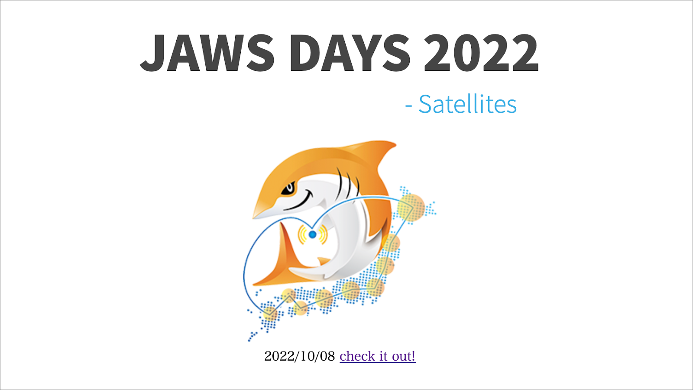

## ご挨拶

### ■ご挨拶

当資料は[JAWS DAYS 2022 - Satellites](https://jawsdays2022.jaws-ug.jp/)でのハンズオントラックの一つ、[コンテナサービスをCI/CDパイプラインでデプロイしよう](https://jaws-ug.doorkeeper.jp/events/141627)のセッションで利用する資料となります

[JAWS DAYS 2022 - Satellites](https://jawsdays2022.jaws-ug.jp/)のハンズオンは以下3点ありますが、他セッションはGUI、CDKでの環境構築であったので、当セッションはCLIでの環境構築として準備しています

- [S3でWebサイトを公開して、リソースポリシーでアクセスを制御してみよう](https://jaws-ug.doorkeeper.jp/events/141646)
- [コンテナサービスをCI/CDパイプラインでデプロイしよう](https://jaws-ug.doorkeeper.jp/events/141627)
- [CDKでサーバーレスアプリをデプロイしよう](https://jaws-ug.doorkeeper.jp/events/141651)

初心者の方にはCLIコマンドが難しいかもしれませんが、まずはこういうステップが必要という勘所だけでも掴んで頂ければ幸いです、慣れた方はCLIコマンドの1つ１つの意味を理解するように進めて頂けるとありがたいです

### ■対象者

- コンテナが何かよく分からない人
- ＡＷＳでのコンテナサービスを知りたい人
- ＣＩ／ＣＤパイプラインでコンテナサービスをデプロイしたい人

### ■当日までにご準備が必要なもの

- マネジメントコンソールにログイン可能なAdministrator権限のIAMユーザー
- Chrome もしくは Firefox

### ■免責事項について

ハンズオンで利用するサービスは一部課金対象となるサービスもございます  
また、ハンズオンで作成した環境を削除しない場合には、課金が続くことによって高額になる可能性があります  
課金が発生したことによる責任は負えませんので、ご承知おきください
上記事項をご理解頂きお申込みいただけますようお願いいたします

### ■参考資料

- [AWS CI/CD for Amazon ECS ハンズオン~ Cloud9, Docker, Code Services を⽤いた開発効率向上 ~](https://pages.awscloud.com/rs/112-TZM-766/images/AWS_CICD_ECS_Handson.pdf)
- [20190731 Black Belt Online Seminar Amazon ECS Deep Dive](https://www.slideshare.net/AmazonWebServicesJapan/20190731-black-belt-online-seminar-amazon-ecs-deep-dive-162160987)

### ■手順について

貼り付けるコマンドは準備しているので、基本的にはCopy & Pasteで手順を進めることができます

#### cmd

cmdと記載された項目にある以下のような表示内容はコマンドをCopy & Pasteするモノとなります

```Sample
Copy & Pasteの対象です
```

#### result

resultと記載された項目にある以下のような表示内容はコマンドの実行結果です  
IDなどは個々に異なりますので

- 表示が大きく変わらない
- エラーメッセージが出力されていない

を確認ください

```Sample
cmd実行後の結果です
```

## ハンズオンを通して学ぶこと

Duration: 0:05:00

### ■ハンズオン１

- VPCを使ったネットワーク環境の構築
- VPCエンドポイントを使ったセキュア環境の構築
- ECS /Fargateを使ったサーバーレスコンテナ運用の構築

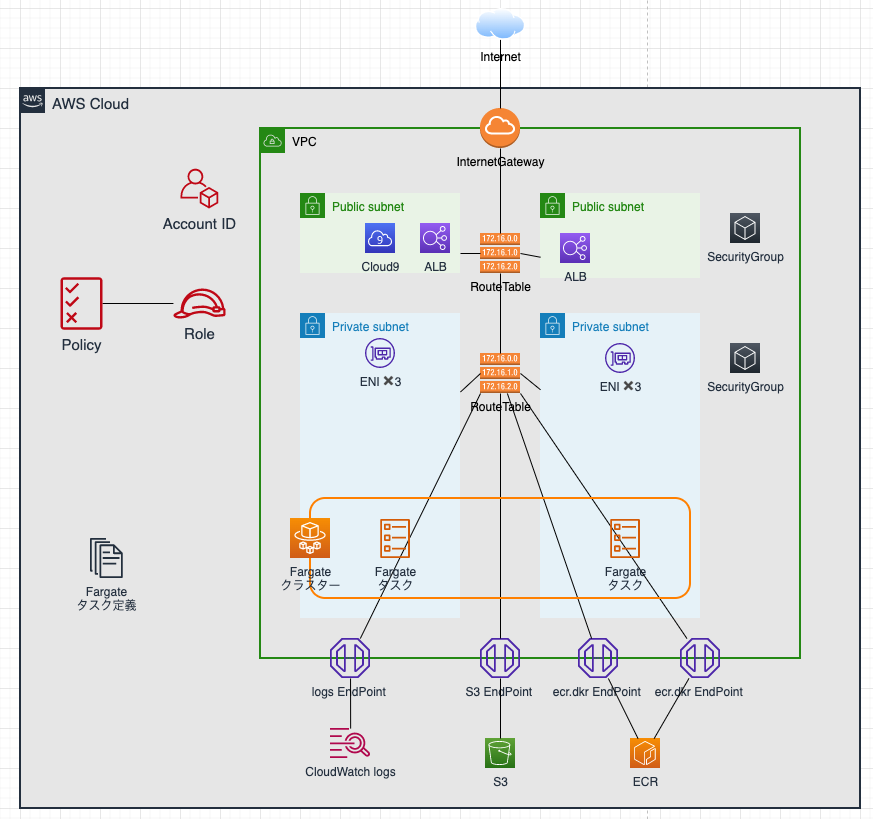

### ■ハンズオン２

- CoceCommitを使ったソースコード管理
- CodeBuildを使った自動ビルド
- CodeDeployを使ったECS/Fargateへのデプロイ
- CodePipelineを使ったCI/CDパイプラインの構築


## 事前準備とネットワーク周りの構築

Duration: 0:15:00

### ■CloudShellの起動

#### AWS コンソールにログイン

- Administrator権限のIAMユーザーでAWSコンソールにログイン

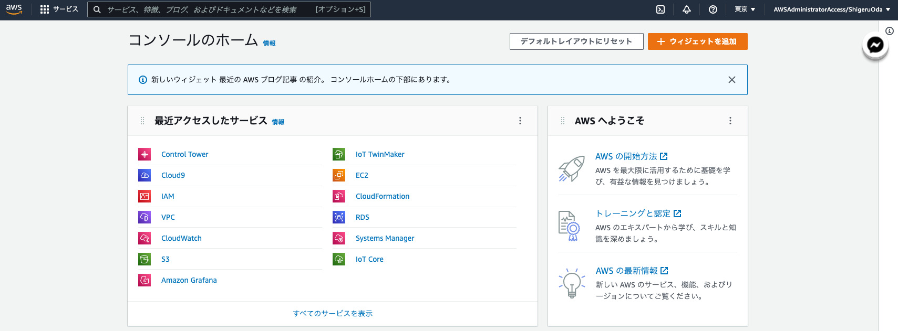

- リージョンを"アジアパシフィック（東京）"に変更

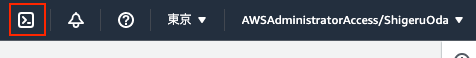

#### CloudShellボタン押下

- 画面右上のCloudShellボタンを押下  


#### CloudShellを起動

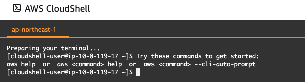

### ■AWS Account IDの取得

- IDを取得し、変数に格納・確認を行います

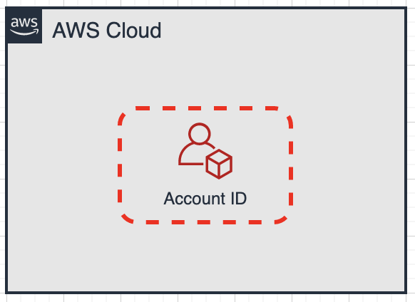

#### cmd

```CloudShell
AccoutID=`aws sts get-caller-identity --query Account --output text`
```

```CloudShell
clear; cat << EOF
AccoutID : ${AccoutID}
EOF
```

#### result

```CloudShell
AccoutID : 123456789012
```

### ■ECSタスクの実行Roleの存在確認

- ECSタスクを実行するRole(ecsTaskExecutionRole)の存在確認を行います

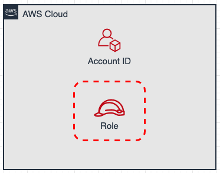

#### cmd

```Cloud9
aws iam list-roles | grep "RoleName" | grep "ecsTaskExecutionRole"
```

#### result（存在する場合）

```Cloud9
            "RoleName": "ecsTaskExecutionRole",
```

#### result（存在しない場合）

```Cloud9
（なし）
```

### ■ECSの実行Role作成（Roleが存在しない場合のみ実行）

- ecsTaskExecutionRoleが存在しない場合のみ実行します


#### cmd

```Cloud9
cat << EOF > assume-role-policy-document.json
{
  "Version": "2012-10-17",
  "Statement": [
    {
      "Sid": "",
      "Effect": "Allow",
      "Principal": {
        "Service": "ecs-tasks.amazonaws.com"
      },
      "Action": "sts:AssumeRole"
    }
  ]
}
EOF
```

```Cloud9
aws iam create-role \
  --role-name ecsTaskExecutionRole \
  --assume-role-policy-document file://assume-role-policy-document.json
```

#### result

```Cloud9
{
    "Role": {
        "Path": "/",
        "RoleName": "ecsTaskExecutionRole",
        "RoleId": "AROASHENIAIFFJ6CDBQVE",
        "Arn": "arn:aws:iam::123456789012:role/ecsTaskExecutionRole",
        "CreateDate": "2022-09-12T20:01:28+00:00",
        "AssumeRolePolicyDocument": {
            "Version": "2012-10-17",
            "Statement": [
                {
                    "Sid": "",
                    "Effect": "Allow",
                    "Principal": {
                        "Service": "ecs-tasks.amazonaws.com"
                    },
                    "Action": "sts:AssumeRole"
                }
            ]
        }
    }
}
```

### ■RoleにPolicyをアタッチ（Roleが存在しない場合のみ実行）

- 作成したRoleにPolicyをアタッチします

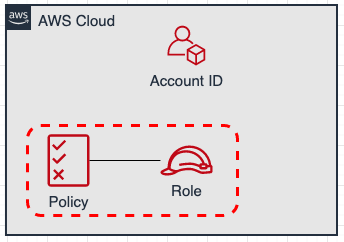

#### cmd

```Cloud9
aws iam attach-role-policy \
  --role-name ecsTaskExecutionRole \
  --policy-arn arn:aws:iam::aws:policy/service-role/AmazonECSTaskExecutionRolePolicy
```

#### result

```
（なし）
```

- Policyがアタッチされたことを確認します

#### cmd

```Cloud9
aws iam list-attached-role-policies \
  --role-name ecsTaskExecutionRole
```

#### result

```Cloud9
{
    "AttachedPolicies": [
        {
            "PolicyName": "AmazonECSTaskExecutionRolePolicy",
            "PolicyArn": "arn:aws:iam::aws:policy/service-role/AmazonECSTaskExecutionRolePolicy"
        }
    ]
}
```

### ■VPCの作成

- VPCを新規に作成します

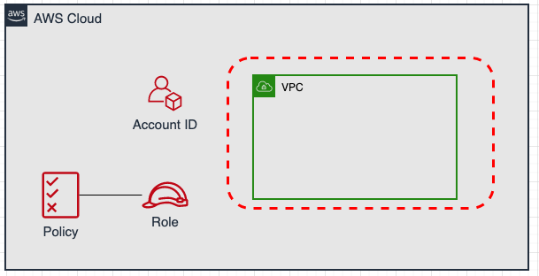

#### cmd

``` CloudShell
aws ec2 create-vpc \
    --cidr-block 10.0.0.0/16 \
    --tag-specification "ResourceType=vpc,Tags=[{Key=Name,Value=ContainerHandsOn}]"
```

#### result

```CloudShell
{
    "Vpc": {
        "CidrBlock": "10.0.0.0/16",
        "DhcpOptionsId": "dopt-c3de3ba5",
        "State": "pending",
        "VpcId": "vpc-0eb621c4712ee0898",
        "OwnerId": "123456789012",
        "InstanceTenancy": "default",
        "Ipv6CidrBlockAssociationSet": [],
        "CidrBlockAssociationSet": [
            {
                "AssociationId": "vpc-cidr-assoc-05cc0c368d9105817",
                "CidrBlock": "10.0.0.0/16",
                "CidrBlockState": {
                    "State": "associated"
                }
            }
        ],
        "IsDefault": false,
        "Tags": [
            {
                "Key": "Name",
                "Value": "ContainerHandsOn"
            }
        ]
    }
}
```

### ■VpcIdの取得

- IDを取得し、変数に格納・確認を行います

#### cmd

```CloudShell
VpcId=`aws ec2 describe-vpcs \
    --query 'Vpcs[*].VpcId' \
    --filters "Name=tag-key,Values=Name" \
    "Name=tag-value,Values=ContainerHandsOn" \
    --output text`
```

```CloudShell
clear; cat << EOF
AccoutID : ${AccoutID}
VpcId : ${VpcId}
EOF
```

#### results

```CloudShell
AccoutID : 123456789012
VpcId : vpc-0d3c1c88db46cfba7
```

#### ■DNS名前解決をONにする

- 作成したVPCで「ドメイン名からIPアドレスへの変換、またはその逆」を可能にします  
- 後程作成するVPCエンドポイントに必要な為です  

### cmd

```CloudShell
 aws ec2 modify-vpc-attribute \
  --vpc-id ${VpcId}  \
  --enable-dns-support  '{"Value":true}' 
```

### result

```CloudShell
（なし）
```

#### ■DNS名前解決の状態確認

- 設定内容が正しく反映されているか確認を行います

### cmd

```CloudShell
aws ec2 describe-vpc-attribute \
  --query EnableDnsSupport \
  --vpc-id ${VpcId}  \
  --attribute enableDnsSupport
```

### result

```CloudShell
{
    "Value": true
}
```

#### ■DNSホスト名をONにする

- VPC内でDNSホスト名(ex : ip-10-0-0-23.ap-northeast-1.compute.internal)を持つように設定します  
- 後程作成するVPCエンドポイントに必要な為です  

### cmd

```CloudShell
 aws ec2 modify-vpc-attribute \
  --vpc-id ${VpcId}  \
  --enable-dns-hostnames  '{"Value":true}' 
```

### result

```CloudShell
（なし）
```

#### ■DNSホスト名の状態確認

- 設定内容が正しく反映されているか確認を行います

### cmd

```CloudShell
aws ec2 describe-vpc-attribute \
  --query EnableDnsHostnames \
  --vpc-id ${VpcId}  \
  --attribute enableDnsHostnames
```

### result

```CloudShell
{
    "Value": true
}
```

### ■Subnetの作成

- 作成したVPCの中にSubnetを4つ作成します  
- Private Subnetが2つ、Public Subnetが2つです  

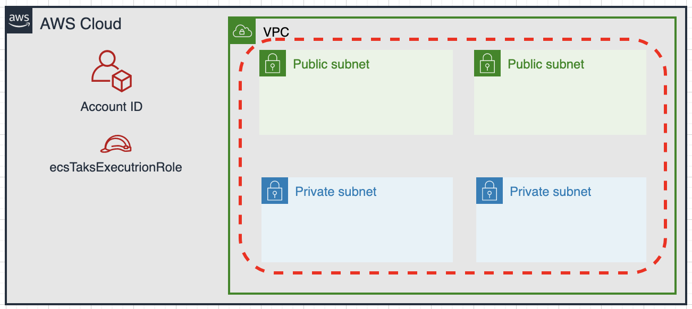

#### cmd (Public Subnet 1つ目)

```CloudShell
aws ec2 create-subnet \
    --vpc-id $VpcId \
    --availability-zone ap-northeast-1a \
    --cidr-block 10.0.0.0/24 \
    --tag-specifications "ResourceType=subnet,Tags=[{Key=Name,Value=ContainerHandsOnPublic}]"
```

#### result (Public Subnet 1つ目)

```CloudShell
{
    "Subnet": {
        "AvailabilityZone": "ap-northeast-1a",
        "AvailabilityZoneId": "apne1-az4",
        "AvailableIpAddressCount": 251,
        "CidrBlock": "10.0.0.0/24",
        "DefaultForAz": false,
        "MapPublicIpOnLaunch": false,
        "State": "available",
        "SubnetId": "subnet-0f66f257f167a1d47",
        "VpcId": "vpc-0d3c1c88db46cfba7",
        "OwnerId": "123456789012",
        "AssignIpv6AddressOnCreation": false,
        "Ipv6CidrBlockAssociationSet": [],
        "Tags": [
            {
                "Key": "Name",
                "Value": "ContainerHandsOnPublic"
            }
        ],
        "SubnetArn": "arn:aws:ec2:ap-northeast-1:123456789012:subnet/subnet-0f66f257f167a1d47",
        "EnableDns64": false,
        "Ipv6Native": false,
        "PrivateDnsNameOptionsOnLaunch": {
            "HostnameType": "ip-name",
            "EnableResourceNameDnsARecord": false,
            "EnableResourceNameDnsAAAARecord": false
        }
    }
}
```

#### cmd (Public Subnet 2つ目)

```CloudShell
aws ec2 create-subnet \
    --vpc-id $VpcId \
    --availability-zone ap-northeast-1c \
    --cidr-block 10.0.1.0/24 \
    --tag-specifications "ResourceType=subnet,Tags=[{Key=Name,Value=ContainerHandsOnPublic}]"
```

#### result (Public Subnet 2つ目)

```CloudShell
{
    "Subnet": {
        "AvailabilityZone": "ap-northeast-1c",
        "AvailabilityZoneId": "apne1-az1",
        "AvailableIpAddressCount": 251,
        "CidrBlock": "10.0.1.0/24",
        "DefaultForAz": false,
        "MapPublicIpOnLaunch": false,
        "State": "available",
        "SubnetId": "subnet-0a1e2afffc8c140d8",
        "VpcId": "vpc-0d3c1c88db46cfba7",
        "OwnerId": "123456789012",
        "AssignIpv6AddressOnCreation": false,
        "Ipv6CidrBlockAssociationSet": [],
        "Tags": [
            {
                "Key": "Name",
                "Value": "ContainerHandsOnPublic"
            }
        ],
        "SubnetArn": "arn:aws:ec2:ap-northeast-1:123456789012:subnet/subnet-0a1e2afffc8c140d8",
        "EnableDns64": false,
        "Ipv6Native": false,
        "PrivateDnsNameOptionsOnLaunch": {
            "HostnameType": "ip-name",
            "EnableResourceNameDnsARecord": false,
            "EnableResourceNameDnsAAAARecord": false
        }
    }
}
```

#### cmd (Private Subnet 1つ目)

```CloudShell
aws ec2 create-subnet \
    --vpc-id $VpcId \
    --availability-zone ap-northeast-1a \
    --cidr-block 10.0.2.0/24 \
    --tag-specifications "ResourceType=subnet,Tags=[{Key=Name,Value=ContainerHandsOnPrivate}]"
```

#### result (Private Subnet 1つ目)

```CloudShell
{
    "Subnet": {
        "AvailabilityZone": "ap-northeast-1a",
        "AvailabilityZoneId": "apne1-az4",
        "AvailableIpAddressCount": 251,
        "CidrBlock": "10.0.2.0/24",
        "DefaultForAz": false,
        "MapPublicIpOnLaunch": false,
        "State": "available",
        "SubnetId": "subnet-049f0119237ff00a0",
        "VpcId": "vpc-0d3c1c88db46cfba7",
        "OwnerId": "123456789012",
        "AssignIpv6AddressOnCreation": false,
        "Ipv6CidrBlockAssociationSet": [],
        "Tags": [
            {
                "Key": "Name",
                "Value": "ContainerHandsOnPrivate"
            }
        ],
        "SubnetArn": "arn:aws:ec2:ap-northeast-1:123456789012:subnet/subnet-049f0119237ff00a0",
        "EnableDns64": false,
        "Ipv6Native": false,
        "PrivateDnsNameOptionsOnLaunch": {
            "HostnameType": "ip-name",
            "EnableResourceNameDnsARecord": false,
            "EnableResourceNameDnsAAAARecord": false
        }
    }
}
```

#### cmd (Private Subnet 2つ目)

```CloudShell
aws ec2 create-subnet \
    --vpc-id $VpcId \
    --availability-zone ap-northeast-1c \
    --cidr-block 10.0.3.0/24 \
    --tag-specifications "ResourceType=subnet,Tags=[{Key=Name,Value=ContainerHandsOnPrivate}]"
```

#### result (Private Subnet 2つ目)

```CloudShell
{
    "Subnet": {
        "AvailabilityZone": "ap-northeast-1c",
        "AvailabilityZoneId": "apne1-az1",
        "AvailableIpAddressCount": 251,
        "CidrBlock": "10.0.3.0/24",
        "DefaultForAz": false,
        "MapPublicIpOnLaunch": false,
        "State": "available",
        "SubnetId": "subnet-0ea89b6bc85e0ec61",
        "VpcId": "vpc-0d3c1c88db46cfba7",
        "OwnerId": "123456789012",
        "AssignIpv6AddressOnCreation": false,
        "Ipv6CidrBlockAssociationSet": [],
        "Tags": [
            {
                "Key": "Name",
                "Value": "ContainerHandsOnPrivate"
            }
        ],
        "SubnetArn": "arn:aws:ec2:ap-northeast-1:123456789012:subnet/subnet-0ea89b6bc85e0ec61",
        "EnableDns64": false,
        "Ipv6Native": false,
        "PrivateDnsNameOptionsOnLaunch": {
            "HostnameType": "ip-name",
            "EnableResourceNameDnsARecord": false,
            "EnableResourceNameDnsAAAARecord": false
        }
    }
}
```

### ■Subnet IDの取得

- IDを取得し、変数に格納・確認を行います

#### cmd

```CloudShell
SubnetId1aPublic=`aws ec2 describe-subnets \
    --filters "Name=tag-key,Values=Name" \
    "Name=tag-value,Values=ContainerHandsOnPublic" \
    "Name=availabilityZone,Values=ap-northeast-1a" \
    --query "Subnets[*].SubnetId" \
    --output text`
```

```CloudShell
SubnetId1cPublic=`aws ec2 describe-subnets \
    --filters "Name=tag-key,Values=Name" \
    "Name=tag-value,Values=ContainerHandsOnPublic" \
    "Name=availabilityZone,Values=ap-northeast-1c" \
    --query "Subnets[*].SubnetId" \
    --output text`
```

```CloudShell
SubnetId1aPrivate=`aws ec2 describe-subnets \
    --filters "Name=tag-key,Values=Name" \
    "Name=tag-value,Values=ContainerHandsOnPrivate" \
    "Name=availabilityZone,Values=ap-northeast-1a" \
    --query "Subnets[*].SubnetId" \
    --output text`
```

```CloudShell
SubnetId1cPrivate=`aws ec2 describe-subnets \
    --filters "Name=tag-key,Values=Name" \
    "Name=tag-value,Values=ContainerHandsOnPrivate" \
    "Name=availabilityZone,Values=ap-northeast-1c" \
    --query "Subnets[*].SubnetId" \
    --output text`
```

```CloudShell
clear; cat << EOF
AccoutID : ${AccoutID}
VpcId : ${VpcId}
SubnetId1aPublic : ${SubnetId1aPublic}
SubnetId1cPublic : ${SubnetId1cPublic}
SubnetId1aPrivate : ${SubnetId1aPrivate}
SubnetId1cPrivate : ${SubnetId1cPrivate}
EOF
```

#### result

```CloudShell
AccoutID : 123456789012
VpcId : vpc-0d3c1c88db46cfba7
SubnetId1aPublic : subnet-0f66f257f167a1d47
SubnetId1cPublic : subnet-0a1e2afffc8c140d8
SubnetId1aPrivate : subnet-049f0119237ff00a0
SubnetId1cPrivate : subnet-0ea89b6bc85e0ec61
```

### ■InternetGatewayの作成

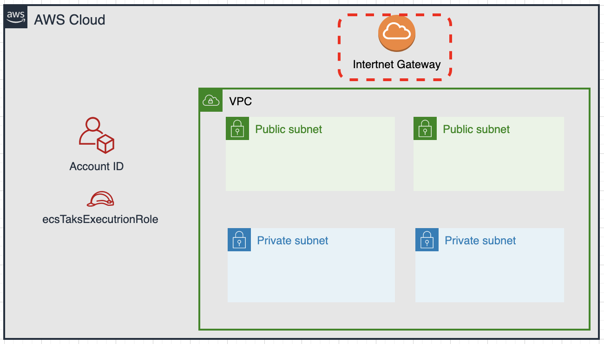

- Internetの出入り口であるInternetGatewayを作成する

#### cmd

```CloudShell
aws ec2 create-internet-gateway \
    --tag-specifications "ResourceType=internet-gateway,Tags=[{Key=Name,Value=ContainerHandsOn}]"
```

#### result

```CloudShell
{
    "InternetGateway": {
        "Attachments": [],
        "InternetGatewayId": "igw-0a511ba68ceb84ed8",
        "OwnerId": "123456789012",
        "Tags": [
            {
                "Key": "Name",
                "Value": "ContainerHandsOn"
            }
        ]
    }
}
```

### ■InternetGateway IDの取得

- IDを取得し、変数に格納・確認を行います

#### cmd

``` CloudShell
InternetGatewayId=`aws ec2 describe-internet-gateways \
    --query 'InternetGateways[*].InternetGatewayId' \
    --filters "Name=tag-key,Values=Name" \
    "Name=tag-value,Values=ContainerHandsOn" \
    --output text`
```

``` CloudShell
clear; cat << EOF
AccoutID : ${AccoutID}
VpcId : ${VpcId}
SubnetId1aPublic : ${SubnetId1aPublic}
SubnetId1cPublic : ${SubnetId1cPublic}
SubnetId1aPrivate : ${SubnetId1aPrivate}
SubnetId1cPrivate : ${SubnetId1cPrivate}
InternetGatewayId : ${InternetGatewayId}
EOF
```

#### result

``` CloudShell
AccoutID : 123456789012
VpcId : vpc-0d3c1c88db46cfba7
SubnetId1aPublic : subnet-0f66f257f167a1d47
SubnetId1cPublic : subnet-0a1e2afffc8c140d8
SubnetId1aPrivate : subnet-049f0119237ff00a0
SubnetId1cPrivate : subnet-0ea89b6bc85e0ec61
InternetGatewayId : igw-0a511ba68ceb84ed8
```

### ■InternetGatewayをVPCにAttach

- VPCとInternetGatewayを紐付けし、Internetとの接続点を作成します

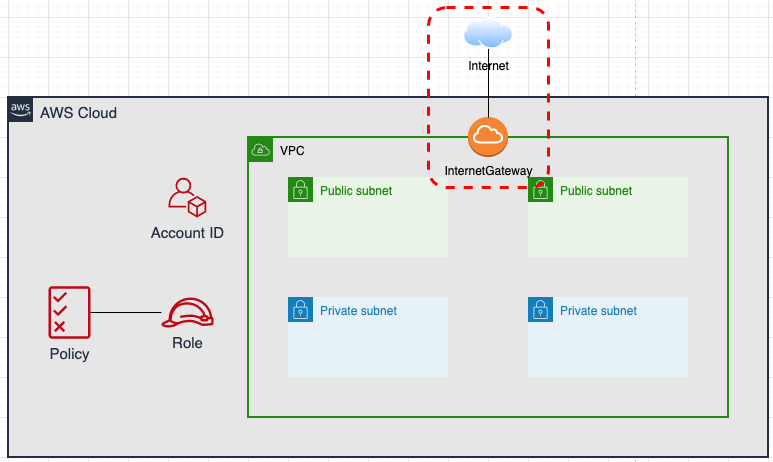

#### cmd

```CloudShell
aws ec2 attach-internet-gateway \
    --internet-gateway-id ${InternetGatewayId} \
    --vpc-id ${VpcId}
```

#### result

```CloudShell
（なし）
```

### ■InternetGatewayをVPCに紐付けされていることを確認

- アタッチされていることを確認

#### cmd

```CloudShell
aws ec2 describe-internet-gateways \
    --internet-gateway-ids ${InternetGatewayId} \
    --query 'InternetGateways[*].Attachments[*].State' \
    --filters "Name=tag-key,Values=Name" \
    "Name=tag-value,Values=ContainerHandsOn" \
    --output text
```

#### result

```CloudShell
available
```

### ■RouteTableの作成

- PublicSubnetとPrivateSubnetのデータの流れを制御するルートテーブルを作成します  
- 現時点ではRouteTableとSubnetの紐付けはないです  

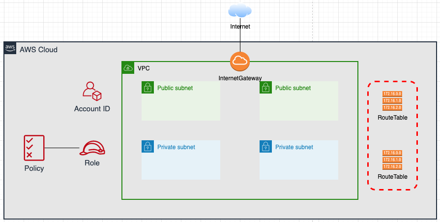

#### cmd (PublicSubnet)

```CloudShell
aws ec2 create-route-table \
  --vpc-id ${VpcId} \
  --tag-specifications "ResourceType=route-table,Tags=[{Key=Name,Value=ContainerHandsOnPublic}]"
```

#### result (PublicSubnet)

```CloudShell
{
    "RouteTable": {
        "Associations": [],
        "PropagatingVgws": [],
        "RouteTableId": "rtb-00cf30796b25b9bc9",
        "Routes": [
            {
                "DestinationCidrBlock": "10.0.0.0/16",
                "GatewayId": "local",
                "Origin": "CreateRouteTable",
                "State": "active"
            }
        ],
        "Tags": [
            {
                "Key": "Name",
                "Value": "ContainerHandsOnPublic"
            }
        ],
        "VpcId": "vpc-0d3c1c88db46cfba7",
        "OwnerId": "123456789012"
    }
}
```

#### cmd (PrivateSubnet)

```CloudShell
aws ec2 create-route-table \
  --vpc-id ${VpcId} \
  --tag-specifications "ResourceType=route-table,Tags=[{Key=Name,Value=ContainerHandsOnPrivate}]"
```

#### result (PrivateSubnet)

```CloudShell
{
    "RouteTable": {
        "Associations": [],
        "PropagatingVgws": [],
        "RouteTableId": "rtb-0afaac377925bca9a",
        "Routes": [
            {
                "DestinationCidrBlock": "10.0.0.0/16",
                "GatewayId": "local",
                "Origin": "CreateRouteTable",
                "State": "active"
            }
        ],
        "Tags": [
            {
                "Key": "Name",
                "Value": "ContainerHandsOnPrivate"
            }
        ],
        "VpcId": "vpc-0d3c1c88db46cfba7",
        "OwnerId": "123456789012"
    }
}
```

### ■RouteTable IDの取得

- IDを取得し、変数に格納・確認を行います

#### cmd

```CloudShell
RouteTableIdPublic=`aws ec2 describe-route-tables \
  --query "RouteTables[*].RouteTableId" \
  --filters "Name=vpc-id,Values=${VpcId}" \
  "Name=tag-key,Values=Name" \
    "Name=tag-value,Values=ContainerHandsOnPublic" \
  --output text`
```

```CloudShell
RouteTableIdPrivate=`aws ec2 describe-route-tables \
  --query "RouteTables[*].RouteTableId" \
  --filters "Name=vpc-id,Values=${VpcId}" \
  "Name=tag-key,Values=Name" \
    "Name=tag-value,Values=ContainerHandsOnPrivate" \
  --output text`
```

```CloudShell
clear; cat << EOF
AccoutID : ${AccoutID}
VpcId : ${VpcId}
SubnetId1aPublic : ${SubnetId1aPublic}
SubnetId1cPublic : ${SubnetId1cPublic}
SubnetId1aPrivate : ${SubnetId1aPrivate}
SubnetId1cPrivate : ${SubnetId1cPrivate}
InternetGatewayId : ${InternetGatewayId}
RouteTableIdPublic : ${RouteTableIdPublic}
RouteTableIdPrivate : ${RouteTableIdPrivate}
EOF
```

#### result

```CloudShell
AccoutID : 123456789012
VpcId : vpc-0d3c1c88db46cfba7
SubnetId1aPublic : subnet-0f66f257f167a1d47
SubnetId1cPublic : subnet-0a1e2afffc8c140d8
SubnetId1aPrivate : subnet-049f0119237ff00a0
SubnetId1cPrivate : subnet-0ea89b6bc85e0ec61
InternetGatewayId : igw-0a511ba68ceb84ed8
RouteTableIdPublic : rtb-00cf30796b25b9bc9
RouteTableIdPrivate : rtb-0afaac377925bca9a
```

### ■RouteTableにSubnetを紐付け

- RouteTableとSubnetを紐付けします

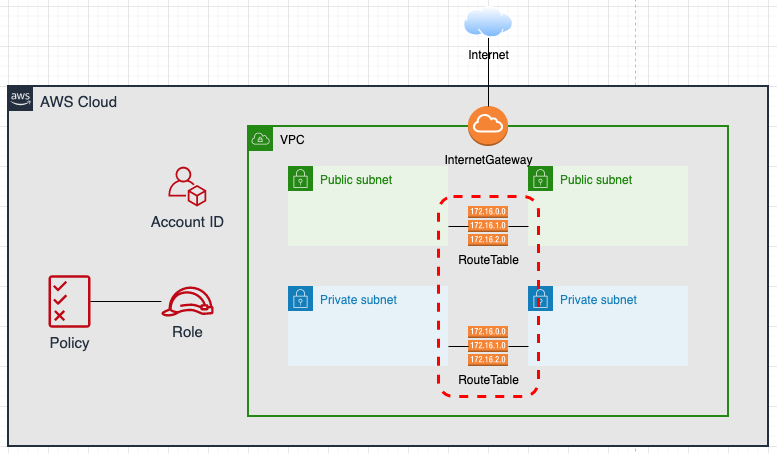

#### cmd (PublicSubnet 1つ目)

```CloudShell
aws ec2 associate-route-table \
  --route-table-id ${RouteTableIdPublic} \
  --subnet-id ${SubnetId1aPublic}
```

#### result (PublicSubnet 1つ目)

```CloudShell
{
    "AssociationId": "rtbassoc-0e98cb5f6c54d5d83",
    "AssociationState": {
        "State": "associated"
    }
}
```

#### cmd (PublicSubnet 2つ目)

```CloudShell
aws ec2 associate-route-table \
  --route-table-id ${RouteTableIdPublic} \
  --subnet-id ${SubnetId1cPublic}
```

#### result (PublicSubnet 2つ目)

```CloudShell
{
    "AssociationId": "rtbassoc-0f3ca785ae8675b6f",
    "AssociationState": {
        "State": "associated"
    }
}
```

#### cmd (PrivateSubnet 1つ目)

```CloudShell
aws ec2 associate-route-table \
  --route-table-id ${RouteTableIdPrivate} \
  --subnet-id ${SubnetId1aPrivate}
```

#### result (PrivateSubnet 1つ目)

```CloudShell
{
    "AssociationId": "rtbassoc-07f8b8f8aa65d0df8",
    "AssociationState": {
        "State": "associated"
    }
}
```

#### cmd (PrivateSubnet 2つ目)

```CloudShell
aws ec2 associate-route-table \
  --route-table-id ${RouteTableIdPrivate} \
  --subnet-id ${SubnetId1cPrivate}
```

#### result (PrivateSubnet 2つ目)

```CloudShell
{
    "AssociationId": "rtbassoc-008c971373c02cf69",
    "AssociationState": {
        "State": "associated"
    }
}
```

### ■RouteTableにInternetGatewayを紐付け

- PublicSubnet用のRouteTableにInternetGatewayを紐付け、Internetに接続できるようにします

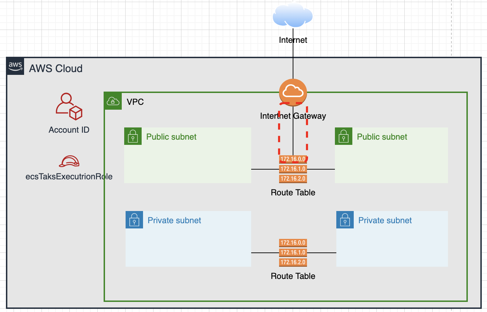

#### cmd

```CloudShell
aws ec2 create-route \
  --route-table-id ${RouteTableIdPublic} \
  --destination-cidr-block "0.0.0.0/0" \
  --gateway-id ${InternetGatewayId}
```

#### result

```CloudShell
{
    "Return": true
}
```

### ■PublicSubnet用のSecurityGroup作成

- PublicSubnet用のSecurityGroup作成

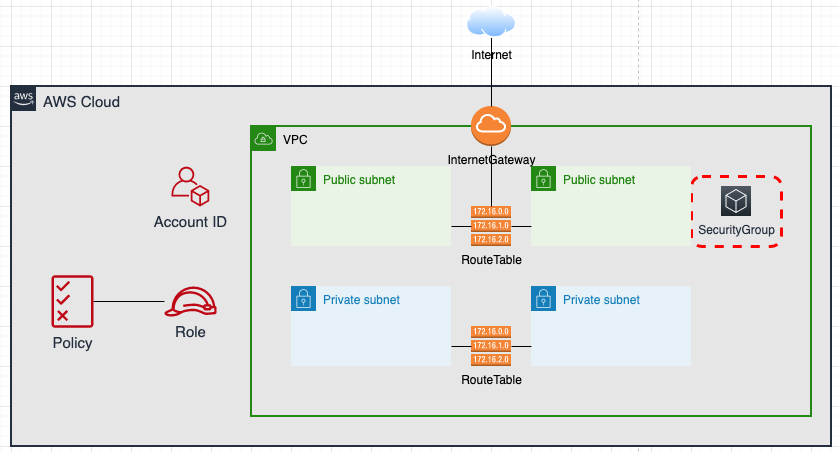

#### cmd

```CloudShell
aws ec2 create-security-group \
  --group-name PublicSecurityGroup \
  --description "Public Security Group" \
  --vpc-id ${VpcId} \
  --tag-specifications "ResourceType=security-group,Tags=[{Key=Name,Value=ContainerHandsOn-PublicSecurityGroup}]"
```

#### result

```CloudShell
{
    "GroupId": "sg-01cc901415c240504",
    "Tags": [
        {
            "Key": "Name",
            "Value": "ContainerHandsOn-PublicSecurityGroup"
        }
    ]
}
```

### ■PublicSunetのSecurityGroupsIdの取得

- IDを取得し、変数に格納・確認を行います

#### cmd

```
PublicSecurityGroupsId=`aws ec2 describe-security-groups \
  --query 'SecurityGroups[*].GroupId' \
  --filters "Name=tag-key,Values=Name" \
    "Name=tag-value,Values=ContainerHandsOn-PublicSecurityGroup" \
    --output text`
```

```CloudShell
clear; cat << EOF
AccoutID : ${AccoutID}
VpcId : ${VpcId}
SubnetId1aPublic : ${SubnetId1aPublic}
SubnetId1cPublic : ${SubnetId1cPublic}
SubnetId1aPrivate : ${SubnetId1aPrivate}
SubnetId1cPrivate : ${SubnetId1cPrivate}
InternetGatewayId : ${InternetGatewayId}
RouteTableIdPublic : ${RouteTableIdPublic}
RouteTableIdPrivate : ${RouteTableIdPrivate}
PublicSecurityGroupsId : ${PublicSecurityGroupsId}
EOF
```

#### result

```CloudShell
AccoutID : 123456789012
VpcId : vpc-0d3c1c88db46cfba7
SubnetId1aPublic : subnet-0f66f257f167a1d47
SubnetId1cPublic : subnet-0a1e2afffc8c140d8
SubnetId1aPrivate : subnet-049f0119237ff00a0
SubnetId1cPrivate : subnet-0ea89b6bc85e0ec61
InternetGatewayId : igw-0a511ba68ceb84ed8
RouteTableIdPublic : rtb-00cf30796b25b9bc9
RouteTableIdPrivate : rtb-0afaac377925bca9a
PublicSecurityGroupsId : sg-01cc901415c240504
```

### ■PrivateSubnet用のSecurityGroup作成

- PrivateSubnet用のSecurityGroup作成

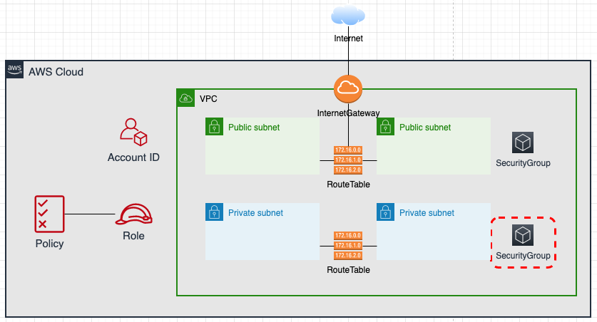

#### cmd

```CloudShell
aws ec2 create-security-group \
  --group-name PrivateSecurityGroup \
  --description "Private Security Group" \
  --vpc-id ${VpcId} \
  --tag-specifications "ResourceType=security-group,Tags=[{Key=Name,Value=ContainerHandsOn-PrivateSecurityGroup}]"
```

#### result

```CloudShell
{
    "GroupId": "sg-040aff209e1fe59cc",
    "Tags": [
        {
            "Key": "Name",
            "Value": "ContainerHandsOn-PrivateSecurityGroup"
        }
    ]
}
```

### ■PublicSunetのSecurityGroupsIdの取得

- IDを取得し、変数に格納・確認を行います

```CloudShell
PrivateSecurityGroupsId=`aws ec2 describe-security-groups \
  --query 'SecurityGroups[*].GroupId' \
  --filters "Name=tag-key,Values=Name" \
    "Name=tag-value,Values=ContainerHandsOn-PrivateSecurityGroup" \
    --output text`
```

```CloudShell
clear; cat << EOF
AccoutID : ${AccoutID}
VpcId : ${VpcId}
SubnetId1aPublic : ${SubnetId1aPublic}
SubnetId1cPublic : ${SubnetId1cPublic}
SubnetId1aPrivate : ${SubnetId1aPrivate}
SubnetId1cPrivate : ${SubnetId1cPrivate}
InternetGatewayId : ${InternetGatewayId}
RouteTableIdPublic : ${RouteTableIdPublic}
RouteTableIdPrivate : ${RouteTableIdPrivate}
PublicSecurityGroupsId : ${PublicSecurityGroupsId}
PrivateSecurityGroupsId : ${PrivateSecurityGroupsId}
EOF
```

#### result

```CloudShell
AccoutID : 123456789012
VpcId : vpc-0d3c1c88db46cfba7
SubnetId1aPublic : subnet-0f66f257f167a1d47
SubnetId1cPublic : subnet-0a1e2afffc8c140d8
SubnetId1aPrivate : subnet-049f0119237ff00a0
SubnetId1cPrivate : subnet-0ea89b6bc85e0ec61
InternetGatewayId : igw-0a511ba68ceb84ed8
RouteTableIdPublic : rtb-00cf30796b25b9bc9
RouteTableIdPrivate : rtb-0afaac377925bca9a
PublicSecurityGroupsId : sg-01cc901415c240504
PrivateSecurityGroupsId : sg-040aff209e1fe59cc
```

### ■PublicSubnetのインバウンドルールを追加

- InternetからのHTTP（プロトコルtcp ポート80）でのアクセスを許可します

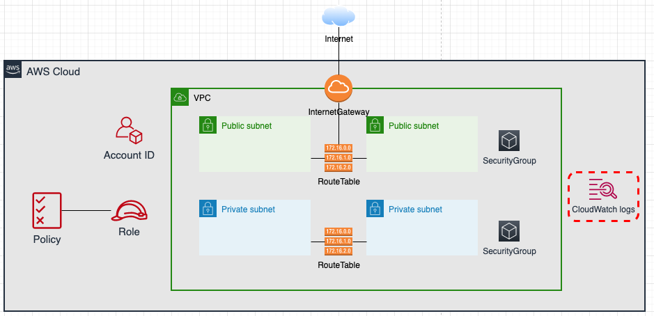

#### cmd

```CloudShell
aws ec2 authorize-security-group-ingress \
    --group-id ${PublicSecurityGroupsId} \
    --protocol tcp \
    --port 80 \
    --cidr 0.0.0.0/0
```

#### result

```CloudShell
{
    "Return": true,
    "SecurityGroupRules": [
        {
            "SecurityGroupRuleId": "sgr-011c9bf434c9439a0",
            "GroupId": "sg-01cc901415c240504",
            "GroupOwnerId": "123456789012",
            "IsEgress": false,
            "IpProtocol": "tcp",
            "FromPort": 80,
            "ToPort": 80,
            "CidrIpv4": "0.0.0.0/0"
        }
    ]
}
```

### ■PrivateSubnetのインバウンドルールを追加１

- PublicSubnet経由でのHTTPでのアクセスを許可します

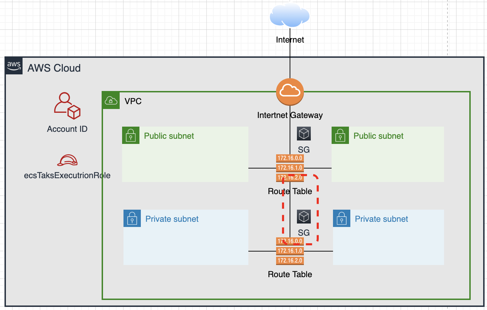

#### cmd

```CloudShell
aws ec2 authorize-security-group-ingress \
    --group-id ${PrivateSecurityGroupsId} \
    --protocol tcp \
    --port 80 \
    --source-group ${PublicSecurityGroupsId}
```

#### result

```CloudShell
{
    "Return": true,
    "SecurityGroupRules": [
        {
            "SecurityGroupRuleId": "sgr-0eca9b6518889b4ca",
            "GroupId": "sg-040aff209e1fe59cc",
            "GroupOwnerId": "123456789012",
            "IsEgress": false,
            "IpProtocol": "tcp",
            "FromPort": 80,
            "ToPort": 80,
            "ReferencedGroupInfo": {
                "GroupId": "sg-01cc901415c240504"
            }
        }
    ]
}
```

### ■PrivateSubnetのインバウンドルールを追加２

- 後で設定するVPCエンドポイントの為にHTTPSアクセスを許可します

#### cmd

```CloudShell
aws ec2 authorize-security-group-ingress \
    --group-id ${PrivateSecurityGroupsId} \
    --protocol tcp \
    --port 443 \
    --cidr 0.0.0.0/0
```

#### result

```CloudShell
{
    "Return": true,
    "SecurityGroupRules": [
        {
            "SecurityGroupRuleId": "sgr-0d637ce636f2f14d9",
            "GroupId": "sg-040aff209e1fe59cc",
            "GroupOwnerId": "123456789012",
            "IsEgress": false,
            "IpProtocol": "tcp",
            "FromPort": 443,
            "ToPort": 443,
            "CidrIpv4": "0.0.0.0/0"
        }
    ]
}
```

### ■CloudWatch LogGroupの作成

- ecsTaskExecutionRoleがLogGroupを作成できないので、手作成します。

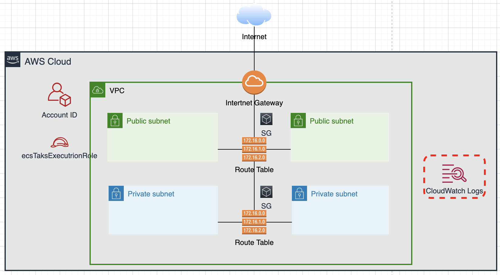

#### cmd

```CloudShell
aws logs create-log-group --log-group-name awslogs-container-hands-on
```

#### result

```CloudShell
（なし）
```

### ■CloudWatch LogGroupの作成確認

#### cmd

```CloudShell
aws logs describe-log-groups --log-group-name-prefix awslogs-container-hands-on
```

#### result

```CloudShell
{
    "logGroups": [
        {
            "logGroupName": "awslogs-container-hands-on",
            "creationTime": 1662547861755,
            "metricFilterCount": 0,
            "arn": "arn:aws:logs:ap-northeast-1:378647896848:log-group:awslogs-container-hands-on:*",
            "storedBytes": 0
        }
    ]
}
```

## Cloud9作成

Duration: 0:10:00

### ■Cloud9の作成

- コードを記述、実行、デバッグできるクラウドベースの統合開発環境 (IDE)であるCloud9を作成

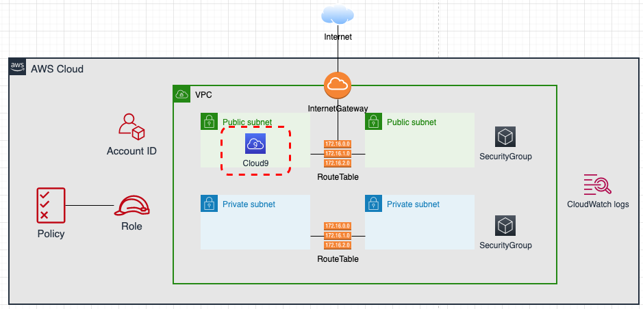

#### cmd

```CloudShell
aws cloud9 create-environment-ec2 \
  --name ContainerHandsOn \
  --description "ContainerHandsOn" \
  --instance-type t3.small  \
  --subnet-id ${SubnetId1aPublic}  \
  --automatic-stop-time-minutes 60 
```

#### result

```CloudShell
{
    "environmentId": "aa2999a731eb4178aed99069f1b683aa"
}
```

### ■Cloud9環境Roleを作成

- Cloud9上でAWSリソースを作成するため、Roleを作成します

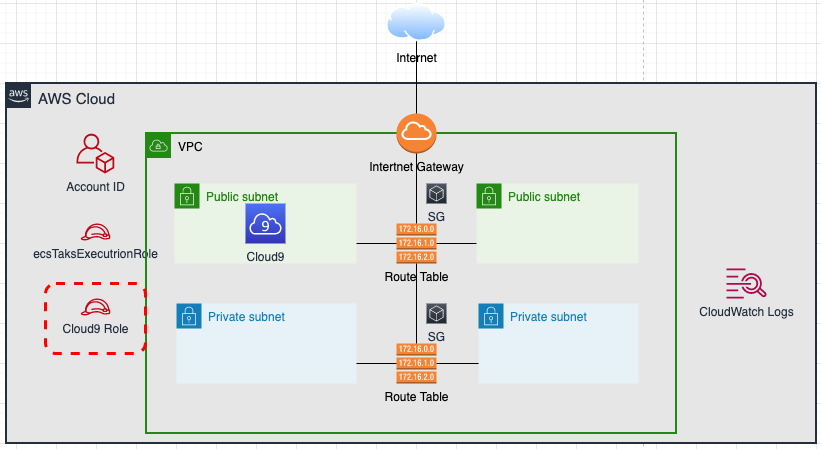

#### cmd

```CloudShell
cat << EOF > assume-role-policy-document.json
{
  "Version": "2012-10-17",
  "Statement": [
    {
      "Sid": "",
      "Effect": "Allow",
      "Principal": {
        "Service": "ec2.amazonaws.com"
      },
      "Action": "sts:AssumeRole"
    }
  ]
}
EOF
```

```Cloud9
aws iam create-role \
  --role-name ContainerHandsOnForCloud9 \
  --assume-role-policy-document file://assume-role-policy-document.json
```

### ■Cloud9環境RoleにPolicy追加

#### cmd

```CloudShell
aws iam attach-role-policy \
  --role-name ContainerHandsOnForCloud9 \
  --policy-arn arn:aws:iam::aws:policy/AdministratorAccess
```

#### result

```CloudShell
（なし）
```

#### cmd

```CloudShell
aws iam list-attached-role-policies \
  --role-name ContainerHandsOnForCloud9
```

#### result

```CloudShell
{
    "AttachedPolicies": [
        {
            "PolicyName": "AdministratorAccess",
            "PolicyArn": "arn:aws:iam::aws:policy/AdministratorAccess"
        }
    ]
}
```

### ■instance-profileを作成

- Cloud9を稼働しているEC2にRoleを付与するため、instance-profileを作成

#### cmd

```CloudShell
aws iam create-instance-profile \
    --instance-profile-name ContainerHandsOnForCloud9
```

#### result

```CloudShell
{
    "InstanceProfile": {
        "Path": "/",
        "InstanceProfileName": "ContainerHandsOnForCloud9",
        "InstanceProfileId": "AIPASHENIAIFABKPZHZ6B",
        "Arn": "arn:aws:iam::123456789012:instance-profile/ContainerHandsOnForCloud9",
        "CreateDate": "2022-09-11T20:08:39+00:00",
        "Roles": []
    }
}
```

### ■instance-profileにRole付与

#### cmd

```CloudShell
aws iam add-role-to-instance-profile \
    --role-name ContainerHandsOnForCloud9 \
    --instance-profile-name ContainerHandsOnForCloud9
```

#### result

```CloudShell
（なし）
```

### ■Cloud9のInstanceIdの取得

- IDを取得し、変数に格納・確認を行います

#### cmd

```CloudShell
InstanceId=`aws ec2 describe-instances \
    --query "Reservations[*].Instances[*].InstanceId" \
    --filters "Name=vpc-id,Values=${VpcId}" \
    --output text`
```

```CloudShell
clear; cat << EOF
AccoutID : ${AccoutID}
VpcId : ${VpcId}
SubnetId1aPublic : ${SubnetId1aPublic}
SubnetId1cPublic : ${SubnetId1cPublic}
SubnetId1aPrivate : ${SubnetId1aPrivate}
SubnetId1cPrivate : ${SubnetId1cPrivate}
InternetGatewayId : ${InternetGatewayId}
RouteTableIdPublic : ${RouteTableIdPublic}
RouteTableIdPrivate : ${RouteTableIdPrivate}
PublicSecurityGroupsId : ${PublicSecurityGroupsId}
PrivateSecurityGroupsId : ${PrivateSecurityGroupsId}
InstanceId : ${InstanceId}
EOF
```

#### result

```CloudShell
AccoutID : 152767562250
VpcId : vpc-0eb621c4712ee0898
SubnetId1aPublic : subnet-035db89cb1df815f1
SubnetId1cPublic : subnet-04872b3467ca94ce2
SubnetId1aPrivate : subnet-00d678e2982d487d0
SubnetId1cPrivate : subnet-08bfff9af19697ab7
InternetGatewayId : igw-0d4373c922961e230
RouteTableIdPublic : rtb-0670248bec99ef90c
RouteTableIdPrivate : rtb-004eba1faed81d581
PublicSecurityGroupsId : sg-06931dc309a0879b2
PrivateSecurityGroupsId : sg-05eb336035d38f645
InstanceId : i-04c7c620fef60c9cb
```

### ■Cloud9環境RoleをAttach

#### cmd

```CloudShell
aws ec2 associate-iam-instance-profile \
    --instance-id ${InstanceId} \
    --iam-instance-profile Name=ContainerHandsOnForCloud9
```

#### result

```CloudShell
{
    "IamInstanceProfileAssociation": {
        "AssociationId": "iip-assoc-060b8208bb529670a",
        "InstanceId": "i-033ba336e274d34f3",
        "IamInstanceProfile": {
            "Arn": "arn:aws:iam::123456789012:instance-profile/ContainerHandsOnForCloud9",
            "Id": "AIPASHENIAIFABKPZHZ6B"
        },
        "State": "associating"
    }
}
```

### ■環境変数をメモ

- Cloud9で使うため、取得した変数をエディターに残して下さい

#### cmd

```CloudShell
clear; cat << EOF
export AccoutID="${AccoutID}"
export VpcId="${VpcId}"
export SubnetId1aPublic="${SubnetId1aPublic}"
export SubnetId1cPublic="${SubnetId1cPublic}"
export SubnetId1aPrivate="${SubnetId1aPrivate}"
export SubnetId1cPrivate="${SubnetId1cPrivate}"
export InternetGatewayId="${InternetGatewayId}"
export RouteTableIdPublic="${RouteTableIdPublic}"
export RouteTableIdPrivate="${RouteTableIdPrivate}"
export PublicSecurityGroupsId="${PublicSecurityGroupsId}"
export PrivateSecurityGroupsId="${PrivateSecurityGroupsId}"
export InstanceId="${InstanceId}"
EOF
```

#### result

```CloudShell
export AccoutID="123456789012"
export VpcId="vpc-0d3c1c88db46cfba7"
export SubnetId1aPublic="subnet-0f66f257f167a1d47"
export SubnetId1cPublic="subnet-0a1e2afffc8c140d8"
export SubnetId1aPrivate="subnet-049f0119237ff00a0"
export SubnetId1cPrivate="subnet-0ea89b6bc85e0ec61"
export InternetGatewayId="igw-0a511ba68ceb84ed8"
export RouteTableIdPublic="rtb-00cf30796b25b9bc9"
export RouteTableIdPrivate="rtb-0afaac377925bca9a"
export PublicSecurityGroupsId="sg-01cc901415c240504"
export PrivateSecurityGroupsId="sg-040aff209e1fe59cc"
export InstanceId="i-04c7c620fef60c9cb"
```

### ■AWS コンソールでCloud9を起動

- 上部の検索バーで`Cloud9`と検索
- `AWS Cloud9 > Your environments`に`ContainerHandsOn`が作成されているので`Open IDE`ボタン押下
- Cloud9の画面が表示される

- 今後のcmdはCloud9のbashと書かれたTABの下に貼り付けていきます
<a href="./image/img4-1.png" target="_blank" rel="noopener noreferrer">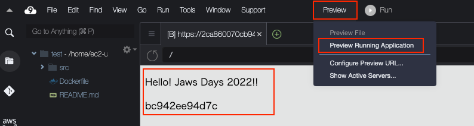</a>

- 間違えてTABを閉じてしまった場合には以下で新しくTABを開いてください
<a href="./image/img4-2.png" target="_blank" rel="noopener noreferrer">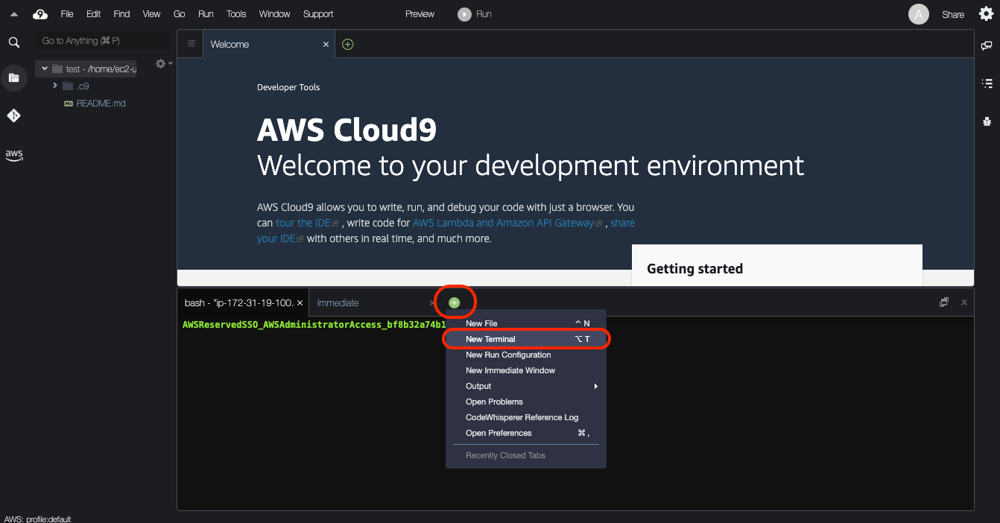</a>

### ■Cloud9でCredentialsを切り替え

- 画面右上の歯車マークをクリックし、Preferencesを開く
- Preferences > AWS Settings > Credentials と画面遷移をする
- Credentialsをオフにする

<a href="./image/img4-3.png" target="_blank" rel="noopener noreferrer">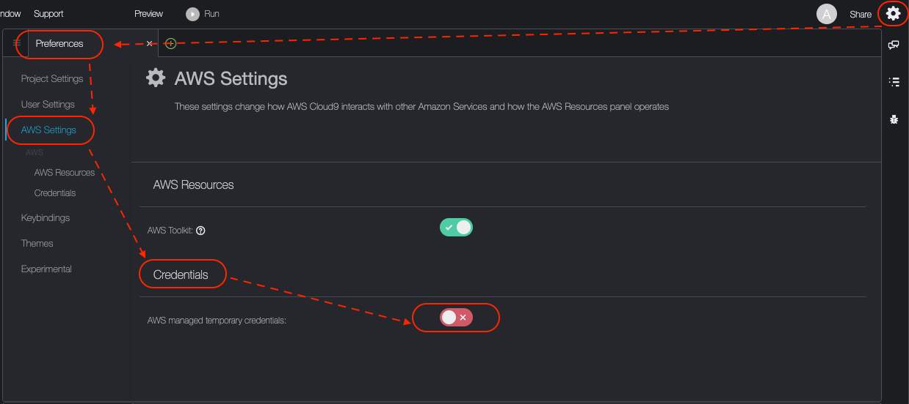</a>

## ECR作成

Duration: 0:05:00

### ■環境変数を貼り付け

- CloudShellで取得した環境変数をCloud9へ移設

#### cmd (以下はサンプルです、エディターに退避した結果を利用ください)

```Cloud9
export AccoutID="123456789012"
export VpcId="vpc-0d3c1c88db46cfba7"
export SubnetId1aPublic="subnet-0f66f257f167a1d47"
export SubnetId1cPublic="subnet-0a1e2afffc8c140d8"
export SubnetId1aPrivate="subnet-049f0119237ff00a0"
export SubnetId1cPrivate="subnet-0ea89b6bc85e0ec61"
export InternetGatewayId="igw-0a511ba68ceb84ed8"
export RouteTableIdPublic="rtb-00cf30796b25b9bc9"
export RouteTableIdPrivate="rtb-0afaac377925bca9a"
export PublicSecurityGroupsId="sg-01cc901415c240504"
export PrivateSecurityGroupsId="sg-040aff209e1fe59cc"
export InstanceId="i-04c7c620fef60c9cb"
```

``` Cloud9
clear; cat << EOF
AccoutID : ${AccoutID}
VpcId : ${VpcId}
SubnetId1aPublic : ${SubnetId1aPublic}
SubnetId1cPublic : ${SubnetId1cPublic}
SubnetId1aPrivate : ${SubnetId1aPrivate}
SubnetId1cPrivate : ${SubnetId1cPrivate}
InternetGatewayId : ${InternetGatewayId}
RouteTableIdPublic : ${RouteTableIdPublic}
RouteTableIdPrivate : ${RouteTableIdPrivate}
PublicSecurityGroupsId : ${PublicSecurityGroupsId}
PrivateSecurityGroupsId : ${PrivateSecurityGroupsId}
InstanceId : ${InstanceId}
EOF
```

#### result

``` Cloud9
AccoutID : 123456789012
VpcId : vpc-0d3c1c88db46cfba7
SubnetId1aPublic : subnet-0f66f257f167a1d47
SubnetId1cPublic : subnet-0a1e2afffc8c140d8
SubnetId1aPrivate : subnet-049f0119237ff00a0
SubnetId1cPrivate : subnet-0ea89b6bc85e0ec61
InternetGatewayId : igw-0a511ba68ceb84ed8
RouteTableIdPublic : rtb-00cf30796b25b9bc9
RouteTableIdPrivate : rtb-0afaac377925bca9a
PublicSecurityGroupsId : sg-01cc901415c240504
PrivateSecurityGroupsId : sg-040aff209e1fe59cc
```

### ■AWS CLI・gitの環境設定実施

#### cmd

```Cloud9
export AWS_DEFAULT_REGION=ap-northeast-1
export AWS_DEFAULT_OUTPUT=json
```

#### result

```Cloud9
（なし）
```

### ■ECRの作成

- コンテナイメージのレジストリであるECRを作成

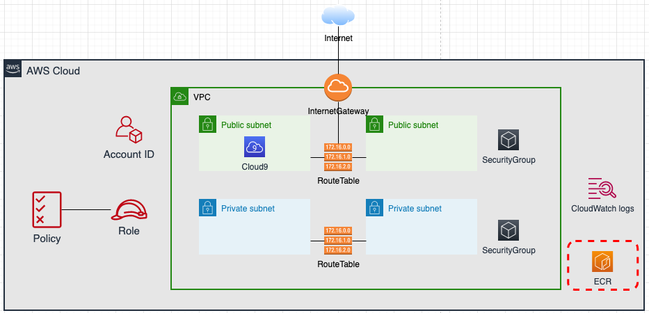

#### cmd

```Cloud9
aws ecr create-repository \
    --repository-name jaws-days-2022/container-hands-on \
    --tags "Key=Name,Value=ContainerHandsOn"
```

#### result

```Cloud9
{
    "repository": {
        "repositoryArn": "arn:aws:ecr:ap-northeast-1:123456789012:repository/jaws-days-2022/container-hands-on",
        "registryId": "123456789012",
        "repositoryName": "jaws-days-2022/container-hands-on",
        "repositoryUri": "123456789012.dkr.ecr.ap-northeast-1.amazonaws.com/jaws-days-2022/container-hands-on",
        "createdAt": "2022-09-06T13:21:42+00:00",
        "imageTagMutability": "MUTABLE",
        "imageScanningConfiguration": {
            "scanOnPush": false
        },
        "encryptionConfiguration": {
            "encryptionType": "AES256"
        }
    }
}
```

## Docker Image作成

Duration: 0:10:00

### ■Cloud9上にdockerセットアップされていることを確認

#### cmd

```Cloud9
docker -v
```

#### result

```Cloud9
Docker version 20.10.13, build a224086
```

### ■Cloud9上にDockerfileを作成

#### cmd

```Cloud9
cat << EOF > Dockerfile
FROM php:7.4.0-apache
COPY src/ /var/www/html/
EOF
```

```Cloud9
mkdir src
```

```Cloud9
cat << EOF > ./src/index.php
<!DOCTYPE html>
<html lang="ja">
  <head>
    <title>Hello! Jaws Days 2022!!</title>
  </head>
  <body>
    <p>Hello! Jaws Days 2022!!</p>
    <?php echo gethostname(); ?>
  </body>
</html>
EOF
```

```Cloud9
ls -l ./Dockerfile ./src/index.php
```

#### result

```Cloud9
-rw-rw-r-- 1 ec2-user ec2-user  47 Sep  6 13:26 ./Dockerfile
-rw-rw-r-- 1 ec2-user ec2-user 190 Sep  6 13:26 ./src/index.php
```

### ■Cloud9上でDocker イメージを構築

#### cmd

```Cloud9
docker build \
  -t jaws-days-2022/container-hands-on .
```

#### result

```Cloud9
Sending build context to Docker daemon  9.823MB
Step 1/2 : FROM php:7.4.0-apache
7.4.0-apache: Pulling from library/php
000eee12ec04: Pull complete 
8ae4f9fcfeea: Pull complete 
60f22fbbd07a: Pull complete 
ccc7a63ad75f: Pull complete 
a2427b8dd6e7: Pull complete 
91cac3b30184: Pull complete 
d6e40015fc10: Pull complete 
9858aa646efe: Pull complete 
7940985f7eb2: Pull complete 
b23f72eebcfb: Pull complete 
75bb7b8d192c: Pull complete 
7edf943992b0: Pull complete 
c8bf9d9d0e11: Pull complete 
Digest: sha256:686af696a87d3836c694380588368ff4e7ad3e30f1faef387c545890b340edee
Status: Downloaded newer image for php:7.4.0-apache
 ---> bf262c8621c1
Step 2/2 : COPY src/ /var/www/html/
 ---> afc680b711d3
Successfully built afc680b711d3
Successfully tagged jaws-days-2022/container-hands-on:latest
```

### ■Cloud9上でDocker イメージを構築されたことを確認

#### cmd

```cloud9
docker images \
  --filter reference= jaws-days-2022/container-hands-on:latest
```

#### result

```cloud9
REPOSITORY                          TAG       IMAGE ID       CREATED          SIZE
jaws-days-2022/container-hands-on   latest    98c14fa37bab   10 seconds ago   414MB
```

### ■Cloud9上でDocker イメージを起動

#### cmd

```Cloud9
docker run \
  --name container-hands-on \
  -d -p 8080:80 jaws-days-2022/container-hands-on:latest
```

#### result

```Cloud9
dcaf3423f6abeea3a67bab0c01a33e7b9d2c97131c8b304900f0455ee73da7b7
```

#### 画面


- Cloud9のヘッダ部分の`Preview`-> `Preview Runnnig Application`のボタン押下  
- `Hello! Jaws Days 2022!!`と記載された画面が表示されること  

Positive
: 作業ミス等によりコンテナを止めたい場合には以下を実行ください

```Cloud9
docker stop $(docker ps -q)
docker rm $(docker ps -q -a)
```

### ■Docker ImageにTag付けを行う

#### cmd

```Cloud9
docker tag \
  jaws-days-2022/container-hands-on:latest `echo ${AccoutID}`.dkr.ecr.ap-northeast-1.amazonaws.com/jaws-days-2022/container-hands-on:latest
```

#### result

```Cloud9
（なし）
```

### ■Docker ImageにTag付けの確認

#### cmd

```Cloud9
docker images \
  --filter reference=`echo ${AccoutID}`.dkr.ecr.ap-northeast-1.amazonaws.com/jaws-days-2022/container-hands-on:latest

```

#### result

```Cloud9
REPOSITORY                                                                            TAG       IMAGE ID       CREATED          SIZE
123456789012.dkr.ecr.ap-northeast-1.amazonaws.com/jaws-days-2022/container-hands-on   latest    98c14fa37bab   10 minutes ago   414MB
```

### ■認証トークンを取得し、レジストリに対して Docker クライアントを認証します

#### cmd

```Cloud9
aws ecr get-login-password \
  --region ap-northeast-1 | \
  docker login \
  --username AWS \
  --password-stdin `echo ${AccoutID}`.dkr.ecr.ap-northeast-1.amazonaws.com
```

#### result

```Cloud9
WARNING! Your password will be stored unencrypted in /home/ec2-user/.docker/config.json.
Configure a credential helper to remove this warning. See
https://docs.docker.com/engine/reference/commandline/login/#credentials-store

Login Succeeded
```

### ■Docker ImageをECRにPush

- Cloud9で作成したイメージをECRに格納します

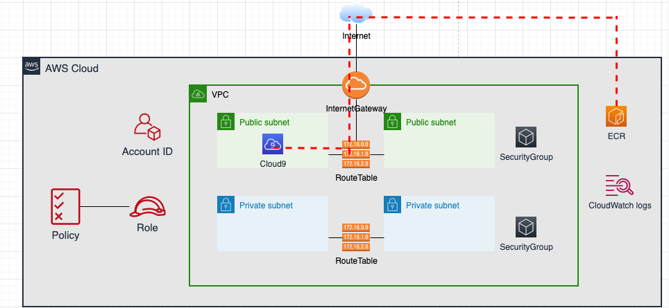

#### cmd

```Cloud9
docker push \
  `echo ${AccoutID}`.dkr.ecr.ap-northeast-1.amazonaws.com/jaws-days-2022/container-hands-on:latest
```

#### result

```Cloud9
The push refers to repository [123456789012.dkr.ecr.ap-northeast-1.amazonaws.com/jaws-days-2022/container-hands-on]
9f8ad0ecf420: Pushed 
536365481ed8: Pushed 
4b3693c51878: Pushed 
677c3ce9f0b4: Pushed 
c08f4d9c281b: Pushed 
ed13170590f7: Pushed 
37cbdda31557: Pushed 
9691e5d7a4c7: Pushed 
6a4d393f0795: Pushed 
e38834ac7561: Pushed 
ec64f555d498: Pushed 
840f3f414cf6: Pushed 
17fce12edef0: Pushed 
831c5620387f: Pushed 
latest: digest: sha256:1fb5a3ac5ea1e7d60c24f371564a8c2c7bbc8072be0e80a3c53c30e1cae3ffd3 size: 3242
```

## VPCエンドポイント作成

Duration: 0:05:00

FargateをPrivateSubnetで稼働させるため、以下VPCエンドポイントを準備します  
ECRに格納されたイメージを取得するためには通常Internet経由となります、しかし今回はFargateはPrivateSubnetというInternetに接続されていないので、Internet経由ではECRにアクセスできません  
これを解決するためにVPCエンドポイントというInternetに繋がらないAWSのネットワーク経由でECRにアクセスを行います。

- com.amazonaws.ap-northeast-1.s3
- com.amazonaws.ap-northeast-1.ecr.dkr
- com.amazonaws.ap-northeast-1.ecr.api
- com.amazonaws.ap-northeast-1.logs

### ■com.amazonaws.ap-northeast-1.s3

- S3はGateway型のエンドポイントを利用します

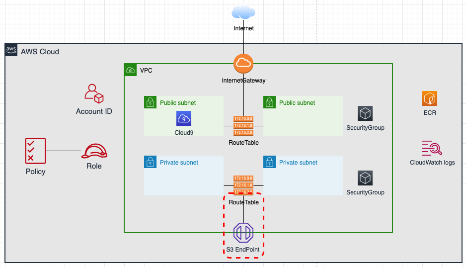

#### cmd

```Cloud9
aws ec2 create-vpc-endpoint \
    --vpc-id ${VpcId} \
    --vpc-endpoint-type Gateway \
    --service-name com.amazonaws.ap-northeast-1.s3 \
    --route-table-ids ${RouteTableIdPrivate} \
    --tag-specifications "ResourceType=vpc-endpoint,Tags=[{Key=Name,Value=ContainerHandsOn}]"
```

#### result

```Cloud9
{
    "VpcEndpoint": {
        "PolicyDocument": "{\"Version\":\"2008-10-17\",\"Statement\":[{\"Effect\":\"Allow\",\"Principal\":\"*\",\"Action\":\"*\",\"Resource\":\"*\"}]}", 
        "VpcId": "vpc-0d3c1c88db46cfba7", 
        "Tags": [
            {
                "Value": "ContainerHands", 
                "Key": "Name"
            }
        ], 
        "NetworkInterfaceIds": [], 
        "SubnetIds": [], 
        "RequesterManaged": false, 
        "PrivateDnsEnabled": false, 
        "State": "available", 
        "ServiceName": "com.amazonaws.ap-northeast-1.s3", 
        "RouteTableIds": [
            "rtb-0afaac377925bca9a"
        ], 
        "Groups": [], 
        "OwnerId": "123456789012", 
        "VpcEndpointId": "vpce-035934e1a19b46f78", 
        "VpcEndpointType": "Gateway", 
        "CreationTimestamp": "2022-09-06T14:14:54.000Z", 
        "DnsEntries": []
    }
}
```

### ■com.amazonaws.ap-northeast-1.ecr.dkr

- ECRはInterface型のエンドポイントを利用します

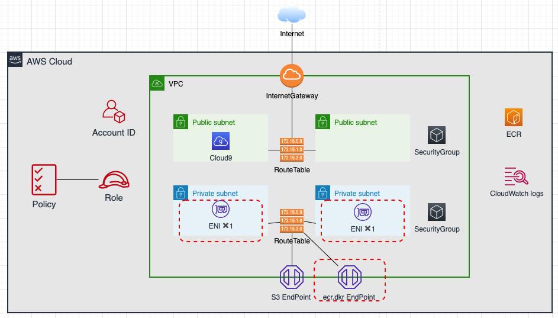

#### cmd

```Cloud9
aws ec2 create-vpc-endpoint \
    --vpc-id ${VpcId} \
    --vpc-endpoint-type Interface \
    --service-name com.amazonaws.ap-northeast-1.ecr.dkr \
    --subnet-ids ${SubnetId1aPrivate} ${SubnetId1cPrivate} \
    --security-group-id ${PrivateSecurityGroupsId} \
    --tag-specifications "ResourceType=vpc-endpoint,Tags=[{Key=Name,Value=ContainerHandsOn}]"
```

#### result

```Cloud9
{
    "VpcEndpoint": {
        "VpcId": "vpc-0d3c1c88db46cfba7", 
        "Tags": [
            {
                "Value": "ContainerHands", 
                "Key": "Name"
            }
        ], 
        "NetworkInterfaceIds": [
            "eni-09e0a49241653c549", 
            "eni-05e27340a7008c6c5"
        ], 
        "SubnetIds": [
            "subnet-0ea89b6bc85e0ec61", 
            "subnet-049f0119237ff00a0"
        ], 
        "RequesterManaged": false, 
        "PrivateDnsEnabled": true, 
        "State": "pending", 
        "ServiceName": "com.amazonaws.ap-northeast-1.ecr.dkr", 
        "RouteTableIds": [], 
        "Groups": [
            {
                "GroupName": "PrivateSecurityGroup", 
                "GroupId": "sg-040aff209e1fe59cc"
            }
        ], 
        "OwnerId": "123456789012", 
        "VpcEndpointId": "vpce-0dceb08e8bffc9a0c", 
        "VpcEndpointType": "Interface", 
        "CreationTimestamp": "2022-09-06T14:15:53.158Z", 
        "DnsEntries": [
            {
                "HostedZoneId": "Z2E726K9Y6RL4W", 
                "DnsName": "vpce-0dceb08e8bffc9a0c-nuehayud.dkr.ecr.ap-northeast-1.vpce.amazonaws.com"
            }, 
            {
                "HostedZoneId": "Z2E726K9Y6RL4W", 
                "DnsName": "vpce-0dceb08e8bffc9a0c-nuehayud-ap-northeast-1a.dkr.ecr.ap-northeast-1.vpce.amazonaws.com"
            }, 
            {
                "HostedZoneId": "Z2E726K9Y6RL4W", 
                "DnsName": "vpce-0dceb08e8bffc9a0c-nuehayud-ap-northeast-1c.dkr.ecr.ap-northeast-1.vpce.amazonaws.com"
            }, 
            {
                "HostedZoneId": "ZONEIDPENDING", 
                "DnsName": "dkr.ecr.ap-northeast-1.amazonaws.com"
            }, 
            {
                "HostedZoneId": "ZONEIDPENDING", 
                "DnsName": "*.dkr.ecr.ap-northeast-1.amazonaws.com"
            }
        ]
    }
}
```

### ■com.amazonaws.ap-northeast-1.ecr.api

- ECRはInterface型のエンドポイントを利用します

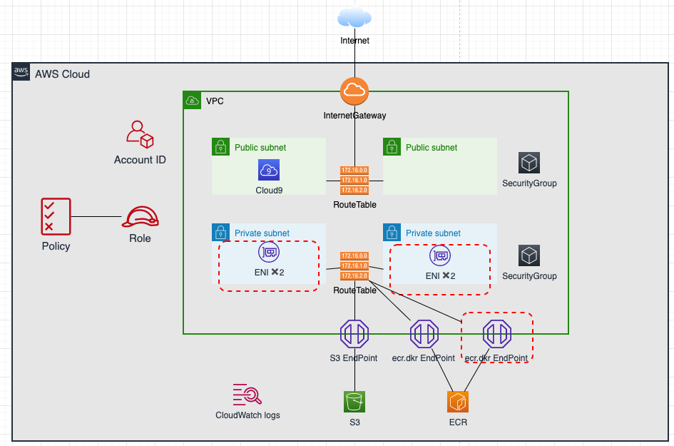

#### cmd

```Cloud9
aws ec2 create-vpc-endpoint \
    --vpc-id ${VpcId} \
    --vpc-endpoint-type Interface \
    --service-name com.amazonaws.ap-northeast-1.ecr.api \
    --subnet-ids ${SubnetId1aPrivate} ${SubnetId1cPrivate} \
    --security-group-id ${PrivateSecurityGroupsId} \
    --tag-specifications "ResourceType=vpc-endpoint,Tags=[{Key=Name,Value=ContainerHandsOn}]"
```

#### result

```Cloud9
{
    "VpcEndpoint": {
        "VpcId": "vpc-0d3c1c88db46cfba7", 
        "Tags": [
            {
                "Value": "ContainerHands", 
                "Key": "Name"
            }
        ], 
        "NetworkInterfaceIds": [
            "eni-084e01fac365b44eb", 
            "eni-0f8846781b4fb82ee"
        ], 
        "SubnetIds": [
            "subnet-0ea89b6bc85e0ec61", 
            "subnet-049f0119237ff00a0"
        ], 
        "RequesterManaged": false, 
        "PrivateDnsEnabled": true, 
        "State": "pending", 
        "ServiceName": "com.amazonaws.ap-northeast-1.ecr.api", 
        "RouteTableIds": [], 
        "Groups": [
            {
                "GroupName": "PrivateSecurityGroup", 
                "GroupId": "sg-040aff209e1fe59cc"
            }
        ], 
        "OwnerId": "123456789012", 
        "VpcEndpointId": "vpce-0e45e7f04848a0600", 
        "VpcEndpointType": "Interface", 
        "CreationTimestamp": "2022-09-06T14:16:25.698Z", 
        "DnsEntries": [
            {
                "HostedZoneId": "Z2E726K9Y6RL4W", 
                "DnsName": "vpce-0e45e7f04848a0600-kef4k347.api.ecr.ap-northeast-1.vpce.amazonaws.com"
            }, 
            {
                "HostedZoneId": "Z2E726K9Y6RL4W", 
                "DnsName": "vpce-0e45e7f04848a0600-kef4k347-ap-northeast-1c.api.ecr.ap-northeast-1.vpce.amazonaws.com"
            }, 
            {
                "HostedZoneId": "Z2E726K9Y6RL4W", 
                "DnsName": "vpce-0e45e7f04848a0600-kef4k347-ap-northeast-1a.api.ecr.ap-northeast-1.vpce.amazonaws.com"
            }, 
            {
                "HostedZoneId": "ZONEIDPENDING", 
                "DnsName": "api.ecr.ap-northeast-1.amazonaws.com"
            }
        ]
    }
}
```

### ■com.amazonaws.ap-northeast-1.logs

- CloudWatch LogsはInterface型のエンドポイントを利用します

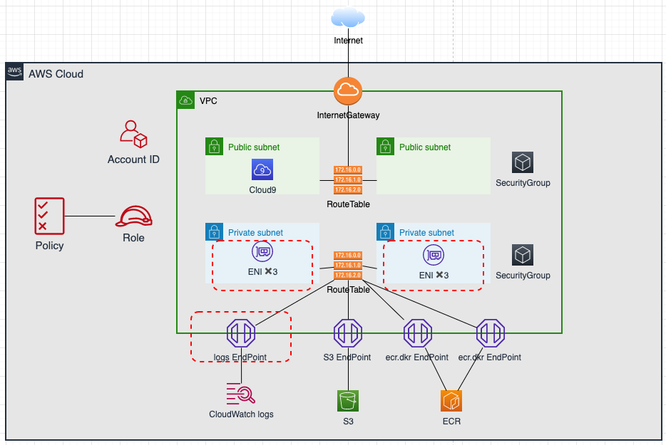

#### cmd

```Cloud9
aws ec2 create-vpc-endpoint \
    --vpc-id ${VpcId} \
    --vpc-endpoint-type Interface \
    --service-name com.amazonaws.ap-northeast-1.logs \
    --subnet-ids ${SubnetId1aPrivate} ${SubnetId1cPrivate} \
    --security-group-id ${PrivateSecurityGroupsId} \
    --tag-specifications "ResourceType=vpc-endpoint,Tags=[{Key=Name,Value=ContainerHandsOn}]"
```

#### result

```Cloud9
{
    "VpcEndpoint": {
        "VpcId": "vpc-0d3c1c88db46cfba7", 
        "Tags": [
            {
                "Value": "ContainerHands", 
                "Key": "Name"
            }
        ], 
        "NetworkInterfaceIds": [
            "eni-04b15926212e8ea31", 
            "eni-0514bbba136ec6108"
        ], 
        "SubnetIds": [
            "subnet-0ea89b6bc85e0ec61", 
            "subnet-049f0119237ff00a0"
        ], 
        "RequesterManaged": false, 
        "PrivateDnsEnabled": true, 
        "State": "pending", 
        "ServiceName": "com.amazonaws.ap-northeast-1.logs", 
        "RouteTableIds": [], 
        "Groups": [
            {
                "GroupName": "PrivateSecurityGroup", 
                "GroupId": "sg-040aff209e1fe59cc"
            }
        ], 
        "OwnerId": "123456789012", 
        "VpcEndpointId": "vpce-05ae88af55de2bf71", 
        "VpcEndpointType": "Interface", 
        "CreationTimestamp": "2022-09-06T14:16:50.374Z", 
        "DnsEntries": [
            {
                "HostedZoneId": "Z2E726K9Y6RL4W", 
                "DnsName": "vpce-05ae88af55de2bf71-5ltns582.logs.ap-northeast-1.vpce.amazonaws.com"
            }, 
            {
                "HostedZoneId": "Z2E726K9Y6RL4W", 
                "DnsName": "vpce-05ae88af55de2bf71-5ltns582-ap-northeast-1c.logs.ap-northeast-1.vpce.amazonaws.com"
            }, 
            {
                "HostedZoneId": "Z2E726K9Y6RL4W", 
                "DnsName": "vpce-05ae88af55de2bf71-5ltns582-ap-northeast-1a.logs.ap-northeast-1.vpce.amazonaws.com"
            }, 
            {
                "HostedZoneId": "ZONEIDPENDING", 
                "DnsName": "logs.ap-northeast-1.amazonaws.com"
            }
        ]
    }
}
```

## ALB作成

Duration: 0:05:00

### ■アプリケーションロードバランサーの作成

- 実行されるコンテナのタスクを複数立てた場合に、処理を振り分けるようにアプリケーションロードバランサーを作成します
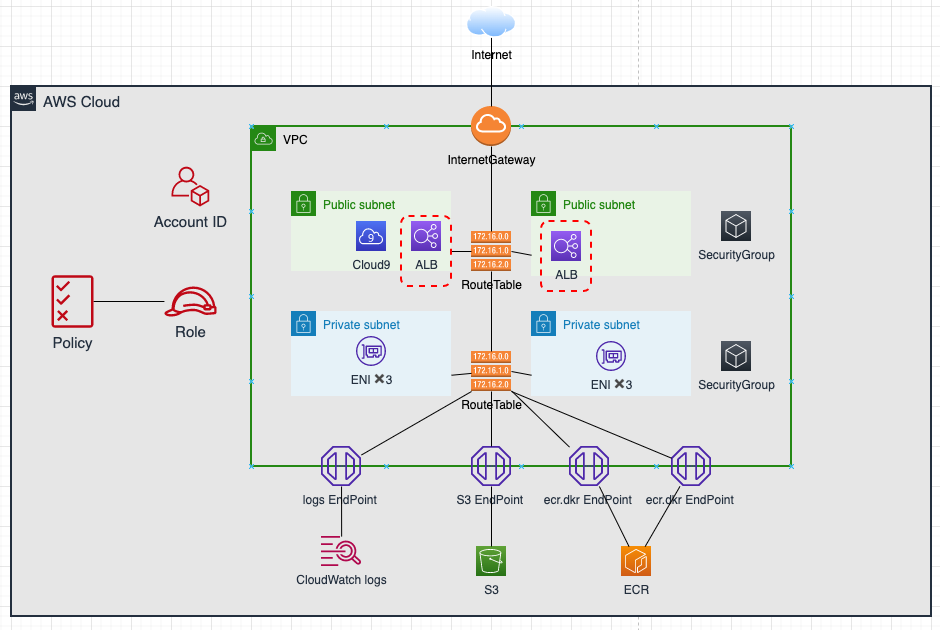

#### cmd

```Cloud9
aws elbv2 create-load-balancer \
    --name ContainerHandsOn \
    --subnets ${SubnetId1aPublic} ${SubnetId1cPublic} \
    --security-groups ${PublicSecurityGroupsId} \
    --tags "Key=Name,Value=ContainerHandsOn"
```

#### result

```Cloud9
{
    "LoadBalancers": [
        {
            "IpAddressType": "ipv4", 
            "VpcId": "vpc-0d3c1c88db46cfba7", 
            "LoadBalancerArn": "arn:aws:elasticloadbalancing:ap-northeast-1:123456789012:loadbalancer/app/ContainerHandsOn/75145ed42d9a3867", 
            "State": {
                "Code": "provisioning"
            }, 
            "DNSName": "ContainerHandsOn-610375823.ap-northeast-1.elb.amazonaws.com", 
            "SecurityGroups": [
                "sg-08822a4834ed05f46"
            ], 
            "LoadBalancerName": "ContainerHandsOn", 
            "CreatedTime": "2022-09-06T14:21:35.730Z", 
            "Scheme": "internet-facing", 
            "Type": "application", 
            "CanonicalHostedZoneId": "Z14GRHDCWA56QT", 
            "AvailabilityZones": [
                {
                    "SubnetId": "subnet-0a1e2afffc8c140d8", 
                    "LoadBalancerAddresses": [], 
                    "ZoneName": "ap-northeast-1c"
                }, 
                {
                    "SubnetId": "subnet-0f66f257f167a1d47", 
                    "LoadBalancerAddresses": [], 
                    "ZoneName": "ap-northeast-1a"
                }
            ]
        }
    ]
}
```

### ■ターゲットグループの作成

- タスクはどのようなプロトコルで稼働するターゲットであるか定義します

#### cmd

```Cloud9
aws elbv2 create-target-group \
    --name ContainerHandsOn \
    --protocol HTTP \
    --port 80 \
    --target-type ip \
    --health-check-protocol HTTP \
    --health-check-port traffic-port \
    --health-check-path /index.php \
    --vpc-id ${VpcId}
```

#### result

```Cloud9
{
    "TargetGroups": [
        {
            "TargetGroupArn": "arn:aws:elasticloadbalancing:ap-northeast-1:123456789012:targetgroup/ContainerHandsOn/7624dfd8f556a2d9",
            "TargetGroupName": "ContainerHandsOn",
            "Protocol": "HTTP",
            "Port": 80,
            "VpcId": "vpc-0d3c1c88db46cfba7",
            "HealthCheckProtocol": "HTTP",
            "HealthCheckPort": "traffic-port",
            "HealthCheckEnabled": true,
            "HealthCheckIntervalSeconds": 30,
            "HealthCheckTimeoutSeconds": 5,
            "HealthyThresholdCount": 5,
            "UnhealthyThresholdCount": 2,
            "HealthCheckPath": "/index.php",
            "Matcher": {
                "HttpCode": "200"
            },
            "TargetType": "ip",
            "ProtocolVersion": "HTTP1",
            "IpAddressType": "ipv4"
        }
    ]
}
```

### ■アプリケーションロードバランサーのDNS取得

#### cmd

```Cloud9
LoadBalancersDnsName=`aws elbv2 describe-load-balancers \
  --names ContainerHandsOn \
  --query "LoadBalancers[*].DNSName" \
  --output text`
```

```Cloud9
clear; cat << EOF
AccoutID : ${AccoutID}
VpcId : ${VpcId}
SubnetId1aPublic : ${SubnetId1aPublic}
SubnetId1cPublic : ${SubnetId1cPublic}
SubnetId1aPrivate : ${SubnetId1aPrivate}
SubnetId1cPrivate : ${SubnetId1cPrivate}
InternetGatewayId : ${InternetGatewayId}
RouteTableIdPublic : ${RouteTableIdPublic}
RouteTableIdPrivate : ${RouteTableIdPrivate}
PublicSecurityGroupsId : ${PublicSecurityGroupsId}
PrivateSecurityGroupsId : ${PrivateSecurityGroupsId}
InstanceId : ${InstanceId}
LoadBalancersDnsName : ${LoadBalancersDnsName}
EOF
```

#### result

```Cloud9
AccoutID : 123456789012
VpcId : vpc-0320e7bf74af8bd72
SubnetId1aPublic : subnet-059ff12a72e014ca1
SubnetId1cPublic : subnet-0076bf4756ca680d1
SubnetId1aPrivate : subnet-000d7e1758777eb85
SubnetId1cPrivate : subnet-04ec5cc1209d3c566
InternetGatewayId : igw-015b39463b346214a
RouteTableIdPublic : rtb-00a15f36fcbabe379
RouteTableIdPrivate : rtb-086e760ddf493b0c3
PublicSecurityGroupsId : sg-04a6d799d221392dc
PrivateSecurityGroupsId : sg-0ce0e72015ca72d09
LoadBalancersDnsName : ContainerHandsOn-1258418044.ap-northeast-1.elb.amazonaws.com
```

### ■アプリケーションロードバランサーのARN取得

#### cmd

```Cloud9
LoadBalancerArn=`aws elbv2 describe-load-balancers \
  --names ContainerHandsOn \
  --query "LoadBalancers[*].LoadBalancerArn" \
  --output text`
```

```Cloud9
clear; cat << EOF
AccoutID : ${AccoutID}
VpcId : ${VpcId}
SubnetId1aPublic : ${SubnetId1aPublic}
SubnetId1cPublic : ${SubnetId1cPublic}
SubnetId1aPrivate : ${SubnetId1aPrivate}
SubnetId1cPrivate : ${SubnetId1cPrivate}
InternetGatewayId : ${InternetGatewayId}
RouteTableIdPublic : ${RouteTableIdPublic}
RouteTableIdPrivate : ${RouteTableIdPrivate}
PublicSecurityGroupsId : ${PublicSecurityGroupsId}
PrivateSecurityGroupsId : ${PrivateSecurityGroupsId}
InstanceId : ${InstanceId}
LoadBalancersDnsName : ${LoadBalancersDnsName}
LoadBalancerArn : ${LoadBalancerArn}
EOF
```

#### result

```Cloud9
AccoutID : 123456789012
VpcId : vpc-0320e7bf74af8bd72
SubnetId1aPublic : subnet-059ff12a72e014ca1
SubnetId1cPublic : subnet-0076bf4756ca680d1
SubnetId1aPrivate : subnet-000d7e1758777eb85
SubnetId1cPrivate : subnet-04ec5cc1209d3c566
InternetGatewayId : igw-015b39463b346214a
RouteTableIdPublic : rtb-00a15f36fcbabe379
RouteTableIdPrivate : rtb-086e760ddf493b0c3
PublicSecurityGroupsId : sg-04a6d799d221392dc
PrivateSecurityGroupsId : sg-0ce0e72015ca72d09
LoadBalancersDnsName : ContainerHandsOn-1258418044.ap-northeast-1.elb.amazonaws.com
LoadBalancerArn : arn:aws:elasticloadbalancing:ap-northeast-1:123456789012:loadbalancer/app/ContainerHandsOn/09fd839792d722ff
```

### ■ターゲットグループのARN取得

#### cmd

```Cloud9
TargetGroupArn=`aws elbv2 describe-target-groups \
  --names ContainerHandsOn \
  --query "TargetGroups[*].TargetGroupArn" \
  --output text`
```

```Cloud9
clear; cat << EOF
AccoutID : ${AccoutID}
VpcId : ${VpcId}
SubnetId1aPublic : ${SubnetId1aPublic}
SubnetId1cPublic : ${SubnetId1cPublic}
SubnetId1aPrivate : ${SubnetId1aPrivate}
SubnetId1cPrivate : ${SubnetId1cPrivate}
InternetGatewayId : ${InternetGatewayId}
RouteTableIdPublic : ${RouteTableIdPublic}
RouteTableIdPrivate : ${RouteTableIdPrivate}
PublicSecurityGroupsId : ${PublicSecurityGroupsId}
PrivateSecurityGroupsId : ${PrivateSecurityGroupsId}
InstanceId : ${InstanceId}
LoadBalancersDnsName : ${LoadBalancersDnsName}
LoadBalancerArn : ${LoadBalancerArn}
TargetGroupArn : ${TargetGroupArn}
EOF
```

#### result

```Cloud9
AccoutID : 123456789012
VpcId : vpc-0320e7bf74af8bd72
SubnetId1aPublic : subnet-059ff12a72e014ca1
SubnetId1cPublic : subnet-0076bf4756ca680d1
SubnetId1aPrivate : subnet-000d7e1758777eb85
SubnetId1cPrivate : subnet-04ec5cc1209d3c566
InternetGatewayId : igw-015b39463b346214a
RouteTableIdPublic : rtb-00a15f36fcbabe379
RouteTableIdPrivate : rtb-086e760ddf493b0c3
PublicSecurityGroupsId : sg-04a6d799d221392dc
PrivateSecurityGroupsId : sg-0ce0e72015ca72d09
LoadBalancersDnsName : ContainerHandsOn-1258418044.ap-northeast-1.elb.amazonaws.com
LoadBalancerArn : arn:aws:elasticloadbalancing:ap-northeast-1:123456789012:loadbalancer/app/ContainerHandsOn/09fd839792d722ff
TargetGroupArn : arn:aws:elasticloadbalancing:ap-northeast-1:123456789012:targetgroup/ContainerHandsOn/d6ccd892547e534d
```

### ■リスナーの追加

- アプリケーションロードバランサーとターゲットグループを紐付けします

#### cmd

```Cloud9
aws elbv2 create-listener \
    --load-balancer-arn ${LoadBalancerArn} \
    --protocol HTTP \
    --port 80 \
    --default-actions Type=forward,TargetGroupArn=${TargetGroupArn}
```

#### result

```Cloud9
{
    "Listeners": [
        {
            "ListenerArn": "arn:aws:elasticloadbalancing:ap-northeast-1:123456789012:listener/app/ContainerHandsOn/75145ed42d9a3867/1245c4be3b3230b7",
            "LoadBalancerArn": "arn:aws:elasticloadbalancing:ap-northeast-1:123456789012:loadbalancer/app/ContainerHandsOn/75145ed42d9a3867",
            "Port": 80,
            "Protocol": "HTTP",
            "DefaultActions": [
                {
                    "Type": "forward",
                    "TargetGroupArn": "arn:aws:elasticloadbalancing:ap-northeast-1:123456789012:targetgroup/ContainerHandsOn/7f11fa9e9d635ce9",
                    "ForwardConfig": {
                        "TargetGroups": [
                            {
                                "TargetGroupArn": "arn:aws:elasticloadbalancing:ap-northeast-1:123456789012:targetgroup/ContainerHandsOn/7f11fa9e9d635ce9",
                                "Weight": 1
                            }
                        ],
                        "TargetGroupStickinessConfig": {
                            "Enabled": false
                        }
                    }
                }
            ]
        }
    ]
}
```

## ECS/Fargate作成

Duration: 0:05:00

### ■ECS/Fargate周辺の説明

#### 参考

[20190731 Black Belt Online Seminar Amazon ECS Deep Dive](https://www.slideshare.net/AmazonWebServicesJapan/20190731-black-belt-online-seminar-amazon-ecs-deep-dive-162160987)

#### ECS on EC2の構成図

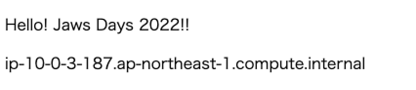

- EC2上で稼働するTaskでコンテナが処理されます
- EC2を複数個まとめてクラスターとして扱います
- クラスター管理をし、どのEC2へ新規タスクを設けるかはECSの役目です

#### ECS on Fargateの構成図

- しかし僕らが注力したいのはコンテナでどのような処理が稼働するかです
- EC2の管理はやりたくないので、そこをマネージドしてくれるのがFargate

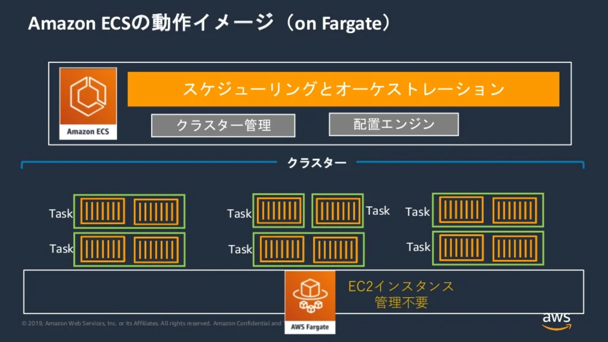

#### ECSの主要要素

- クラスター：実行環境の境界線
- サービス：タスクを維持する機能
- タスク：タスク定義に記載された内容を実行するコンテナ群
- タスク定義：CPU/メモリ、稼働するコンテナイメージ等、何を稼働させるのかの定義

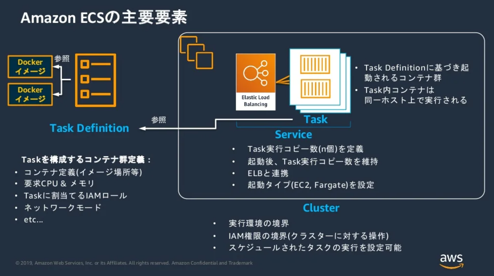

### ■クラスターの作成

- クラスターという実行環境の境界線を作成します

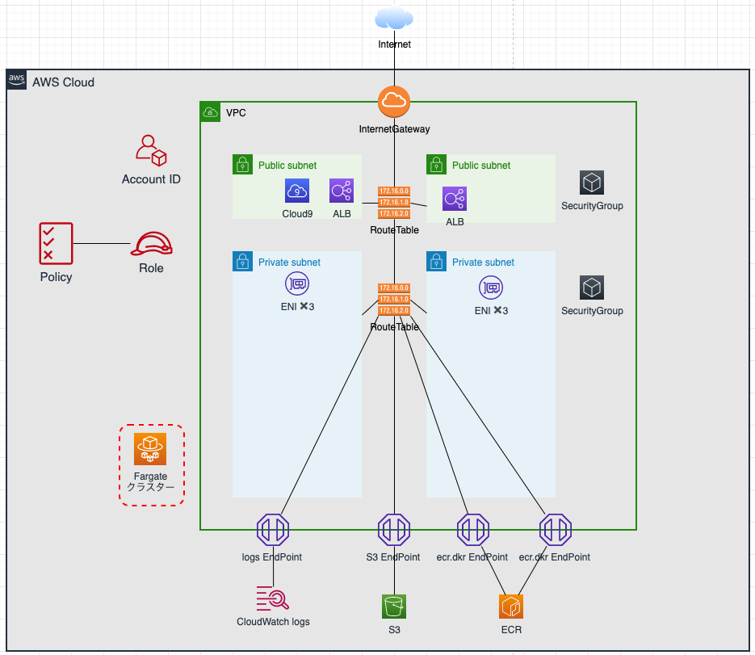

#### cmd

```Cloud9
aws ecs create-cluster \
    --cluster-name ContainerHandsOn \
    --tags "key=Name,value=ContainerHandsOn"
```

#### result

```Cloud9
{
    "cluster": {
        "status": "ACTIVE", 
        "defaultCapacityProviderStrategy": [], 
        "statistics": [], 
        "capacityProviders": [], 
        "tags": [
            {
                "value": "ContainerHandsOn", 
                "key": "Name"
            }
        ], 
        "clusterName": "ContainerHandsOn", 
        "settings": [
            {
                "name": "containerInsights", 
                "value": "disabled"
            }
        ], 
        "registeredContainerInstancesCount": 0, 
        "pendingTasksCount": 0, 
        "runningTasksCount": 0, 
        "activeServicesCount": 0, 
        "clusterArn": "arn:aws:ecs:ap-northeast-1:123456789012:cluster/ContainerHandsOn"
    }
}
```

### ■タスク定義の作成

- どのようなタスクが稼働するかを定義します

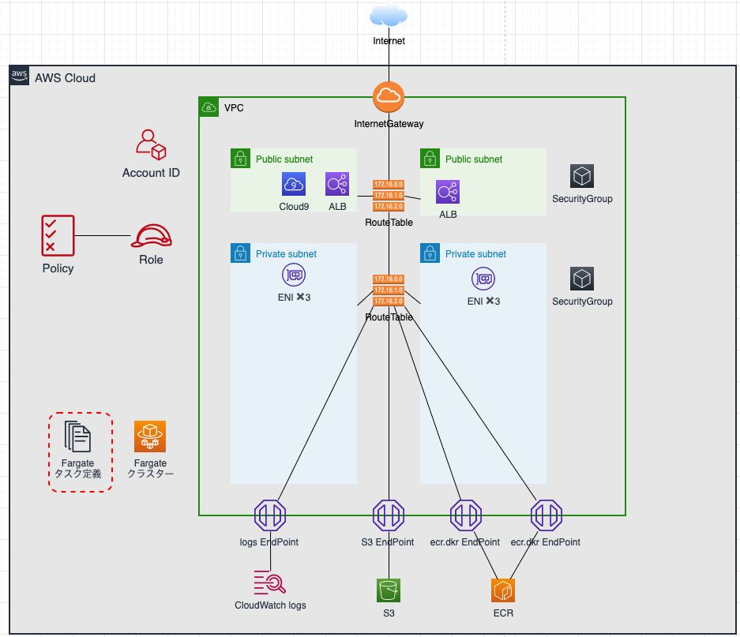

#### cmd

```Cloud9
cat << EOF > register-task-definition.json
{
    "family": "ContainerHandsOn", 
    "executionRoleArn": "arn:aws:iam::${AccoutID}:role/ecsTaskExecutionRole", 
    "networkMode": "awsvpc", 
    "containerDefinitions": [
        {
            "name": "ContainerHandsOn", 
            "image": "${AccoutID}.dkr.ecr.ap-northeast-1.amazonaws.com/jaws-days-2022/container-hands-on:latest", 
            "portMappings": [
                {
                    "containerPort": 80, 
                    "hostPort": 80, 
                    "protocol": "tcp"
                }
            ], 
            "essential": true,
            "logConfiguration": {
                "logDriver": "awslogs",
                "options": {
                    "awslogs-create-group": "true",
                    "awslogs-group": "awslogs-container-hands-on",
                    "awslogs-region": "ap-northeast-1",
                    "awslogs-stream-prefix": "hands-on"
                }
            }
        }
    ], 
    "requiresCompatibilities": [
        "FARGATE"
    ], 
    "cpu": "256", 
    "memory": "512",
    "runtimePlatform": {
        "cpuArchitecture": "X86_64",
        "operatingSystemFamily": "LINUX"
    }
}
EOF
```

```Cloud9
aws ecs register-task-definition \
  --cli-input-json file://register-task-definition.json \
  --tags "key=Name,value=ContainerHandsOn"
```

#### result

```Cloud9
{
    "taskDefinition": {
        "taskDefinitionArn": "arn:aws:ecs:ap-northeast-1:123456789012:task-definition/ContainerHandsOn:1",
        "containerDefinitions": [
            {
                "name": "ContainerHandsOn",
                "image": "123456789012.dkr.ecr.ap-northeast-1.amazonaws.com/jaws-days-2022/container-hands-on:latest",
                "cpu": 0,
                "portMappings": [
                    {
                        "containerPort": 80,
                        "hostPort": 80,
                        "protocol": "tcp"
                    }
                ],
                "essential": true,
                "environment": [],
                "mountPoints": [],
                "volumesFrom": []
            }
        ],
        "family": "ContainerHandsOn",
        "executionRoleArn": "arn:aws:iam::123456789012:role/ecsTaskExecutionRole",
        "networkMode": "awsvpc",
        "revision": 1,
        "volumes": [],
        "status": "ACTIVE",
        "requiresAttributes": [
            {
                "name": "com.amazonaws.ecs.capability.ecr-auth"
            },
            {
                "name": "ecs.capability.execution-role-ecr-pull"
            },
            {
                "name": "com.amazonaws.ecs.capability.docker-remote-api.1.18"
            },
            {
                "name": "ecs.capability.task-eni"
            }
        ],
        "placementConstraints": [],
        "compatibilities": [
            "EC2",
            "FARGATE"
        ],
        "runtimePlatform": {
            "cpuArchitecture": "X86_64",
            "operatingSystemFamily": "LINUX"
        },
        "requiresCompatibilities": [
            "FARGATE"
        ],
        "cpu": "256",
        "memory": "512",
        "registeredAt": "2022-09-06T14:59:53.594000+00:00",
        "registeredBy": "arn:aws:sts::123456789012:assumed-role/AWSReservedSSO_AWSAdministratorAccess_8fe206b83490a022/ShigeruOda"
    },
    "tags": [
        {
            "key": "Name",
            "value": "ContainerHandsOn"
        }
    ]
}
```

### ■タスク定義のリビジョン取得

- タスク定義は作成する度にカウントアップされるので、最新のリビジョン番号を取得します

#### cmd

```Cloud9
RevisionNo=`aws ecs list-task-definitions \
  --family-prefix ContainerHandsOn \
  --status ACTIVE \
  --sort ASC | \
  grep ContainerHandsOn | tail -1 | sed -e 's/"//g' | cut -f 7 --delim=":"`
```

```Cloud9
clear; cat << EOF
AccoutID : ${AccoutID}
VpcId : ${VpcId}
SubnetId1aPublic : ${SubnetId1aPublic}
SubnetId1cPublic : ${SubnetId1cPublic}
SubnetId1aPrivate : ${SubnetId1aPrivate}
SubnetId1cPrivate : ${SubnetId1cPrivate}
InternetGatewayId : ${InternetGatewayId}
RouteTableIdPublic : ${RouteTableIdPublic}
RouteTableIdPrivate : ${RouteTableIdPrivate}
PublicSecurityGroupsId : ${PublicSecurityGroupsId}
PrivateSecurityGroupsId : ${PrivateSecurityGroupsId}
InstanceId : ${InstanceId}
LoadBalancersDnsName : ${LoadBalancersDnsName}
LoadBalancerArn : ${LoadBalancerArn}
TargetGroupArn : ${TargetGroupArn}
RevisionNo : ${RevisionNo}
EOF
```

#### result

```Cloud9
AccoutID : 123456789012
VpcId : vpc-0320e7bf74af8bd72
SubnetId1aPublic : subnet-059ff12a72e014ca1
SubnetId1cPublic : subnet-0076bf4756ca680d1
SubnetId1aPrivate : subnet-000d7e1758777eb85
SubnetId1cPrivate : subnet-04ec5cc1209d3c566
InternetGatewayId : igw-015b39463b346214a
RouteTableIdPublic : rtb-00a15f36fcbabe379
RouteTableIdPrivate : rtb-086e760ddf493b0c3
PublicSecurityGroupsId : sg-04a6d799d221392dc
PrivateSecurityGroupsId : sg-0ce0e72015ca72d09
LoadBalancersDnsName : ContainerHandsOn-1258418044.ap-northeast-1.elb.amazonaws.com
LoadBalancerArn : arn:aws:elasticloadbalancing:ap-northeast-1:123456789012:loadbalancer/app/ContainerHandsOn/09fd839792d722ff
TargetGroupArn : arn:aws:elasticloadbalancing:ap-northeast-1:123456789012:targetgroup/ContainerHandsOn/d6ccd892547e534d
RevisionNo : 2
```

### ■サービスの作成

- 実行数やネットワーク周りを定義したサービスを作成します

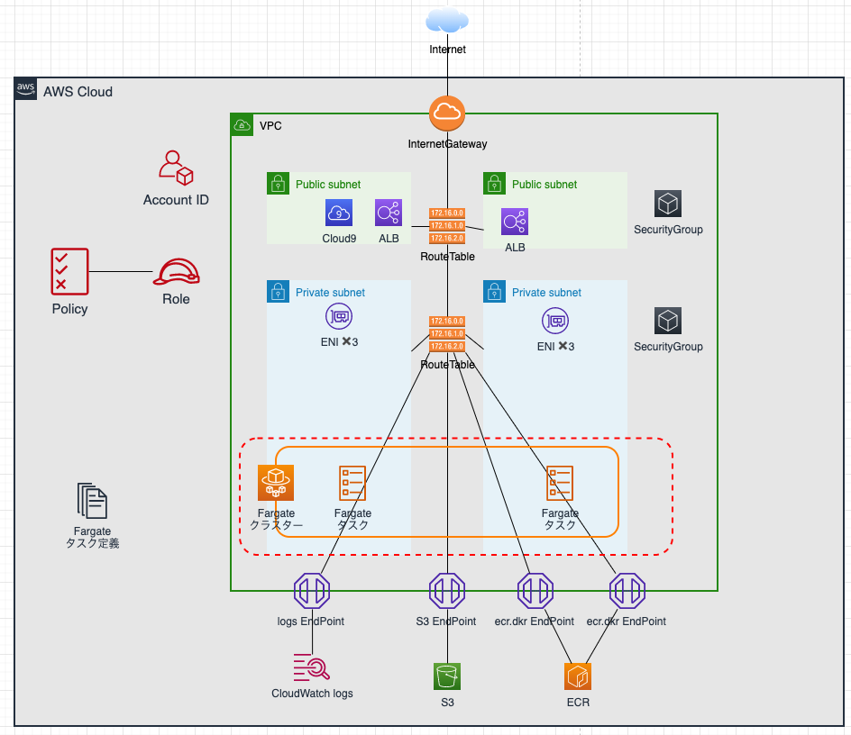

#### cmd

```Cloud9
aws ecs create-service \
    --cluster ContainerHandsOn \
    --service-name ContainerHandsOn \
    --task-definition ContainerHandsOn:${RevisionNo} \
    --deployment-controller type=CODE_DEPLOY \
    --desired-count 2 \
    --launch-type FARGATE \
    --platform-version LATEST \
    --network-configuration "awsvpcConfiguration={subnets=[${SubnetId1aPrivate},${SubnetId1cPrivate}],securityGroups=[${PrivateSecurityGroupsId}],assignPublicIp=DISABLED}" \
    --load-balancers targetGroupArn=${TargetGroupArn},containerName=ContainerHandsOn,containerPort=80 
```

#### result

```Cloud9
{
    "service": {
        "serviceArn": "arn:aws:ecs:ap-northeast-1:123456789012:service/ContainerHandsOn/ContainerHandsOn",
        "serviceName": "ContainerHandsOn",
        "clusterArn": "arn:aws:ecs:ap-northeast-1:123456789012:cluster/ContainerHandsOn",
        "loadBalancers": [
            {
                "targetGroupArn": "arn:aws:elasticloadbalancing:ap-northeast-1:123456789012:targetgroup/ContainerHandsOn/7624dfd8f556a2d9",
                "containerName": "ContainerHandsOn",
                "containerPort": 80
            }
        ],
        "serviceRegistries": [],
        "status": "ACTIVE",
        "desiredCount": 2,
        "runningCount": 0,
        "pendingCount": 0,
        "launchType": "FARGATE",
        "platformVersion": "LATEST",
        "platformFamily": "Linux",
        "taskDefinition": "arn:aws:ecs:ap-northeast-1:123456789012:task-definition/ContainerHandsOn:8",
        "deploymentConfiguration": {
            "deploymentCircuitBreaker": {
                "enable": false,
                "rollback": false
            },
            "maximumPercent": 200,
            "minimumHealthyPercent": 100
        },
        "deployments": [
            {
                "id": "ecs-svc/9015413324295259653",
                "status": "PRIMARY",
                "taskDefinition": "arn:aws:ecs:ap-northeast-1:123456789012:task-definition/ContainerHandsOn:1",
                "desiredCount": 2,
                "pendingCount": 0,
                "runningCount": 0,
                "failedTasks": 0,
                "createdAt": "2022-09-07T02:14:18.688000+00:00",
                "updatedAt": "2022-09-07T02:14:18.688000+00:00",
                "launchType": "FARGATE",
                "platformVersion": "1.4.0",
                "platformFamily": "Linux",
                "networkConfiguration": {
                    "awsvpcConfiguration": {
                        "subnets": [
                            "subnet-0ea89b6bc85e0ec61",
                            "subnet-049f0119237ff00a0"
                        ],
                        "securityGroups": [
                            "sg-040aff209e1fe59cc"
                        ],
                        "assignPublicIp": "DISABLED"
                    }
                },
                "rolloutState": "IN_PROGRESS",
                "rolloutStateReason": "ECS deployment ecs-svc/9015413324295259653 in progress."
            }
        ],
        "roleArn": "arn:aws:iam::123456789012:role/aws-service-role/ecs.amazonaws.com/AWSServiceRoleForECS",
        "events": [],
        "createdAt": "2022-09-07T02:14:18.688000+00:00",
        "placementConstraints": [],
        "placementStrategy": [],
        "networkConfiguration": {
            "awsvpcConfiguration": {
                "subnets": [
                    "subnet-0ea89b6bc85e0ec61",
                    "subnet-049f0119237ff00a0"
                ],
                "securityGroups": [
                    "sg-040aff209e1fe59cc"
                ],
                "assignPublicIp": "DISABLED"
            }
        },
        "healthCheckGracePeriodSeconds": 0,
        "schedulingStrategy": "REPLICA",
        "createdBy": "arn:aws:iam::123456789012:role/aws-reserved/sso.amazonaws.com/ap-northeast-1/AWSReservedSSO_AWSAdministratorAccess_8fe206b83490a022",
        "enableECSManagedTags": false,
        "propagateTags": "NONE",
        "enableExecuteCommand": false
    }
}
```

## 動作確認１

Duration: 0:05:00

### ■アドレス確認

#### cmd

```Cloud9
echo "http://"${LoadBalancersDnsName}
```

#### result

```Cloud9
http://ContainerHandsOn-610375823.ap-northeast-1.elb.amazonaws.com
```

### ■ブラウザ確認

- 上記で取得されたアドレスをChromeなどのブラウザに貼り付け、以下のような表示になること
- 503エラーの場合にはデプロイ中のため、1分程度待って、リトライをお願いします
- 更新を行うと2行目のhostnameが変更されていること（ALBで負荷分散されている確認）

### ■表示結果例

#### パターン例１

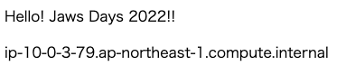

#### パターン例２

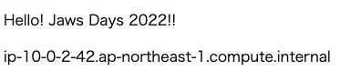

### ■CloudWatch Logsの確認

- 上部の検索バーでCloudWatchと検索
- CloudWatch > ロググループ > awslogs-container-hands-on > 2つのログストリームを確認
- "ロードバランサーのアクセスログ" と "ブラウザアクセスログ"をそれぞれのログストリームで確認

#### 画面

- ログストリームを確認

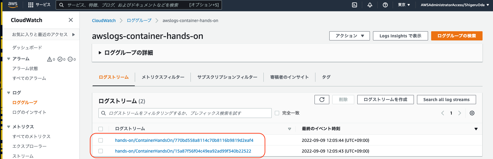

- ロードバランサーアクセスログを確認

```CloudWatch
10.0.0.102 - - [09/Sep/2022:03:09:33 +0000] \
"GET /index.php HTTP/1.1" 200 403 "-" "ELB-HealthChecker/2.0"
```

- ブラウザアクセスログを確認

```CloudWatch
10.0.0.102 - - [09/Sep/2022:03:10:00 +0000] \
"GET / HTTP/1.1" 200 384 "-" "Mozilla/5.0 (Macintosh; Intel Mac OS X 10_15_7) AppleWebKit/537.36 (KHTML, like Gecko) Chrome/105.0.0.0 Safari/537.36"
```

## 変数整理

### ■ここまで取得された変数を整理

- 後続のため、取得した変数をエディターに残して下さい

#### cmd

```Cloud9
clear; cat << EOF
export AccoutID="${AccoutID}"
export VpcId="${VpcId}"
export SubnetId1aPublic="${SubnetId1aPublic}"
export SubnetId1cPublic="${SubnetId1cPublic}"
export SubnetId1aPrivate="${SubnetId1aPrivate}"
export SubnetId1cPrivate="${SubnetId1cPrivate}"
export InternetGatewayId="${InternetGatewayId}"
export RouteTableIdPublic="${RouteTableIdPublic}"
export RouteTableIdPrivate="${RouteTableIdPrivate}"
export PublicSecurityGroupsId="${PublicSecurityGroupsId}"
export PrivateSecurityGroupsId="${PrivateSecurityGroupsId}"
export InstanceId="${InstanceId}"
export LoadBalancerArn="${LoadBalancerArn}"
export TargetGroupArn="${TargetGroupArn}"
export LoadBalancersDnsName="${LoadBalancersDnsName}"
export RevisionNo="${RevisionNo}"
EOF
```

#### result

```Cloud9
export AccoutID="152767562250"
export VpcId="vpc-0eb621c4712ee0898"
export SubnetId1aPublic="subnet-035db89cb1df815f1"
export SubnetId1cPublic="subnet-04872b3467ca94ce2"
export SubnetId1aPrivate="subnet-00d678e2982d487d0"
export SubnetId1cPrivate="subnet-08bfff9af19697ab7"
export InternetGatewayId="igw-0d4373c922961e230"
export RouteTableIdPublic="rtb-0670248bec99ef90c"
export RouteTableIdPrivate="rtb-004eba1faed81d581"
export PublicSecurityGroupsId="sg-06931dc309a0879b2"
export PrivateSecurityGroupsId="sg-05eb336035d38f645"
export InstanceId="i-04c7c620fef60c9cb"
export LoadBalancerArn="arn:aws:elasticloadbalancing:ap-northeast-1:152767562250:loadbalancer/app/ContainerHandsOn/9f7c6d0c3b1b76da"
export TargetGroupArn="arn:aws:elasticloadbalancing:ap-northeast-1:152767562250:targetgroup/ContainerHandsOn/f46da45550c208d5"
export LoadBalancersDnsName="ContainerHandsOn-879378718.ap-northeast-1.elb.amazonaws.com"
export RevisionNo="6"
```

## CodeCommit作成

Duration: 0:05:00

### ■CodeCommitの作成

- git互換のソースリポジトリであるCodeCommitを作成

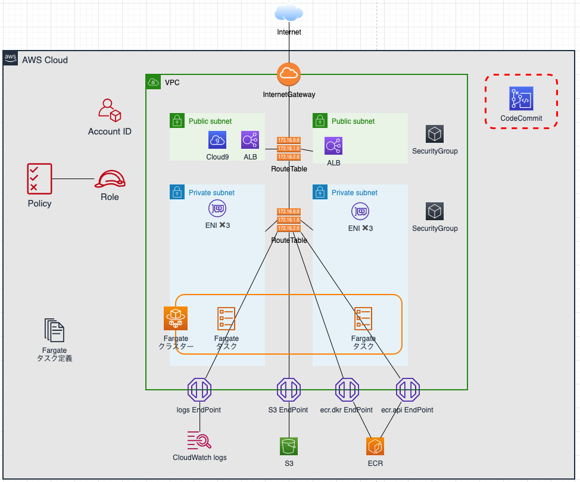

#### cmd

```Cloud9
aws codecommit create-repository \
  --repository-name ContainerHandsOn \
  --repository-description "ContainerHandsOn" \
  --tags "key=Name,value=ContainerHandsOn"
```

#### result

```Cloud9
{
    "repositoryMetadata": {
        "accountId": "378647896848",
        "repositoryId": "b4e47286-11a4-4280-9760-8c8103a5ace7",
        "repositoryName": "ContainerHandsOn",
        "repositoryDescription": "ContainerHandsOn",
        "lastModifiedDate": 1662705554.252,
        "creationDate": 1662705554.252,
        "cloneUrlHttp": "https://git-codecommit.ap-northeast-1.amazonaws.com/v1/repos/ContainerHandsOn",
        "cloneUrlSsh": "ssh://git-codecommit.ap-northeast-1.amazonaws.com/v1/repos/ContainerHandsOn",
        "Arn": "arn:aws:codecommit:ap-northeast-1:378647896848:ContainerHandsOn"
    }
}
```

### ■CodeCommitリポジトリのクローン

- git cloneでリポジトリをcloneします、中身は空です

#### cmd

```Cloud9
cd ~/environment/
git clone https://git-codecommit.ap-northeast-1.amazonaws.com/v1/repos/ContainerHandsOn
```

#### result

```Cloud9
Cloning into 'ContainerHandsOn'...
warning: You appear to have cloned an empty repository.
```

### ■資材の準備

- 事前に作成した資材をgit管理ディレクトリにcopyします

#### cmd

```Cloud9
cd ~/environment/ContainerHandsOn
cp -p ../Dockerfile ./
cp -pr ../src ./
ls -lR
```

#### result

```Cloud9
.:
total 8
-rw-rw-r-- 1 ec2-user ec2-user   47 Sep  9 01:31 Dockerfile
drwxrwxr-x 2 ec2-user ec2-user 4096 Sep  9 01:32 src

./src:
total 4
-rw-rw-r-- 1 ec2-user ec2-user 190 Sep  9 01:32 index.php
```

### ■buildspec.ymlの新規作成

- CodeBuildの仕様を記述したファイルを作成します

#### cmd

```Cloud9
cat << EOF > buildspec.yml
version: 0.2
phases:
  install:
    runtime-versions:
        docker: 20
        
  pre_build:
    commands:
      - echo Logging in to Amazon ECR...
      - docker version
      - aws ecr get-login-password --region ap-northeast-1 | docker login --username AWS --password-stdin ${AccoutID}.dkr.ecr.ap-northeast-1.amazonaws.com
      - RepositoryUri=${AccoutID}.dkr.ecr.ap-northeast-1.amazonaws.com/jaws-days-2022/container-hands-on
      - ImageTag=\$(echo \$CODEBUILD_RESOLVED_SOURCE_VERSION | cut -c 1-7)

  build:
    commands:
      - echo Build started on \`date\`
      - echo Building the Docker image...          
      - docker build -t jaws-days-2022/container-hands-on .
      - docker tag jaws-days-2022/container-hands-on:latest \${RepositoryUri}:latest
      - docker tag jaws-days-2022/container-hands-on:latest \${RepositoryUri}:\${ImageTag}
      - printf '{"Version":"1.0","ImageURI":"%s"}' \${RepositoryUri}:\${ImageTag} > imageDetail.json

  post_build:
    commands:
      - echo Build completed on \`date\`
      - echo Pushing the Docker image...
      - docker push \${RepositoryUri}:latest
      - docker push \${RepositoryUri}:\${ImageTag}

artifacts:
  files: imageDetail.json
EOF
```

#### result

```Cloud9
（なし）
```

### ■buildspec.ymlの確認

#### cmd

```Cloud9
ls -l buildspec.yml
```

#### result

```Cloud9
-rw-rw-r-- 1 ec2-user ec2-user 1192 Sep 11 04:59 buildspec.yml
```

### ■appspec.ymlの新規作成

- CodeDeployの仕様を記述したファイルを作成します
- <TASK_DEFINITION>と記載されている箇所は後ほどCodePipelineで更新します

#### cmd

```Cloud9
cat << EOF > appspec.yml
version: 0.0
Resources:
  - TargetService:
      Type: AWS::ECS::Service
      Properties:
        TaskDefinition: "<TASK_DEFINITION>"
        LoadBalancerInfo:
            ContainerName: "ContainerHandsOn" 
            ContainerPort: "80"
EOF
```

#### result

```Cloud9
（なし）
```

### ■appspec.ymlの確認

#### cmd

```Cloud9
ls -l appspec.yml
```

#### result

```Cloud9
-rw-rw-r-- 1 ec2-user ec2-user 240 Sep 11 05:04 appspec.yml
```

### ■taskdef.jsonの新規作成

- ECS Taskの仕様を記述したファイルを作成します  
- 前半のハンズオンで作成した内容を出力しています  

#### cmd

```Cloud9
aws ecs describe-task-definition \
  --task-definition ContainerHandsOn:${RevisionNo} \
  --query taskDefinition > taskdef.json
```

#### result

```Cloud9
（なし）
```

### ■taskdef.jsonの変更

- Cloud9のエディター機能を使って、6行目を変更します  
- <IMAGE_NAME>はPipeLine処理で作成された最新のイメージに置換されます  
- 変更後、Ctrl+Sでの保存をお忘れなく  
- sedでやりたい- - -

#### 変更前

```Cloud9
"image": "123456789012.dkr.ecr.ap-northeast-1.amazonaws.com/jaws-days-2022/container-hands-on:latest",
```

#### 変更前

```Cloud9
"image": "<IMAGE_NAME>",
```

### ■CodeCommitへのPush

- 作成したファイルをCodeCommitへPushし格納します

#### cmd

```Cloud9
git config --global user.name "Your Name"
git config --global user.email you@example.com

git add -A
git commit -m "first commit"
git push origin master
```

#### result

```Cloud9
[master (root-commit) 091ba9a] first commit
 5 files changed, 131 insertions(+)
 create mode 100644 Dockerfile
 create mode 100644 appspec.yml
 create mode 100644 buildspec.yml
 create mode 100644 src/index.php
 create mode 100644 taskdef.json

Enumerating objects: 8, done.
Counting objects: 100% (8/8), done.
Delta compression using up to 2 threads
Compressing objects: 100% (6/6), done.
Writing objects: 100% (8/8), 1.96 KiB | 1.96 MiB/s, done.
Total 8 (delta 0), reused 0 (delta 0), pack-reused 0
To https://git-codecommit.ap-northeast-1.amazonaws.com/v1/repos/ContainerHandsOn
 * [new branch]      master -> master
```

## CodeBuild作成

Duration: 0:05:00

### ■CodeBuild用Role作成

- CodeBuildのためにRoleを作成します。

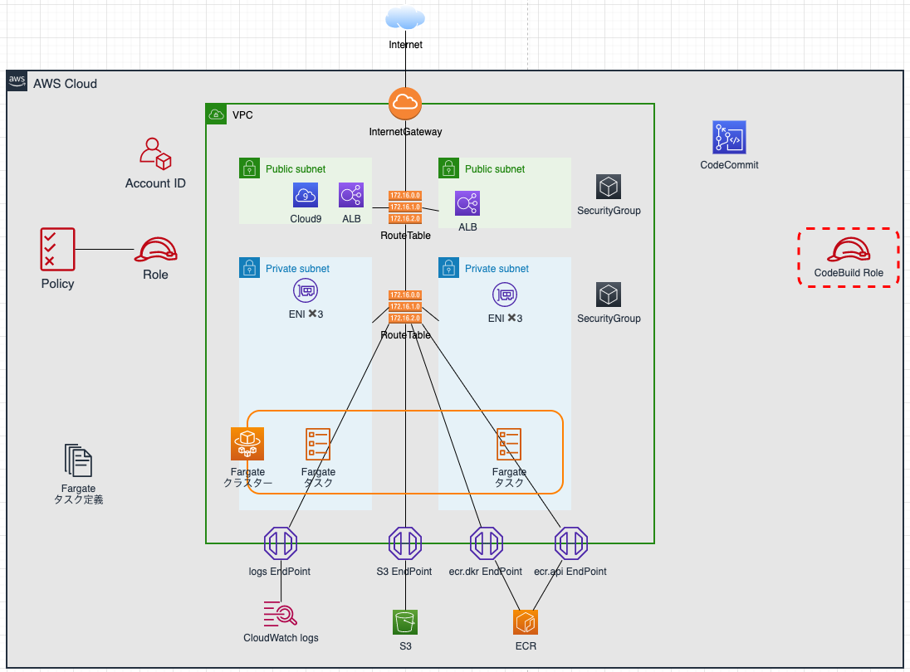

#### cmd

```Cloud9
cd ~/environment
```

```Cloud9
cat << EOF > assume-role-policy-document.json
{
  "Version": "2012-10-17",
  "Statement": [
    {
      "Sid": "",
      "Effect": "Allow",
      "Principal": {
        "Service": "codebuild.amazonaws.com"
      },
      "Action": "sts:AssumeRole"
    }
  ]
}
EOF
```

```Cloud9
aws iam create-role \
  --role-name ContainerHandsOnForCodeBuild \
  --assume-role-policy-document file://assume-role-policy-document.json
```

#### result

```Cloud9
{
    "Role": {
        "Path": "/",
        "RoleName": "ContainerHandsOnForCodeBuild",
        "RoleId": "AROASHENIAIFMIBJGIWAY",
        "Arn": "arn:aws:iam::123456789012:role/ContainerHandsOnForCodeBuild",
        "CreateDate": "2022-09-11T05:26:01Z",
        "AssumeRolePolicyDocument": {
            "Version": "2012-10-17",
            "Statement": [
                {
                    "Sid": "",
                    "Effect": "Allow",
                    "Principal": {
                        "Service": "codebuild.amazonaws.com"
                    },
                    "Action": "sts:AssumeRole"
                }
            ]
        }
    }
}
```

### ■CodeBuild用RoleにPolicyをアタッチ

#### cmd

```
aws iam attach-role-policy \
  --role-name ContainerHandsOnForCodeBuild \
  --policy-arn arn:aws:iam::aws:policy/AmazonEC2ContainerRegistryPowerUser
```

#### result

```
（なし）
```

#### cmd

```
aws iam attach-role-policy \
  --role-name ContainerHandsOnForCodeBuild \
  --policy-arn arn:aws:iam::aws:policy/CloudWatchLogsFullAccess
```

#### result

```
（なし）
```

#### cmd

```
aws iam attach-role-policy \
  --role-name ContainerHandsOnForCodeBuild \
  --policy-arn arn:aws:iam::aws:policy/AmazonS3FullAccess
```

#### result

```
（なし）
```

#### cmd

```
aws iam list-attached-role-policies \
  --role-name ContainerHandsOnForCodeBuild
```

#### result

```Cloud9
{
    "AttachedPolicies": [
        {
            "PolicyName": "AmazonEC2ContainerRegistryPowerUser",
            "PolicyArn": "arn:aws:iam::aws:policy/AmazonEC2ContainerRegistryPowerUser"
        },
        {
            "PolicyName": "CloudWatchLogsFullAccess",
            "PolicyArn": "arn:aws:iam::aws:policy/CloudWatchLogsFullAccess"
        },
        {
            "PolicyName": "AmazonS3FullAccess",
            "PolicyArn": "arn:aws:iam::aws:policy/AmazonS3FullAccess"
        }
    ]
}
```

### ■CodeBuild設定

#### cmd

```Cloud9
cat << EOF > codebuild-create-project.json
{
    "name": "ContainerHandsOn",
    "source": {
        "type": "CODECOMMIT",
        "location": "https://git-codecommit.ap-northeast-1.amazonaws.com/v1/repos/ContainerHandsOn"
    },
    "sourceVersion": "refs/heads/master",
    "artifacts": {
        "type": "NO_ARTIFACTS"
    },
    "environment": {
        "type": "LINUX_CONTAINER",
        "image": "aws/codebuild/amazonlinux2-x86_64-standard:4.0",
        "computeType": "BUILD_GENERAL1_SMALL",
        "privilegedMode": true
    },
    "serviceRole": "arn:aws:iam::${AccoutID}:role/ContainerHandsOnForCodeBuild"
}
EOF
```

#### result

```Cloud9
（なし）
```

### ■CodeBuild作成

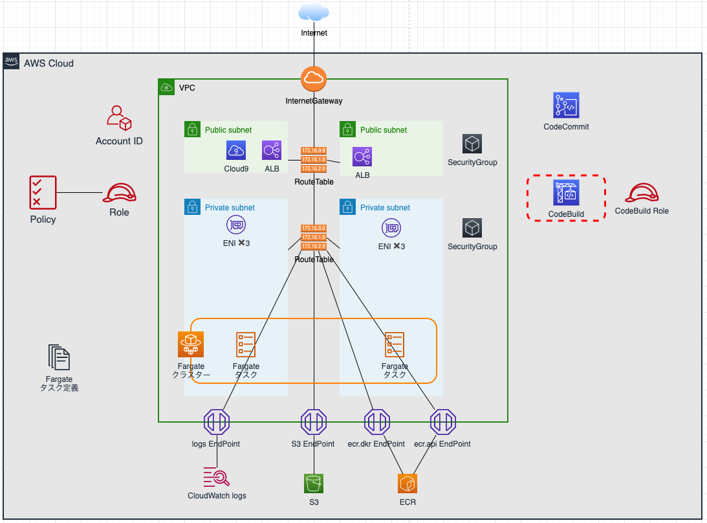

#### cmd

```Cloud9
aws codebuild create-project \
  --cli-input-json file://codebuild-create-project.json \
  --tags key=Name,value=ContainerHandsOn
```

#### result

```Cloud9
{
    "project": {
        "name": "ContainerHandsOn",
        "arn": "arn:aws:codebuild:ap-northeast-1:123456789012:project/ContainerHandsOn",
        "source": {
            "type": "CODECOMMIT",
            "location": "https://git-codecommit.ap-northeast-1.amazonaws.com/v1/repos/ContainerHandsOn",
            "insecureSsl": false
        },
        "sourceVersion": "refs/heads/master",
        "artifacts": {
            "type": "NO_ARTIFACTS"
        },
        "cache": {
            "type": "NO_CACHE"
        },
        "environment": {
            "type": "LINUX_CONTAINER",
            "image": "aws/codebuild/amazonlinux2-x86_64-standard:4.0",
            "computeType": "BUILD_GENERAL1_SMALL",
            "environmentVariables": [],
            "privilegedMode": false,
            "imagePullCredentialsType": "CODEBUILD"
        },
        "serviceRole": "arn:aws:iam::123456789012:role/ContainerHandsOnForCodeBuild",
        "timeoutInMinutes": 60,
        "queuedTimeoutInMinutes": 480,
        "encryptionKey": "arn:aws:kms:ap-northeast-1:123456789012:alias/aws/s3",
        "tags": [
            {
                "key": "Name",
                "value": "ContainerHandsOn"
            }
        ],
        "created": 1662874335.259,
        "lastModified": 1662874335.259,
        "badge": {
            "badgeEnabled": false
        },
        "projectVisibility": "PRIVATE"
    }
}
```

## CodeDeploy作成

Duration: 0:05:00

### ■CodeDeploy用Role作成

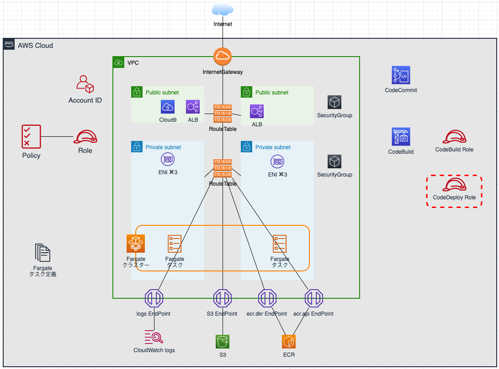

#### cmd

```Cloud9
cd ~/environment
```

```Cloud9
cat << EOF > assume-role-policy-document.json
{
  "Version": "2012-10-17",
  "Statement": [
    {
      "Sid": "",
      "Effect": "Allow",
      "Principal": {
        "Service": "codedeploy.amazonaws.com"
      },
      "Action": "sts:AssumeRole"
    }
  ]
}
EOF
```

```Cloud9
aws iam create-role \
  --role-name ContainerHandsOnForCodeDeploy \
  --assume-role-policy-document file://assume-role-policy-document.json
```

#### result

```Cloud9
{
    "Role": {
        "Path": "/",
        "RoleName": "ContainerHandsOnForCodeDeploy",
        "RoleId": "AROASHENIAIFMRHKSS3UR",
        "Arn": "arn:aws:iam::123456789012:role/ContainerHandsOnForCodeDeploy",
        "CreateDate": "2022-09-11T06:39:05Z",
        "AssumeRolePolicyDocument": {
            "Version": "2012-10-17",
            "Statement": [
                {
                    "Sid": "",
                    "Effect": "Allow",
                    "Principal": {
                        "Service": "codedeploy.amazonaws.com"
                    },
                    "Action": "sts:AssumeRole"
                }
            ]
        }
    }
}
```

### ■CodeDeploy用RoleにPolicyをアタッチ

#### cmd

```
aws iam attach-role-policy \
  --role-name ContainerHandsOnForCodeDeploy \
  --policy-arn arn:aws:iam::aws:policy/AWSCodeDeployRoleForECS
```

#### result

```
（なし）
```

#### cmd

```
aws iam attach-role-policy \
  --role-name ContainerHandsOnForCodeDeploy \
  --policy-arn arn:aws:iam::aws:policy/AmazonEC2ContainerRegistryPowerUser
```

#### result

```
（なし）
```

#### cmd

```
aws iam list-attached-role-policies \
  --role-name ContainerHandsOnForCodeDeploy
```

#### result

```Cloud9
{
    "AttachedPolicies": [
        {
            "PolicyName": "AmazonEC2ContainerRegistryPowerUser",
            "PolicyArn": "arn:aws:iam::aws:policy/AmazonEC2ContainerRegistryPowerUser"
        },
        {
            "PolicyName": "AWSCodeDeployRoleForECS",
            "PolicyArn": "arn:aws:iam::aws:policy/AWSCodeDeployRoleForECS"
        }
    ]
}
```

### ■アプリケーションを作成

- デプロイするアプリケーションを識別する名前を定義します。

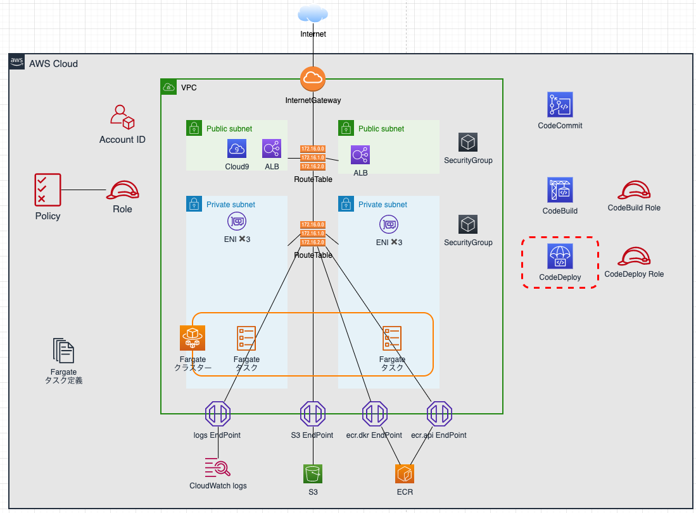

#### cmd

```Cloud9
aws deploy create-application \
  --application-name ContainerHandsOn \
  --compute-platform ECS \
  --tags Key=Name,Value=ContainerHandsOn
```

#### result

```Cloud9
{
    "applicationId": "84eb81cb-1e84-46cb-9209-c17334e7bc15"
}
```

### ■ターゲットグループの作成

- ALBのターゲットグループを新規作成します、テスト用として通常利用とはポートは変更します

#### cmd

```Cloud9
aws elbv2 create-target-group \
    --name ContainerHandsOn8080 \
    --protocol HTTP \
    --port 8080 \
    --target-type ip \
    --health-check-protocol HTTP \
    --health-check-port traffic-port \
    --health-check-path /index.php \
    --vpc-id ${VpcId}
```

#### result

```Cloud9
{
    "TargetGroups": [
        {
            "TargetGroupArn": "arn:aws:elasticloadbalancing:ap-northeast-1:123456789012:targetgroup/ContainerHandsOn8080/e27bdcbab658f9d4",
            "TargetGroupName": "ContainerHandsOn8080",
            "Protocol": "HTTP",
            "Port": 8080,
            "VpcId": "vpc-0320e7bf74af8bd72",
            "HealthCheckProtocol": "HTTP",
            "HealthCheckPort": "traffic-port",
            "HealthCheckEnabled": true,
            "HealthCheckIntervalSeconds": 30,
            "HealthCheckTimeoutSeconds": 5,
            "HealthyThresholdCount": 5,
            "UnhealthyThresholdCount": 2,
            "HealthCheckPath": "/index.php",
            "Matcher": {
                "HttpCode": "200"
            },
            "TargetType": "ip",
            "ProtocolVersion": "HTTP1",
            "IpAddressType": "ipv4"
        }
    ]
}
```

### ■ターゲットグループのARN取得

- 上記で作成したターゲットグループのARNを取得します

#### cmd

```Cloud9
TargetGroupArn8080=`aws elbv2 describe-target-groups \
  --names ContainerHandsOn8080 \
  --query "TargetGroups[*].TargetGroupArn" \
  --output text`
```

```Cloud9
clear; cat << EOF
AccoutID : ${AccoutID}
VpcId : ${VpcId}
SubnetId1aPublic : ${SubnetId1aPublic}
SubnetId1cPublic : ${SubnetId1cPublic}
SubnetId1aPrivate : ${SubnetId1aPrivate}
SubnetId1cPrivate : ${SubnetId1cPrivate}
InternetGatewayId : ${InternetGatewayId}
RouteTableIdPublic : ${RouteTableIdPublic}
RouteTableIdPrivate : ${RouteTableIdPrivate}
PublicSecurityGroupsId : ${PublicSecurityGroupsId}
PrivateSecurityGroupsId : ${PrivateSecurityGroupsId}
InstanceId : ${InstanceId}
LoadBalancersDnsName : ${LoadBalancersDnsName}
LoadBalancerArn : ${LoadBalancerArn}
TargetGroupArn : ${TargetGroupArn}
RevisionNo : ${RevisionNo}
TargetGroupArn8080 : ${TargetGroupArn8080}
EOF
```

#### result

```Cloud9
AccoutID : 123456789012
VpcId : vpc-0320e7bf74af8bd72
SubnetId1aPublic : subnet-059ff12a72e014ca1
SubnetId1cPublic : subnet-0076bf4756ca680d1
SubnetId1aPrivate : subnet-000d7e1758777eb85
SubnetId1cPrivate : subnet-04ec5cc1209d3c566
InternetGatewayId : igw-015b39463b346214a
RouteTableIdPublic : rtb-00a15f36fcbabe379
RouteTableIdPrivate : rtb-086e760ddf493b0c3
PublicSecurityGroupsId : sg-04a6d799d221392dc
PrivateSecurityGroupsId : sg-0ce0e72015ca72d09
LoadBalancersDnsName : ContainerHandsOn-1258418044.ap-northeast-1.elb.amazonaws.com
LoadBalancerArn : arn:aws:elasticloadbalancing:ap-northeast-1:123456789012:loadbalancer/app/ContainerHandsOn/09fd839792d722ff
TargetGroupArn : arn:aws:elasticloadbalancing:ap-northeast-1:123456789012:targetgroup/ContainerHandsOn/d6ccd892547e534d
RevisionNo : 2
TargetGroupArn8080 : arn:aws:elasticloadbalancing:ap-northeast-1:123456789012:targetgroup/ContainerHandsOn8080/e27bdcbab658f9d4
```

### ■リスナーの作成

- ALBに対する接続リクエストを追加します。8080ポートでテスト用として受け口となるリスナーです。

#### cmd

```Cloud9
aws elbv2 create-listener \
    --load-balancer-arn ${LoadBalancerArn} \
    --protocol HTTP \
    --port 8080 \
    --default-actions Type=forward,TargetGroupArn=${TargetGroupArn8080}
```

#### result

```Cloud9
{
    "Listeners": [
        {
            "ListenerArn": "arn:aws:elasticloadbalancing:ap-northeast-1:123456789012:listener/app/ContainerHandsOn/09fd839792d722ff/c39cf5572d2a4854",
            "LoadBalancerArn": "arn:aws:elasticloadbalancing:ap-northeast-1:123456789012:loadbalancer/app/ContainerHandsOn/09fd839792d722ff",
            "Port": 8080,
            "Protocol": "HTTP",
            "DefaultActions": [
                {
                    "Type": "forward",
                    "TargetGroupArn": "arn:aws:elasticloadbalancing:ap-northeast-1:123456789012:targetgroup/ContainerHandsOn8080/e27bdcbab658f9d4",
                    "ForwardConfig": {
                        "TargetGroups": [
                            {
                                "TargetGroupArn": "arn:aws:elasticloadbalancing:ap-northeast-1:123456789012:targetgroup/ContainerHandsOn8080/e27bdcbab658f9d4",
                                "Weight": 1
                            }
                        ],
                        "TargetGroupStickinessConfig": {
                            "Enabled": false
                        }
                    }
                }
            ]
        }
    ]
}
```

### ■リスナーのARN取得

- リスナーのARNを取得します

#### cmd

```Cloud9
ListenerArn=`aws elbv2 describe-listeners \
    --load-balancer-arn ${LoadBalancerArn} \
    --query "Listeners[*].[Port,ListenerArn]" \
    --output text | grep "^80\s" | cut -f 2`
```

#### result

```Cloud9
（なし）
```

#### cmd

```Cloud9
ListenerArn8080=`aws elbv2 describe-listeners \
    --load-balancer-arn ${LoadBalancerArn} \
    --query "Listeners[*].[Port,ListenerArn]" \
    --output text | grep "^8080" | cut -f 2`
```

#### result

```Cloud9
（なし）
```

#### cmd

```Cloud9
clear; cat << EOF
AccoutID : ${AccoutID}
VpcId : ${VpcId}
SubnetId1aPublic : ${SubnetId1aPublic}
SubnetId1cPublic : ${SubnetId1cPublic}
SubnetId1aPrivate : ${SubnetId1aPrivate}
SubnetId1cPrivate : ${SubnetId1cPrivate}
InternetGatewayId : ${InternetGatewayId}
RouteTableIdPublic : ${RouteTableIdPublic}
RouteTableIdPrivate : ${RouteTableIdPrivate}
PublicSecurityGroupsId : ${PublicSecurityGroupsId}
PrivateSecurityGroupsId : ${PrivateSecurityGroupsId}
InstanceId : ${InstanceId}
LoadBalancersDnsName : ${LoadBalancersDnsName}
LoadBalancerArn : ${LoadBalancerArn}
TargetGroupArn : ${TargetGroupArn}
RevisionNo : ${RevisionNo}
TargetGroupArn8080 : ${TargetGroupArn8080}
ListenerArn : ${ListenerArn}
ListenerArn8080 : ${ListenerArn8080}
EOF
```

#### result

```Cloud9
AccoutID : 123456789012
VpcId : vpc-0320e7bf74af8bd72
SubnetId1aPublic : subnet-059ff12a72e014ca1
SubnetId1cPublic : subnet-0076bf4756ca680d1
SubnetId1aPrivate : subnet-000d7e1758777eb85
SubnetId1cPrivate : subnet-04ec5cc1209d3c566
InternetGatewayId : igw-015b39463b346214a
RouteTableIdPublic : rtb-00a15f36fcbabe379
RouteTableIdPrivate : rtb-086e760ddf493b0c3
PublicSecurityGroupsId : sg-04a6d799d221392dc
PrivateSecurityGroupsId : sg-0ce0e72015ca72d09
LoadBalancersDnsName : ContainerHandsOn-1258418044.ap-northeast-1.elb.amazonaws.com
LoadBalancerArn : arn:aws:elasticloadbalancing:ap-northeast-1:123456789012:loadbalancer/app/ContainerHandsOn/09fd839792d722ff
TargetGroupArn : arn:aws:elasticloadbalancing:ap-northeast-1:123456789012:targetgroup/ContainerHandsOn/d6ccd892547e534d
RevisionNo : 2
TargetGroupArn8080 : arn:aws:elasticloadbalancing:ap-northeast-1:123456789012:targetgroup/ContainerHandsOn8080/e27bdcbab658f9d4
ListenerArn : arn:aws:elasticloadbalancing:ap-northeast-1:123456789012:listener/app/ContainerHandsOn/09fd839792d722ff/06feb1b2e81f0f88
ListenerArn8080 : arn:aws:elasticloadbalancing:ap-northeast-1:123456789012:listener/app/ContainerHandsOn/09fd839792d722ff/c39cf5572d2a4854
```

### ■PublicSubnetのインバウンドルールを追加

- リスナーとして8080ポートを追加するので、セキュリティグループにも8080ポートを許可します

#### cmd

```Cloud9
aws ec2 authorize-security-group-ingress \
    --group-id ${PublicSecurityGroupsId} \
    --protocol tcp \
    --port 8080 \
    --cidr 0.0.0.0/0
```

#### result

```Cloud9
{
    "Return": true,
    "SecurityGroupRules": [
        {
            "SecurityGroupRuleId": "sgr-0d94c6066ce720a52",
            "GroupId": "sg-04a6d799d221392dc",
            "GroupOwnerId": "123456789012",
            "IsEgress": false,
            "IpProtocol": "tcp",
            "FromPort": 8080,
            "ToPort": 8080,
            "CidrIpv4": "0.0.0.0/0"
        }
    ]
}
```

### ■デプロイグループの作成

- デプロイ環境の定義を行います

#### cmd

```Cloud9
cat << EOF > create-deployment-group.json
{
    "applicationName": "ContainerHandsOn",
    "deploymentGroupName": "ContainerHandsOn",
    "deploymentConfigName": "CodeDeployDefault.ECSAllAtOnce",
    "serviceRoleArn": "arn:aws:iam::${AccoutID}:role/ContainerHandsOnForCodeDeploy",
    "deploymentStyle": {
        "deploymentType": "BLUE_GREEN",
        "deploymentOption": "WITH_TRAFFIC_CONTROL"
    },
    "blueGreenDeploymentConfiguration": {
        "terminateBlueInstancesOnDeploymentSuccess": {
            "action": "TERMINATE",
            "terminationWaitTimeInMinutes": 60
        },
        "deploymentReadyOption": {
            "actionOnTimeout": "STOP_DEPLOYMENT",
            "waitTimeInMinutes": 60
        }
    },
    "loadBalancerInfo": {
        "targetGroupPairInfoList": [
            {
                "targetGroups": [
                    {
                        "name": "ContainerHandsOn"
                    },
                    {
                        "name": "ContainerHandsOn8080"
                    }
                ],
                "prodTrafficRoute": {
                    "listenerArns": [
                        "${ListenerArn}"
                    ]
                },
                "testTrafficRoute": {
                    "listenerArns": [
                        "${ListenerArn8080}"
                    ]
                }
            }
        ]
    },
    "ecsServices": [
        {
            "serviceName": "ContainerHandsOn",
            "clusterName": "ContainerHandsOn"
        }
    ]
}
EOF
```

```Cloud9
aws deploy create-deployment-group \
  --cli-input-json file://create-deployment-group.json
```

#### result

```Cloud9
{
    "deploymentGroupId": "66c261d6-481c-411c-a450-408e4582d3a3"
}
```

## CodePipeline作成

Duration: 0:05:00

### ■CodePipeline用Role作成

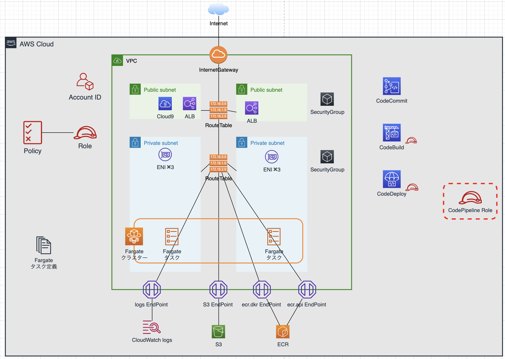

#### cmd

```Cloud9
cat << EOF > assume-role-policy-document.json
{
  "Version": "2012-10-17",
  "Statement": [
    {
      "Sid": "",
      "Effect": "Allow",
      "Principal": {
        "Service": "codepipeline.amazonaws.com"
      },
      "Action": "sts:AssumeRole"
    }
  ]
}
EOF
```

```Cloud9
aws iam create-role \
  --role-name ContainerHandsOnForPipeLine \
  --assume-role-policy-document file://assume-role-policy-document.json
```

#### result

```Cloud9
{
    "Role": {
        "Path": "/",
        "RoleName": "ContainerHandsOnForPipeLine",
        "RoleId": "AROASHENIAIFE3VFSOI5C",
        "Arn": "arn:aws:iam::123456789012:role/ContainerHandsOnForPipeLine",
        "CreateDate": "2022-09-11T07:29:04Z",
        "AssumeRolePolicyDocument": {
            "Version": "2012-10-17",
            "Statement": [
                {
                    "Sid": "",
                    "Effect": "Allow",
                    "Principal": {
                        "Service": "codepipeline.amazonaws.com"
                    },
                    "Action": "sts:AssumeRole"
                }
            ]
        }
    }
}
```

### ■CodePipeline用RoleにPolicyをアタッチ

#### cmd

```Cloud9
cat << EOF > InlinePolicy.json
{
    "Statement": [
        {
            "Action": [
                "iam:PassRole"
            ],
            "Resource": "*",
            "Effect": "Allow",
            "Condition": {
                "StringEqualsIfExists": {
                    "iam:PassedToService": [
                        "cloudformation.amazonaws.com",
                        "elasticbeanstalk.amazonaws.com",
                        "ec2.amazonaws.com",
                        "ecs-tasks.amazonaws.com"
                    ]
                }
            }
        },
        {
            "Action": [
                "codecommit:CancelUploadArchive",
                "codecommit:GetBranch",
                "codecommit:GetCommit",
                "codecommit:GetRepository",
                "codecommit:GetUploadArchiveStatus",
                "codecommit:UploadArchive"
            ],
            "Resource": "*",
            "Effect": "Allow"
        },
        {
            "Action": [
                "codedeploy:CreateDeployment",
                "codedeploy:GetApplication",
                "codedeploy:GetApplicationRevision",
                "codedeploy:GetDeployment",
                "codedeploy:GetDeploymentConfig",
                "codedeploy:RegisterApplicationRevision"
            ],
            "Resource": "*",
            "Effect": "Allow"
        },
        {
            "Action": [
                "codestar-connections:UseConnection"
            ],
            "Resource": "*",
            "Effect": "Allow"
        },
        {
            "Action": [
                "elasticbeanstalk:*",
                "ec2:*",
                "elasticloadbalancing:*",
                "autoscaling:*",
                "cloudwatch:*",
                "s3:*",
                "sns:*",
                "cloudformation:*",
                "rds:*",
                "sqs:*",
                "ecs:*"
            ],
            "Resource": "*",
            "Effect": "Allow"
        },
        {
            "Action": [
                "lambda:InvokeFunction",
                "lambda:ListFunctions"
            ],
            "Resource": "*",
            "Effect": "Allow"
        },
        {
            "Action": [
                "opsworks:CreateDeployment",
                "opsworks:DescribeApps",
                "opsworks:DescribeCommands",
                "opsworks:DescribeDeployments",
                "opsworks:DescribeInstances",
                "opsworks:DescribeStacks",
                "opsworks:UpdateApp",
                "opsworks:UpdateStack"
            ],
            "Resource": "*",
            "Effect": "Allow"
        },
        {
            "Action": [
                "cloudformation:CreateStack",
                "cloudformation:DeleteStack",
                "cloudformation:DescribeStacks",
                "cloudformation:UpdateStack",
                "cloudformation:CreateChangeSet",
                "cloudformation:DeleteChangeSet",
                "cloudformation:DescribeChangeSet",
                "cloudformation:ExecuteChangeSet",
                "cloudformation:SetStackPolicy",
                "cloudformation:ValidateTemplate"
            ],
            "Resource": "*",
            "Effect": "Allow"
        },
        {
            "Action": [
                "codebuild:BatchGetBuilds",
                "codebuild:StartBuild",
                "codebuild:BatchGetBuildBatches",
                "codebuild:StartBuildBatch"
            ],
            "Resource": "*",
            "Effect": "Allow"
        },
        {
            "Effect": "Allow",
            "Action": [
                "devicefarm:ListProjects",
                "devicefarm:ListDevicePools",
                "devicefarm:GetRun",
                "devicefarm:GetUpload",
                "devicefarm:CreateUpload",
                "devicefarm:ScheduleRun"
            ],
            "Resource": "*"
        },
        {
            "Effect": "Allow",
            "Action": [
                "servicecatalog:ListProvisioningArtifacts",
                "servicecatalog:CreateProvisioningArtifact",
                "servicecatalog:DescribeProvisioningArtifact",
                "servicecatalog:DeleteProvisioningArtifact",
                "servicecatalog:UpdateProduct"
            ],
            "Resource": "*"
        },
        {
            "Effect": "Allow",
            "Action": [
                "cloudformation:ValidateTemplate"
            ],
            "Resource": "*"
        },
        {
            "Effect": "Allow",
            "Action": [
                "ecr:DescribeImages"
            ],
            "Resource": "*"
        },
        {
            "Effect": "Allow",
            "Action": [
                "states:DescribeExecution",
                "states:DescribeStateMachine",
                "states:StartExecution"
            ],
            "Resource": "*"
        },
        {
            "Effect": "Allow",
            "Action": [
                "appconfig:StartDeployment",
                "appconfig:StopDeployment",
                "appconfig:GetDeployment"
            ],
            "Resource": "*"
        }
    ],
    "Version": "2012-10-17"
}
EOF
```

```Cloud9
aws iam put-role-policy \
  --role-name ContainerHandsOnForPipeLine \
  --policy-name InlinePolicy \
  --policy-document file://InlinePolicy.json
```

#### result

```Cloud9
（なし）
```

### ■artifactStoreとしてS3を作成

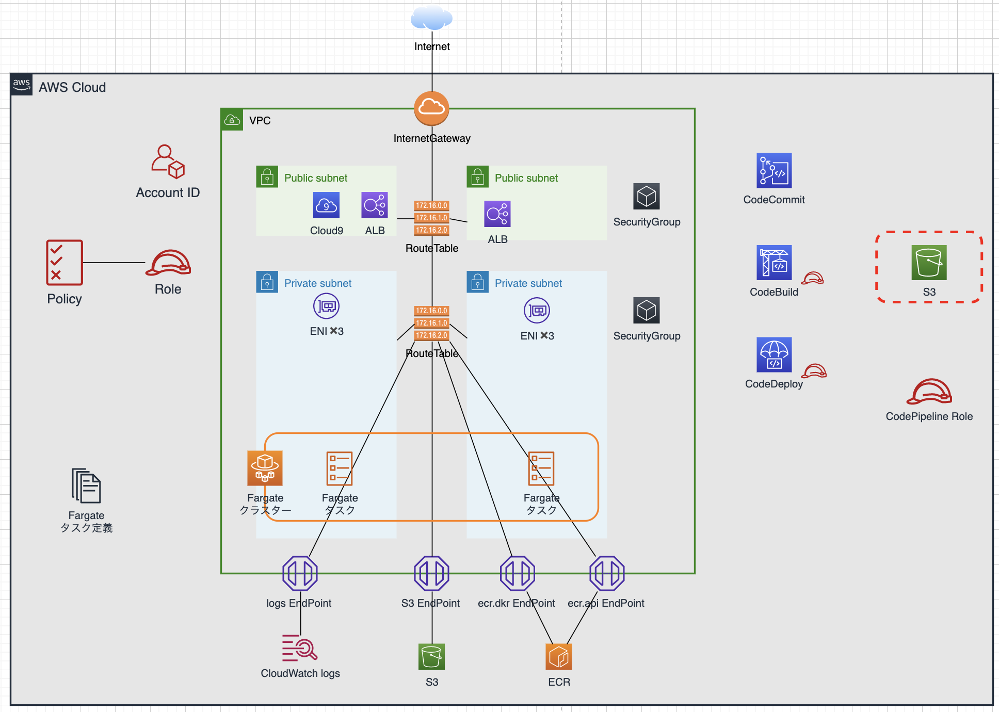

#### cmd

Positive
: あなたのフルネームを記載下さい、英語小文字でお願いします

```Cloud9
YourName=shigeru-oda
```

#### cmd

```Cloud9
S3Name=${YourName}-container-handson-`date +"%Y%m%d%H%M%S"`
```

```Cloud9
clear; cat << EOF
AccoutID : ${AccoutID}
VpcId : ${VpcId}
SubnetId1aPublic : ${SubnetId1aPublic}
SubnetId1cPublic : ${SubnetId1cPublic}
SubnetId1aPrivate : ${SubnetId1aPrivate}
SubnetId1cPrivate : ${SubnetId1cPrivate}
InternetGatewayId : ${InternetGatewayId}
RouteTableIdPublic : ${RouteTableIdPublic}
RouteTableIdPrivate : ${RouteTableIdPrivate}
PublicSecurityGroupsId : ${PublicSecurityGroupsId}
PrivateSecurityGroupsId : ${PrivateSecurityGroupsId}
InstanceId : ${InstanceId}
LoadBalancersDnsName : ${LoadBalancersDnsName}
LoadBalancerArn : ${LoadBalancerArn}
TargetGroupArn : ${TargetGroupArn}
RevisionNo : ${RevisionNo}
TargetGroupArn8080 : ${TargetGroupArn8080}
ListenerArn : ${ListenerArn}
ListenerArn8080 : ${ListenerArn8080}
S3Name : ${S3Name}
EOF
```

#### result

```Cloud9
AccoutID : 123456789012
VpcId : vpc-0320e7bf74af8bd72
SubnetId1aPublic : subnet-059ff12a72e014ca1
SubnetId1cPublic : subnet-0076bf4756ca680d1
SubnetId1aPrivate : subnet-000d7e1758777eb85
SubnetId1cPrivate : subnet-04ec5cc1209d3c566
InternetGatewayId : igw-015b39463b346214a
RouteTableIdPublic : rtb-00a15f36fcbabe379
RouteTableIdPrivate : rtb-086e760ddf493b0c3
PublicSecurityGroupsId : sg-04a6d799d221392dc
PrivateSecurityGroupsId : sg-0ce0e72015ca72d09
LoadBalancersDnsName : ContainerHandsOn-1258418044.ap-northeast-1.elb.amazonaws.com
LoadBalancerArn : arn:aws:elasticloadbalancing:ap-northeast-1:123456789012:loadbalancer/app/ContainerHandsOn/09fd839792d722ff
TargetGroupArn : arn:aws:elasticloadbalancing:ap-northeast-1:123456789012:targetgroup/ContainerHandsOn/d6ccd892547e534d
RevisionNo : 2
TargetGroupArn8080 : arn:aws:elasticloadbalancing:ap-northeast-1:123456789012:targetgroup/ContainerHandsOn8080/e27bdcbab658f9d4
ListenerArn : arn:aws:elasticloadbalancing:ap-northeast-1:123456789012:listener/app/ContainerHandsOn/09fd839792d722ff/06feb1b2e81f0f88
ListenerArn8080 : arn:aws:elasticloadbalancing:ap-northeast-1:123456789012:listener/app/ContainerHandsOn/09fd839792d722ff/c39cf5572d2a4854
S3Name : shigeru-oda-container-handson-20220911072649
```

#### cmd

```Cloud9
aws s3 mb s3://${S3Name}
```

### ■CodePipelineを作成

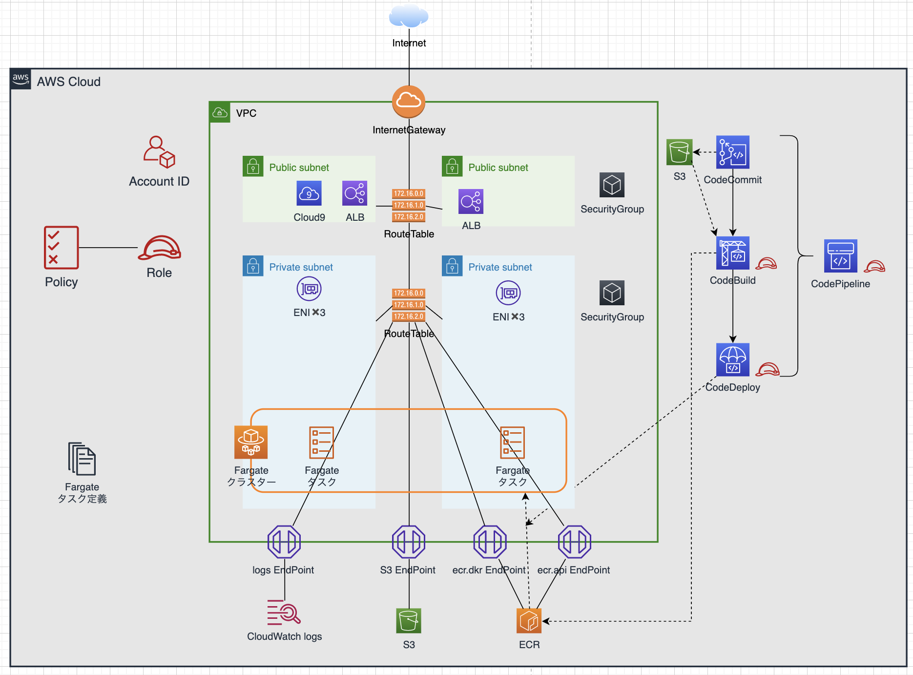

#### cmd

```Cloud9
cat << EOF > create-pipeline.json
{
    "pipeline": {
        "name": "ContainerHandsOn",
        "roleArn": "arn:aws:iam::`echo ${AccoutID}`:role/ContainerHandsOnForPipeLine",
        "artifactStore": {
            "type": "S3",
            "location": "`echo ${S3Name}`"
        },
        "stages": [
            {
                "name": "Source",
                "actions": [
                    {
                        "name": "Source",
                        "actionTypeId": {
                            "category": "Source",
                            "owner": "AWS",
                            "provider": "CodeCommit",
                            "version": "1"
                        },
                        "runOrder": 1,
                        "configuration": {
                            "BranchName": "master",
                            "OutputArtifactFormat": "CODE_ZIP",
                            "PollForSourceChanges": "false",
                            "RepositoryName": "ContainerHandsOn"
                        },
                        "outputArtifacts": [
                            {
                                "name": "SourceArtifact"
                            }
                        ],
                        "inputArtifacts": [],
                        "region": "ap-northeast-1",
                        "namespace": "SourceVariables"
                    }
                ]
            },
            {
                "name": "Build",
                "actions": [
                    {
                        "name": "Build",
                        "actionTypeId": {
                            "category": "Build",
                            "owner": "AWS",
                            "provider": "CodeBuild",
                            "version": "1"
                        },
                        "runOrder": 1,
                        "configuration": {
                            "ProjectName": "ContainerHandsOn"
                        },
                        "outputArtifacts": [
                            {
                                "name": "BuildArtifact"
                            }
                        ],
                        "inputArtifacts": [
                            {
                                "name": "SourceArtifact"
                            }
                        ],
                        "region": "ap-northeast-1",
                        "namespace": "BuildVariables"
                    }
                ]
            },
            {
                "name": "Deploy",
                "actions": [
                    {
                        "name": "Deploy",
                        "actionTypeId": {
                            "category": "Deploy",
                            "owner": "AWS",
                            "provider": "CodeDeployToECS",
                            "version": "1"
                        },
                        "runOrder": 1,
                        "configuration": {
                            "AppSpecTemplateArtifact": "SourceArtifact",
                            "ApplicationName": "ContainerHandsOn",
                            "DeploymentGroupName": "ContainerHandsOn",
                            "Image1ArtifactName": "BuildArtifact",
                            "Image1ContainerName": "IMAGE_NAME",
                            "TaskDefinitionTemplateArtifact": "SourceArtifact"
                        },
                        "outputArtifacts": [],
                        "inputArtifacts": [
                            {
                                "name": "BuildArtifact"
                            },
                            {
                                "name": "SourceArtifact"
                            }
                        ],
                        "region": "ap-northeast-1",
                        "namespace": "DeployVariables"
                    }
                ]
            }
        ],
        "version": 1
    }
}
EOF
```

```Cloud9
aws codepipeline create-pipeline --cli-input-json file://create-pipeline.json
```

#### result

```Cloud9
{
    "pipeline": {
        "name": "ContainerHandsOn",
        "roleArn": "arn:aws:iam::123456789012:role/ContainerHandsOnForPipeLine",
        "artifactStore": {
            "type": "S3",
            "location": "shigeru-oda-container-handson-20220911072649"
        },
        "stages": [
            {
                "name": "Source",
                "actions": [
                    {
                        "name": "Source",
                        "actionTypeId": {
                            "category": "Source",
                            "owner": "AWS",
                            "provider": "CodeCommit",
                            "version": "1"
                        },
                        "runOrder": 1,
                        "configuration": {
                            "BranchName": "master",
                            "OutputArtifactFormat": "CODE_ZIP",
                            "PollForSourceChanges": "false",
                            "RepositoryName": "ContainerHandsOn"
                        },
                        "outputArtifacts": [
                            {
                                "name": "SourceArtifact"
                            }
                        ],
                        "inputArtifacts": [],
                        "region": "ap-northeast-1",
                        "namespace": "SourceVariables"
                    }
                ]
            },
            {
                "name": "Build",
                "actions": [
                    {
                        "name": "Build",
                        "actionTypeId": {
                            "category": "Build",
                            "owner": "AWS",
                            "provider": "CodeBuild",
                            "version": "1"
                        },
                        "runOrder": 1,
                        "configuration": {
                            "ProjectName": "ContainerHandsOn"
                        },
                        "outputArtifacts": [
                            {
                                "name": "BuildArtifact"
                            }
                        ],
                        "inputArtifacts": [
                            {
                                "name": "SourceArtifact"
                            }
                        ],
                        "region": "ap-northeast-1",
                        "namespace": "BuildVariables"
                    }
                ]
            },
            {
                "name": "Deploy",
                "actions": [
                    {
                        "name": "Deploy",
                        "actionTypeId": {
                            "category": "Deploy",
                            "owner": "AWS",
                            "provider": "CodeDeployToECS",
                            "version": "1"
                        },
                        "runOrder": 1,
                        "configuration": {
                            "AppSpecTemplateArtifact": "SourceArtifact",
                            "ApplicationName": "ContainerHandsOn",
                            "DeploymentGroupName": "ContainerHandsOn",
                            "Image1ArtifactName": "BuildArtifact",
                            "Image1ContainerName": "IMAGE_NAME",
                            "TaskDefinitionTemplateArtifact": "SourceArtifact"
                        },
                        "outputArtifacts": [],
                        "inputArtifacts": [
                            {
                                "name": "BuildArtifact"
                            },
                            {
                                "name": "SourceArtifact"
                            }
                        ],
                        "region": "ap-northeast-1",
                        "namespace": "DeployVariables"
                    }
                ]
            }
        ],
        "version": 1
    }
}
```

## 動作確認２−１（Blue/Green Deployの確認）

Duration: 0:05:00

### ■CodePipelineの流れ

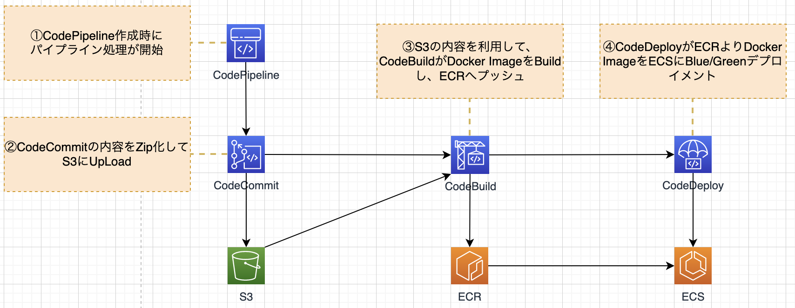

### ■Bule/Greenデプロイの流れ

- 参考元：[20190731 Black Belt Online Seminar Amazon ECS Deep Dive](https://www.slideshare.net/AmazonWebServicesJapan/20190731-black-belt-online-seminar-amazon-ecs-deep-dive-162160987)
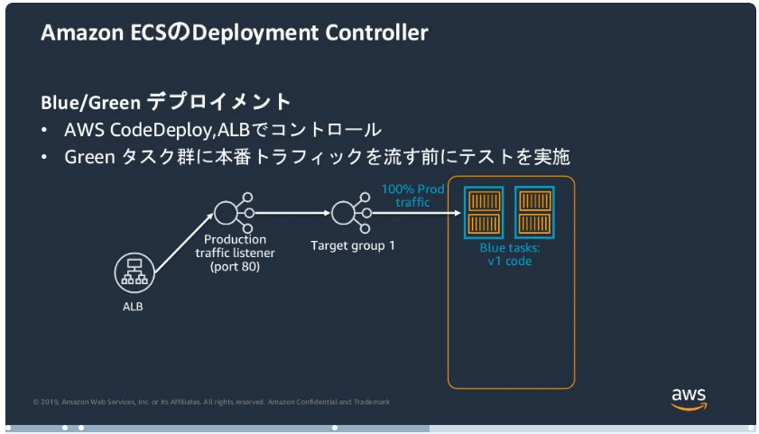
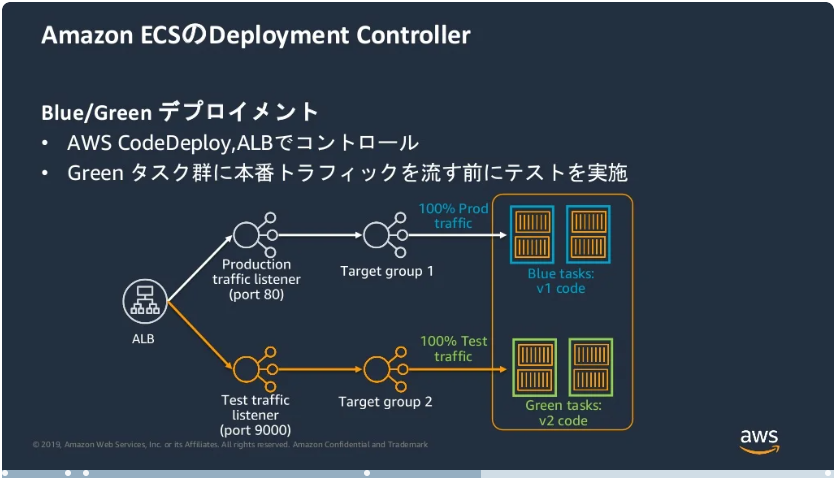
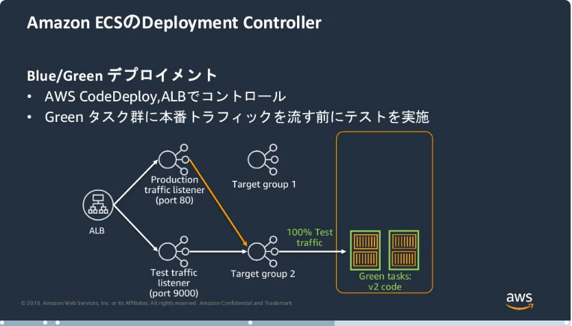

### ■AWS コンソールでCodePipelineを検索

- 上部の検索バーでCodePipelineと検索
- パイプラインの画面が表示されるのでContainerHandsOnを選択
- Source、Buildが「成功しました」と表示されるまで暫く待機
- Deployが「進行中」になった段階で「詳細」ボタン押下
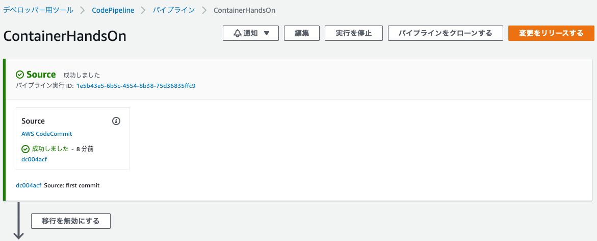


- Blue（オリジナル）にトラフィックが向いていることが確認できます。
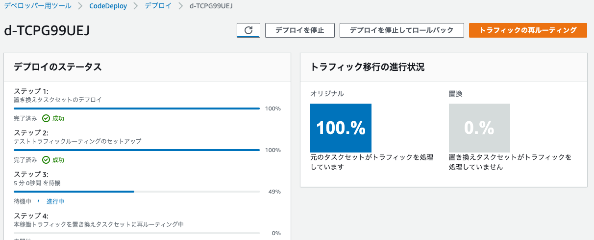

- 上部の検索バーで「Elastic Container Service」と検索
- クラスター一覧の画面が表示されるのでContainerHandsOnを選択
- タスクタブを選択
- リビジョンが異なる2 * 2のタスクが稼働していることが確認できます。
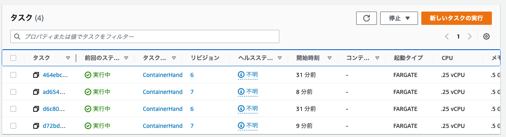

- リビジョンが異なる2 * 2のタスクが稼働していることが確認できます。

### ■アドレス確認 Blue（オリジナル）

#### cmd

```Cloud9
echo "http://"${LoadBalancersDnsName}
```

#### result

```Cloud9
http://ContainerHandsOn-610375823.ap-northeast-1.elb.amazonaws.com
```

#### 画面

- 上記で取得されたアドレスをChromeなどのブラウザに貼り付け、以下のような表示になること
- ブラウザを更新すると２種類のタスクが確認できます
- パターン１

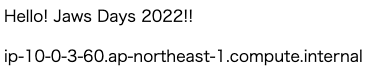

- パターン２

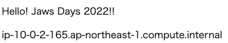

### ■アドレス確認 Green（置換）

#### cmd

```Cloud9
echo "http://"${LoadBalancersDnsName}:8080
```

#### result

```Cloud9
http://ContainerHandsOn-610375823.ap-northeast-1.elb.amazonaws.com:8080
```

#### 画面

- 上記で取得されたアドレスをChromeなどのブラウザに貼り付け、以下のような表示になること
- ブラウザを更新すると先ほどとは異なる２種類のタスクが確認できます
- パターン１

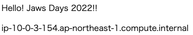

- パターン２

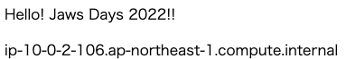

### ■Blue/Greenの置換

#### 画面

- CodeDeployの画面に戻ります
- 「トラフィックの再ルーティング」ボタン押下

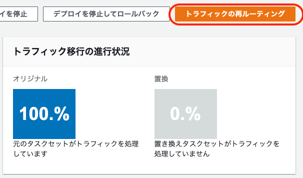

- 暫くするとトラフィックがGreen（置換）に切り替わっていることが確認できます。

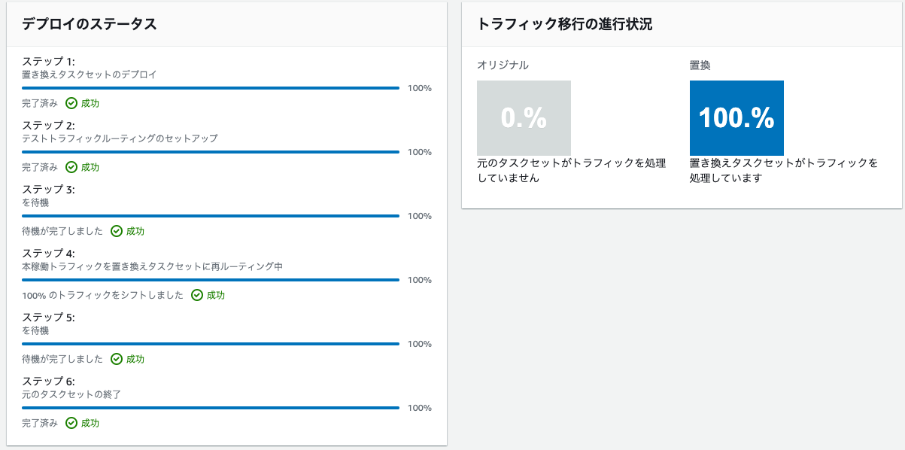

### ■Blue/Greenの置換後

#### 画面

- 再度ECSの画面に戻るとタスクで古いリビジョンが削除されていることが確認できます。

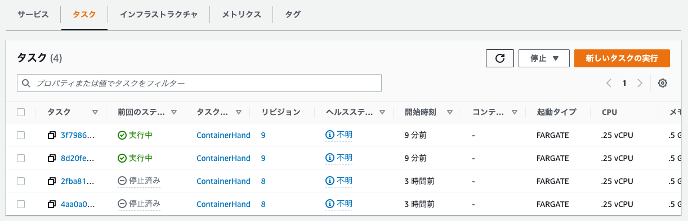

## EventBridge作成

Duration: 0:05:00

### ■EventBridge用Role作成

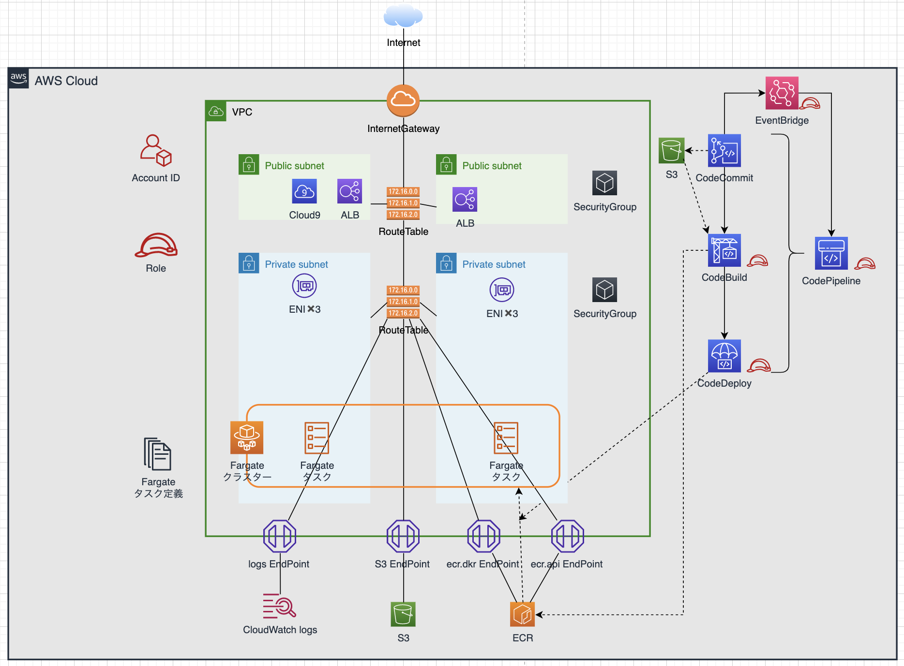

#### cmd

```Cloud9
cd ~/environment
```

```Cloud9
cat << EOF > assume-role-policy-document.json
{
    "Version": "2012-10-17",
    "Statement": [
        {
            "Effect": "Allow",
            "Principal": {
                "Service": "events.amazonaws.com"
            },
            "Action": "sts:AssumeRole"
        }
    ]
}
EOF
```

```
aws iam create-role \
  --role-name ContainerHandsOnForEventBridge \
  --assume-role-policy-document file://assume-role-policy-document.json
```

#### result

```Cloud9
{
    "Role": {
        "Path": "/",
        "RoleName": "ContainerHandsOnForEventBridge",
        "RoleId": "AROASHENIAIFKIXIOXE3I",
        "Arn": "arn:aws:iam::152767562250:role/ContainerHandsOnForEventBridge",
        "CreateDate": "2022-09-13T05:32:16Z",
        "AssumeRolePolicyDocument": {
            "Version": "2012-10-17",
            "Statement": [
                {
                    "Effect": "Allow",
                    "Principal": {
                        "Service": "events.amazonaws.com"
                    },
                    "Action": "sts:AssumeRole"
                }
            ]
        }
    }
}
```

### ■EventBridge用RoleにPolicyをアタッチ

#### cmd

```Cloud9
cat << EOF > InlinePolicy.json
{
    "Version": "2012-10-17",
    "Statement": [
        {
            "Effect": "Allow",
            "Action": [
                "codepipeline:StartPipelineExecution"
            ],
            "Resource": [
                "arn:aws:codepipeline:ap-northeast-1:${AccoutID}:*"
            ]
        }
    ]
}
EOF
```

```Cloud9
aws iam put-role-policy \
  --role-name ContainerHandsOnForEventBridge \
  --policy-name InlinePolicy \
  --policy-document file://InlinePolicy.json
```

#### result

```Cloud9
```

### ■EventBridgeを作成
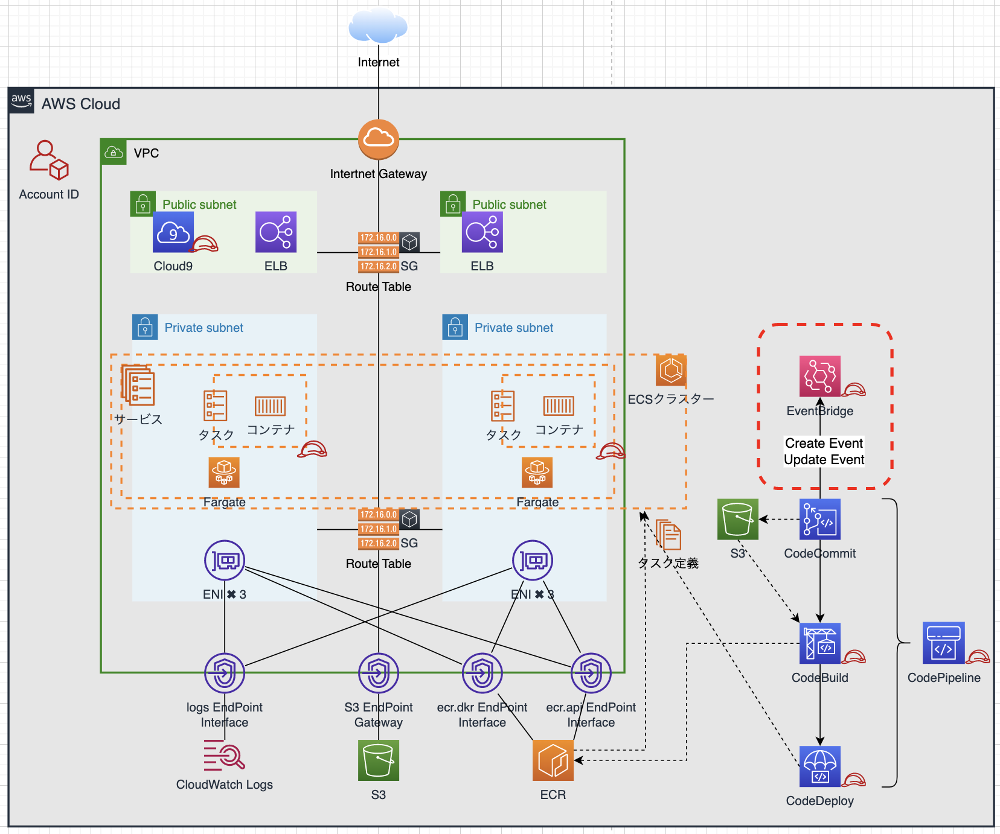

#### cmd

```Cloud9
aws events put-rule \
  --name "ContainerHandsOn" \
  --state "ENABLED" \
  --description "ContainerHandsOn" \
  --event-bus-name "default" \
  --event-pattern "{ \
    \"source\":[\"aws.codecommit\"], \
    \"detail-type\":[\"CodeCommit Repository State Change\"], \
    \"resources\":[\"arn:aws:codecommit:ap-northeast-1:${AccoutID}:ContainerHandsOn\"], \
    \"detail\":{ \
        \"event\":[\"referenceCreated\",\"referenceUpdated\"], \
        \"referenceType\": [\"branch\"], \
        \"referenceName\":[\"master\"] \
    } \
  }" \
  --role-arn "arn:aws:iam::${AccoutID}:role/ContainerHandsOnForEventBridge"
```

#### result

```Cloud9
{
    "RuleArn": "arn:aws:events:ap-northeast-1:152767562250:rule/ContainerHandsOnForEventBridge"
}
```

### ■targetを作成
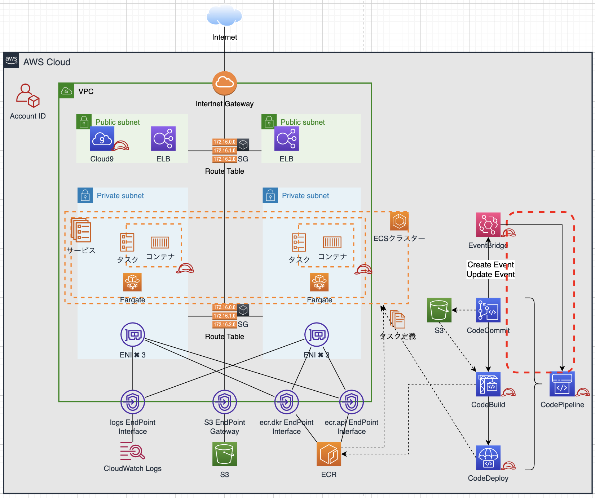

#### cmd

```Cloud9
aws events put-targets \
  --rule ContainerHandsOn \
  --targets "Id"="1","Arn"="arn:aws:codepipeline:ap-northeast-1:${AccoutID}:ContainerHandsOn","RoleArn"="arn:aws:iam::${AccoutID}:role/ContainerHandsOnForEventBridge"
```

#### result

```Cloud9
{
    "FailedEntryCount": 0,
    "FailedEntries": []
}
```

## 動作確認２−２（Codeシリーズを利用）

Duration: 0:05:00
### ■CodePipelineの流れ

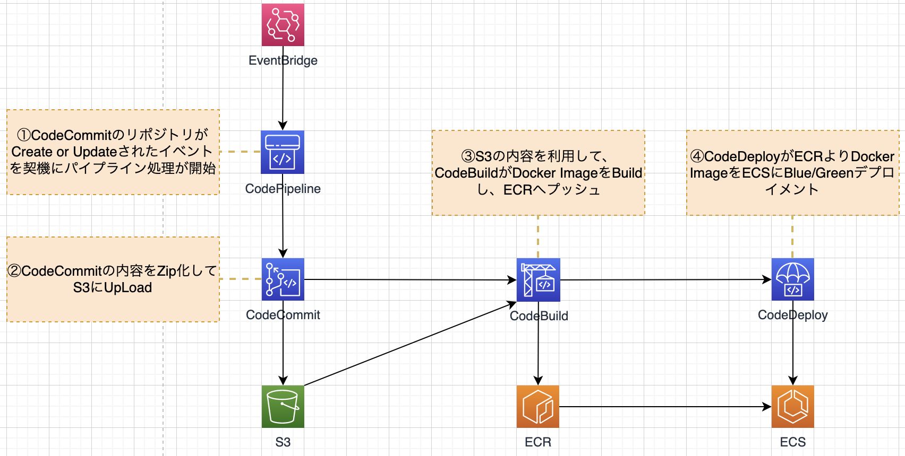
### ■srcの変更

- Cloud9上で「/home/ec2-user/environment/ContainerHandsOn/src/index.php」を変更する

#### cmd

```Cloud9
cd ~/environment/ContainerHandsOn/src
```

```Cloud9
cat << EOF > index.php
<!DOCTYPE html>
<html lang="ja">
  <head>
    <title>Hello! Jaws Days 2022!!</title>
  </head>
  <body>
    <p>Hello! Jaws Days 2022!!</p>
    <p>CICD ContainerHandOn!!!</p>
    <?php echo gethostname(); ?>
  </body>
</html>
EOF
```

```Cloud9
git diff index.php
```

#### result

```Cloud9
diff --git a/src/index.php b/src/index.php
index 3e2ebff..f6a5cd5 100644
--- a/src/index.php
+++ b/src/index.php
@@ -5,6 +5,7 @@
   </head>
   <body>
     <p>Hello! Jaws Days 2022!!</p>
+    <p>CICD ContainerHandOn!!!</p>
     <?php echo gethostname(); ?>
   </body>
 </html>
```

### ■git操作

#### cmd

```Cloud9
git add ./index.php
git commit -m "CICD TEST"
git push
```

#### result

```Cloud9
[master 1f49fba] CICD TEST
 1 file changed, 1 insertion(+)


Enumerating objects: 7, done.
Counting objects: 100% (7/7), done.
Delta compression using up to 2 threads
Compressing objects: 100% (3/3), done.
Writing objects: 100% (4/4), 361 bytes | 361.00 KiB/s, done.
Total 4 (delta 2), reused 0 (delta 0), pack-reused 0
To https://git-codecommit.ap-northeast-1.amazonaws.com/v1/repos/ContainerHandsOn
   dc004ac..1f49fba  master -> master
```

### ■CodePipeline確認

### 画面

- git操作でCodePipelineが稼働することを確認する
- Deployの詳細ボタンを選択する

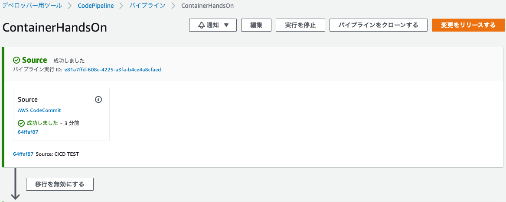
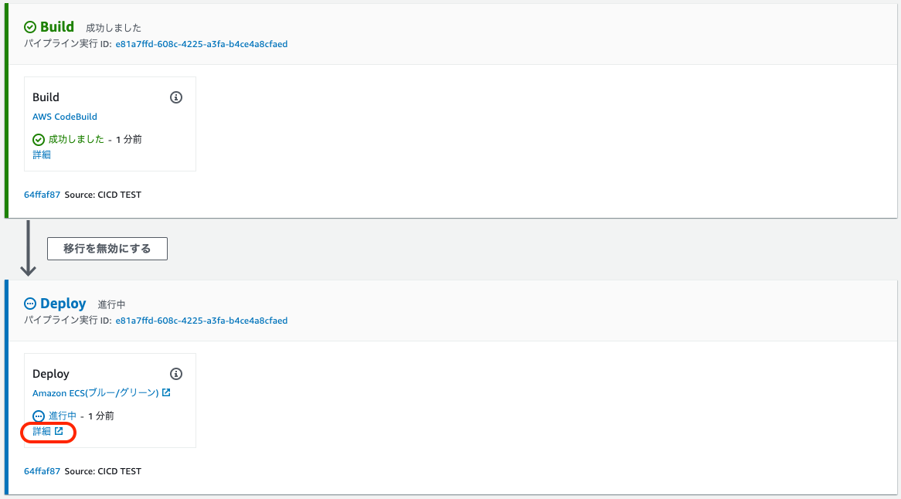

- ステップ１- ２が完了済みであることを確認
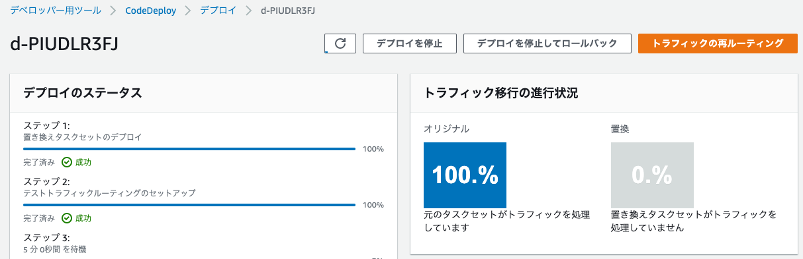

### ■アドレス確認

- Blue（オリジナル）でのアクセスを確認する

#### cmd

```Cloud9
echo "http://"${LoadBalancersDnsName}
```

#### result

```Cloud9
http://ContainerHandsOn-610375823.ap-northeast-1.elb.amazonaws.com
```

### ■画面

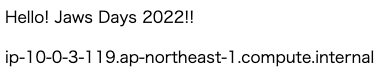

### ■アドレス確認

- Green（置換）でのアクセスを確認する

#### cmd

```Cloud9
echo "http://"${LoadBalancersDnsName}":8080"
```

#### result

```Cloud9
http://ContainerHandsOn-610375823.ap-northeast-1.elb.amazonaws.com:8080
```

### ■画面

- CICD-ContainerHandONと表示されていることを確認
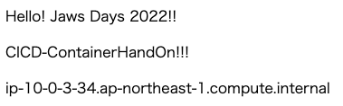

### ■トラフィックの再ルーティング

- 「トラフィックの再ルーティング」ボタンを押下
- Blue/Greenの切り替えが行われる


### ■元のタスクセットの終了

- 「元のタスクセットの終了」ボタンを押下
- Blueのタスクセットを終了させる
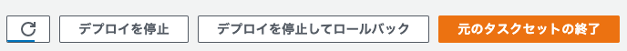

### ■画面

- 全ての処理が終了する
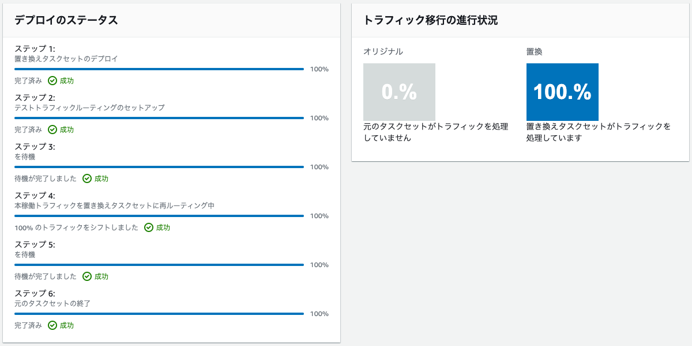

### ■アドレス確認

- Blue（オリジナル）でのアクセスを確認する

#### cmd

```Cloud9
echo "http://"${LoadBalancersDnsName}
```

#### result

```Cloud9
http://ContainerHandsOn-610375823.ap-northeast-1.elb.amazonaws.com
```

### ■画面


## 片付け

Duration: 0:05:00
- 削除部分はGUIで対応します
- CLIが苦手な方も削除漏れにより課金が発生しないように確認をお願いします

### ■CodePipeline
- パイプライン > ContainerHandsOn > パイプラインを削除する

### ■CodeDeploy
- アプリケーション > ContainerHandsOn > アプリケーションの削除

### ■CodeBuild
- ビルドプロジェクト > ContainerHandsOn > ビルドプロジェクトの削除
- ビルド履歴 > 検索バーに「ContainerHandsOn」 > ビルドの削除

### ■CodeCommit
- リポジトリ > ContainerHandsOn > リポジトリの削除

### ■EventBridge
- ルール > ContainerHandsOn > 削除

### ■Cloud9
- Your environments > ContainerHandsOn > Delete

### ■EC2
- セキュリティグループ > ContainerHandsOn-PrivateSecurityGroup > インバウンドルール > インバウンドのルールを編集 > 2行削除
- セキュリティグループ > ContainerHandsOn-PublicSecurityGroup > インバウンドルール > インバウンドのルールを編集 > 2行削除
- ロードバランサー > ContainerHandsOn > リスナーTAB > 2行削除
- ロードバランサー > ContainerHandsOn > アクション > 削除
- ターゲットグループ > ContainerHandsOn > アクション > 削除
- ターゲットグループ > ContainerHandsOn8080 > アクション > 削除

### ■ECS
- タスク定義 > ContainerHandsOn > 全てのリビジョンを１つずつ登録解除
- クラスター > ContainerHandsOn > サービスTAB > ContainerHandsOn > サービスを削除(強制削除)
- クラスター > ContainerHandsOn > クラスターの削除

### ■VPC
- エンドポイント > ContainerHandsOnの4行 > アクション > 削除
（削除に数分時間を要しますが、お待ちください）
- お使いのVPC > ContainerHandsOn > アクション > VPCの削除

### ■CloudWatch
- ロググループ > awslogs-container-hands-on > アクション > ロググループの削除
- ロググループ > /aws/codebuild/ContainerHandsOn > アクション > ロググループの削除

### ■IAM
- ロール > ContainerHandsOnForCloud9 > 削除
- ロール > ContainerHandsOnForCodeBuild > 削除
- ロール > ContainerHandsOnForCodeDeploy > 削除
- ロール > ContainerHandsOnForPipeLine > 削除
- ロール > ContainerHandsOnForEventBridge > 削除
