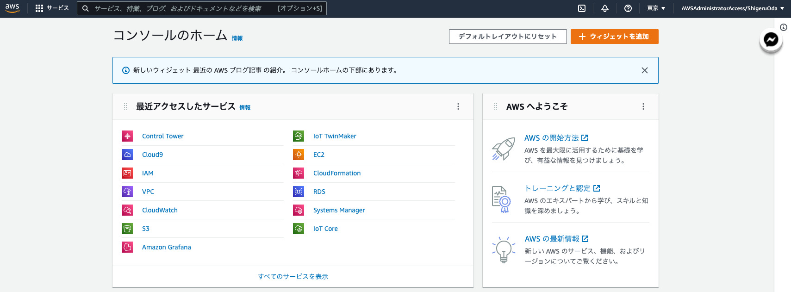

author: Shigeru Oda
summary: JAWS DAYS 2022 コンテナ ハンズオン
id:docs
categories: codelab,markdown
environments: HandsOn
status: Draft
feedback link: <https://github.com/shigeru-oda/jawsdays2022-container-handson>
analytics account: XXXXXXXX

# [JAWS DAYS 2022] ハンズオン～コンテナサービスをCI/CDパイプラインでデプロイしよう～

## はじめに

Duration: 0:05:00

## VPC作成

Duration: 0:05:00

### ■CloudShellの起動

#### AWS コンソールにログイン

#### CloudShellボタン押下

画面右上のCloudShellボタンを押下  


#### CloudShellを起動

今後は以下の画面にコマンド（以下 cmd）と結果（以下 result）を確認し、進める。


### ■VPCの作成

VPCを新規に作成します。

#### cmd

CloudShellに以下cmdをCopy & Paste

``` CloudShell
aws ec2 create-vpc \
    --cidr-block 10.0.0.0/16 \
    --tag-specification "ResourceType=vpc,Tags=[{Key=Name,Value=ContainerHandsOn}]"
```

#### result

CloudShellに以下のような結果が返却されていることを確認下さい。ID等は個人個人異なります。

```CloudShell
xx
```

#### 変数設定

VPC IDを取得します、CloudShellに以下cmdをCopy & Paste。

```CloudShell
VpcId=`aws ec2 describe-vpcs \
    --query 'Vpcs[*].VpcId' \
    --filters "Name=tag-key,Values=Name" \
    "Name=tag-value,Values=ContainerHandsOn" \
    --output text`
```

```CloudShell
clear; cat << EOF
VpcId : ${VpcId}
EOF
```

#### 変数設定確認

IDが取得されていることを確認。ID等は個人個人異なります。

```CloudShell
VpcId : vpc-08a77289b9b351429
```

#### ■DNS名前解決をONにする

### cmd

```CloudShell
 aws ec2 modify-vpc-attribute \
  --vpc-id ${VpcId}  \
  --enable-dns-support  '{"Value":true}' 
```

### result

```CloudShell
（なし）
```

#### ■DNS名前解決の状態確認

### cmd

```CloudShell
aws ec2 describe-vpc-attribute \
  --query EnableDnsSupport \
  --vpc-id ${VpcId}  \
  --attribute enableDnsSupport
```

### result

```CloudShell
{
    "Value": true
}
```

#### ■DNSホスト名をONにする

### cmd

```CloudShell
 aws ec2 modify-vpc-attribute \
  --vpc-id ${VpcId}  \
  --enable-dns-support  '{"Value":true}' 
```

### result

```CloudShell
（なし）
```

#### ■DNSホスト名の状態確認

### cmd

```CloudShell
aws ec2 describe-vpc-attribute \
  --query EnableDnsHostnames \
  --vpc-id ${VpcId}  \
  --attribute enableDnsHostnames
```

### result

```CloudShell
{
    "Value": true
}
```

### ■Subnetの作成

作成したVPCの中にSubnetを4つ作成します。
Private Subnetが2つ、Public Subnetが2つです。

#### cmd1

Subnetの1つ目を作成します。

```CloudShell
aws ec2 create-subnet \
    --vpc-id $VpcId \
    --availability-zone ap-northeast-1a \
    --cidr-block 10.0.0.0/24 \
    --tag-specifications "ResourceType=subnet,Tags=[{Key=Name,Value=ContainerHandsOnPublic}]"
```

#### result1

CloudShellに以下のような結果が返却されていることを確認下さい。ID等は個人個人異なります。

```CloudShell
xxx
```

#### cmd2

Subnetの2つ目を作成します。

```CloudShell
aws ec2 create-subnet \
    --vpc-id $VpcId \
    --availability-zone ap-northeast-1c \
    --cidr-block 10.0.1.0/24 \
    --tag-specifications "ResourceType=subnet,Tags=[{Key=Name,Value=ContainerHandsOnPublic}]"
```

#### result2

CloudShellに以下のような結果が返却されていることを確認下さい。ID等は個人個人異なります。

```CloudShell
xxx
```

#### cmd3

Subnetの3つ目を作成します。

```CloudShell
aws ec2 create-subnet \
    --vpc-id $VpcId \
    --availability-zone ap-northeast-1a \
    --cidr-block 10.0.2.0/24 \
    --tag-specifications "ResourceType=subnet,Tags=[{Key=Name,Value=ContainerHandsOnPrivate}]"
```

#### result3

CloudShellに以下のような結果が返却されていることを確認下さい。ID等は個人個人異なります。

```CloudShell
xxx
```

#### cmd4

Subnetの4つ目を作成します。

```CloudShell
aws ec2 create-subnet \
    --vpc-id $VpcId \
    --availability-zone ap-northeast-1c \
    --cidr-block 10.0.3.0/24 \
    --tag-specifications "ResourceType=subnet,Tags=[{Key=Name,Value=ContainerHandsOnPrivate}]"
```

#### result4

CloudShellに以下のような結果が返却されていることを確認下さい。ID等は個人個人異なります。

```CloudShell
xxx
```

#### 変数取得

IDが取得されていることを確認。ID等は個人個人異なります。

```CloudShell
SubnetId1aPublic=`aws ec2 describe-subnets \
    --filters "Name=tag-key,Values=Name" \
    "Name=tag-value,Values=ContainerHandsOnPublic" \
    "Name=availabilityZone,Values=ap-northeast-1a" \
    --query "Subnets[*].SubnetId" \
    --output text`
```

```CloudShell
SubnetId1cPublic=`aws ec2 describe-subnets \
    --filters "Name=tag-key,Values=Name" \
    "Name=tag-value,Values=ContainerHandsOnPublic" \
    "Name=availabilityZone,Values=ap-northeast-1c" \
    --query "Subnets[*].SubnetId" \
    --output text`
```

```CloudShell
SubnetId1aPrivate=`aws ec2 describe-subnets \
    --filters "Name=tag-key,Values=Name" \
    "Name=tag-value,Values=ContainerHandsOnPrivate" \
    "Name=availabilityZone,Values=ap-northeast-1a" \
    --query "Subnets[*].SubnetId" \
    --output text`
```

```CloudShell
SubnetId1cPrivate=`aws ec2 describe-subnets \
    --filters "Name=tag-key,Values=Name" \
    "Name=tag-value,Values=ContainerHandsOnPrivate" \
    "Name=availabilityZone,Values=ap-northeast-1c" \
    --query "Subnets[*].SubnetId" \
    --output text`
```

```CloudShell
clear; cat << EOF
VpcId : ${VpcId}
SubnetId1aPublic : ${SubnetId1aPublic}
SubnetId1cPublic: ${SubnetId1cPublic}
SubnetId1aPrivate : ${SubnetId1aPrivate}
SubnetId1cPrivate: ${SubnetId1cPrivate}
EOF
```

#### 変数設定確認

IDが取得されていることを確認。ID等は個人個人異なります。

```CloudShell
VpcId : vpc-08a77289b9b351429
SubnetId1aPublic : subnet-0ae475cbd47289960
SubnetId1cPublic: subnet-051a32873cc5c562b
SubnetId1aPrivate : subnet-01eb19ab0aeb0f6f1
SubnetId1cPrivate: subnet-0819c13fe959a0d1a
```

### ■InternetGatewayの作成

Internetに繋がるInternetGatewayを作成します。

#### cmd

```CloudShell
aws ec2 create-internet-gateway \
    --tag-specifications "ResourceType=internet-gateway,Tags=[{Key=Name,Value=ContainerHandsOn}]"
```

#### result1

```CloudShell
xxx
```

#### 変数設定

作成したInternet GatewayのIDを取得します。

``` CloudShell
InternetGatewayId=`aws ec2 describe-internet-gateways \
    --query 'InternetGateways[*].InternetGatewayId' \
    --filters "Name=tag-key,Values=Name" \
    "Name=tag-value,Values=ContainerHandsOn" \
    --output text`
```

``` CloudShell
cat << EOF
VpcId : ${VpcId}
SubnetId1aPublic : ${SubnetId1aPublic}
SubnetId1cPublic: ${SubnetId1cPublic}
SubnetId1aPrivate : ${SubnetId1aPrivate}
SubnetId1cPrivate: ${SubnetId1cPrivate}
InternetGatewayId : ${InternetGatewayId}
EOF
```

#### 変数設定確認

変数が取得されていることを確認します。

``` CloudShell
VpcId : vpc-08a77289b9b351429
SubnetId1aPublic : subnet-0ae475cbd47289960
SubnetId1cPublic: subnet-051a32873cc5c562b
SubnetId1aPrivate : subnet-01eb19ab0aeb0f6f1
SubnetId1cPrivate: subnet-0819c13fe959a0d1a
InternetGatewayId : igw-0db61da9fcd82b6eb
```

### ■InternetGatewayをVPCにAttach

作成したInternetGatewayをVPCに紐付けします。

#### cmd

```CloudShell
aws ec2 attach-internet-gateway \
    --internet-gateway-id ${InternetGatewayId} \
    --vpc-id ${VpcId}
```

#### result

```CloudShell
（何もなし）
```

### ■InternetGatewayをVPCにAttachされていることを確認

紐付けが正しく行われたことを確認します。

#### cmd

```CloudShell
aws ec2 describe-internet-gateways \
    --internet-gateway-ids ${InternetGatewayId} \
    --query 'InternetGateways[*].Attachments[*].State' \
    --filters "Name=tag-key,Values=Name" \
    "Name=tag-value,Values=ContainerHandsOn" \
    --output text
```

#### result

結果がavailableであること

```CloudShell
available
```

### ■RouteTableの作成

#### cmd1

```CloudShell
aws ec2 create-route-table \
  --vpc-id ${VpcId} \
  --tag-specifications "ResourceType=route-table,Tags=[{Key=Name,Value=ContainerHandsOnPublic}]"
```

#### result1

```CloudShell
```

#### cmd2

```CloudShell
aws ec2 create-route-table \
  --vpc-id ${VpcId} \
  --tag-specifications "ResourceType=route-table,Tags=[{Key=Name,Value=ContainerHandsOnPrivate}]"
```

#### result2

```CloudShell
```

### ■RouteTableの確認

#### 変数設定

```CloudShell
RouteTableIdPublic=`aws ec2 describe-route-tables \
  --query "RouteTables[*].RouteTableId" \
  --filters "Name=vpc-id,Values=${VpcId}" \
  "Name=tag-key,Values=Name" \
    "Name=tag-value,Values=ContainerHandsOnPublic" \
  --output text`
```

```CloudShell
RouteTableIdPrivate=`aws ec2 describe-route-tables \
  --query "RouteTables[*].RouteTableId" \
  --filters "Name=vpc-id,Values=${VpcId}" \
  "Name=tag-key,Values=Name" \
    "Name=tag-value,Values=ContainerHandsOnPrivate" \
  --output text`
```

```CloudShell
clear; cat << EOF
VpcId : ${VpcId}
SubnetId1aPublic : ${SubnetId1aPublic}
SubnetId1cPublic: ${SubnetId1cPublic}
SubnetId1aPrivate : ${SubnetId1aPrivate}
SubnetId1cPrivate: ${SubnetId1cPrivate}
InternetGatewayId : ${InternetGatewayId}
RouteTableIdPublic : ${RouteTableIdPublic}
RouteTableIdPrivate : ${RouteTableIdPrivate}
EOF
```

#### 変数設定確認

```CloudShell
VpcId : vpc-08a77289b9b351429
SubnetId1aPublic : subnet-0ae475cbd47289960
SubnetId1cPublic: subnet-051a32873cc5c562b
SubnetId1aPrivate : subnet-01eb19ab0aeb0f6f1
SubnetId1cPrivate: subnet-0819c13fe959a0d1a
InternetGatewayId : igw-0db61da9fcd82b6eb
RouteTableIdPublic : rtb-0cfcfe4b74de83091
RouteTableIdPrivate : rtb-089389ec79a044951
```

### ■RouteTableにSubnetを紐付け

#### cmd1

```CloudShell
aws ec2 associate-route-table \
  --route-table-id ${RouteTableIdPublic} \
  --subnet-id ${SubnetId1aPublic}
```

#### result1

```CloudShell

```

#### cmd2

```CloudShell
aws ec2 associate-route-table \
  --route-table-id ${RouteTableIdPrivate} \
  --subnet-id ${SubnetId1aPrivate}
```

#### result2

```CloudShell
```

#### cmd2

```CloudShell
aws ec2 associate-route-table \
  --route-table-id ${RouteTableIdPrivate} \
  --subnet-id ${SubnetId1cPrivate}
```

#### result2

```CloudShell
```

#### cmd2

```CloudShell
aws ec2 associate-route-table \
  --route-table-id ${RouteTableIdPublic} \
  --subnet-id ${SubnetId1cPublic}
```

#### result2

```CloudShell
```

### ■RouteTableにInternetGatewayを紐付け

#### cmd

```CloudShell
aws ec2 create-route \
  --route-table-id ${RouteTableIdPublic} \
  --destination-cidr-block "0.0.0.0/0" \
  --gateway-id ${InternetGatewayId}
```

#### result

```CloudShell
{
    "Return": true
}
```

### ■環境変数をメモ

Cloud9で使うため、取得した変数をエディターに残して下さい。

#### cmd

```CloudShell
clear; cat << EOF
export VpcId="${VpcId}"
export SubnetId1aPublic="${SubnetId1aPublic}"
export SubnetId1cPublic="${SubnetId1cPublic}"
export SubnetId1aPrivate="${SubnetId1aPrivate}"
export SubnetId1cPrivate="${SubnetId1cPrivate}"
export InternetGatewayId="${InternetGatewayId}"
export RouteTableIdPublic="${RouteTableIdPublic}"
export RouteTableIdPrivate="${RouteTableIdPrivate}"
EOF
```

#### result

```CloudShell
export VpcId="vpc-08a77289b9b351429"
export SubnetId1aPublic="subnet-0ae475cbd47289960"
export SubnetId1cPublic="subnet-051a32873cc5c562b"
export SubnetId1aPrivate="subnet-01eb19ab0aeb0f6f1"
export SubnetId1cPrivate="subnet-0819c13fe959a0d1a"
export InternetGatewayId="igw-0db61da9fcd82b6eb"
export RouteTableIdPublic="rtb-0cfcfe4b74de83091"
export RouteTableIdPrivate="rtb-089389ec79a044951"
```

## Cloud9作成

Duration: 0:05:00

### ■Cloud9の作成

#### cmd

```CloudShell
aws cloud9 create-environment-ec2 \
  --name ContainerHandsOn \
  --description "ContainerHandsOn" \
  --instance-type t3.small  \
  --subnet-id ${SubnetId1aPublic}  \
  --automatic-stop-time-minutes 60  \
  --tags "Key=Name,Value=ContainerHandsOn"
```

#### result

```CloudShell
{
    "environmentId": "96614b2a3f434be7a83b5dffb22a1f0a"
}
```

### ■AWS コンソールでCloud9を起動

- 上部の検索バーで`Cloud9`と検索
- `AWS Cloud9 > Your environments`に`ContainerHandsOn`が作成されているので`Open IDE`ボタン押下
- Cloud9の画面が表示される。

## ECR作成

Duration: 0:05:00

### ■環境変数を貼り付け

#### cmd

```Cloud9
export VpcId="vpc-08a77289b9b351429"
export SubnetId1aPublic="subnet-0ae475cbd47289960"
export SubnetId1cPublic="subnet-051a32873cc5c562b"
export SubnetId1aPrivate="subnet-01eb19ab0aeb0f6f1"
export SubnetId1cPrivate="subnet-0819c13fe959a0d1a"
export InternetGatewayId="igw-0db61da9fcd82b6eb"
export RouteTableIdPublic="rtb-0cfcfe4b74de83091"
export RouteTableIdPrivate="rtb-089389ec79a044951"
```

``` Cloud9
clear; cat << EOF
VpcId : ${VpcId}
SubnetId1aPublic : ${SubnetId1aPublic}
SubnetId1cPublic : ${SubnetId1cPublic}
SubnetId1aPrivate : ${SubnetId1aPrivate}
SubnetId1cPrivate : ${SubnetId1cPrivate}
InternetGatewayId : ${InternetGatewayId}
RouteTableIdPublic : ${RouteTableIdPublic}
RouteTableIdPrivate : ${RouteTableIdPrivate}
EOF
```

#### result

``` Cloud9
VpcId : vpc-08a77289b9b351429
SubnetId1aPublic : subnet-0ae475cbd47289960
SubnetId1cPublic : subnet-051a32873cc5c562b
SubnetId1aPrivate : subnet-01eb19ab0aeb0f6f1
SubnetId1cPrivate : subnet-0819c13fe959a0d1a
InternetGatewayId : igw-0db61da9fcd82b6eb
RouteTableIdPublic : rtb-0cfcfe4b74de83091
RouteTableIdPrivate : rtb-089389ec79a044951
```

### ■ECRの作成

#### cmd

```Cloud9
aws ecr create-repository \
    --repository-name jaws-days-2022/container-hands-on \
    --tags "Key=Name,Value=ContainerHandsOn"
```

#### result

```Cloud9
{
    "repository": {
        "repositoryArn": "arn:aws:ecr:ap-northeast-1:378647896848:repository/jaws-days-2022/container-hands-on",
        "registryId": "378647896848",
        "repositoryName": "jaws-days-2022/container-hands-on",
        "repositoryUri": "378647896848.dkr.ecr.ap-northeast-1.amazonaws.com/jaws-days-2022/container-hands-on",
        "createdAt": 1662173179.0,
        "imageTagMutability": "MUTABLE",
        "imageScanningConfiguration": {
            "scanOnPush": false
        },
        "encryptionConfiguration": {
            "encryptionType": "AES256"
        }
    }
}
```

## Docker Image作成

Duration: 0:05:00

### ■Cloud9上にdockerセットアップされていることを確認

#### cmd

```Cloud9
docker -v
```

#### result

```Cloud9
Docker version 20.10.13, build a224086
```

### ■Cloud9上にDockerfileを作成

[参考元](https://docs.aws.amazon.com/ja_jp/AmazonECS/latest/developerguide/create-container-image.html)

#### cmd

```Cloud9
cat << EOF > Dockerfile
FROM ubuntu:18.04

# Install dependencies
RUN apt-get update && \
 apt-get -y install apache2

# Install apache and write hello world message
RUN echo 'Hello! Jaws Days 2022!!' > /var/www/html/index.html

# Configure apache
RUN echo '. /etc/apache2/envvars' > /root/run_apache.sh && \
 echo 'mkdir -p /var/run/apache2' >> /root/run_apache.sh && \
 echo 'mkdir -p /var/lock/apache2' >> /root/run_apache.sh && \ 
 echo '/usr/sbin/apache2 -D FOREGROUND' >> /root/run_apache.sh && \ 
 chmod 755 /root/run_apache.sh

EXPOSE 80

CMD /root/run_apache.sh
EOF
```

```Cloud9
cat Dockerfile;
```

#### result

```Cloud9
FROM ubuntu:18.04

# Install dependencies
RUN apt-get update &&  apt-get -y install apache2

# Install apache and write hello world message
RUN echo 'Hello! Jaws Days 2022!!' > /var/www/html/index.html

# Configure apache
RUN echo '. /etc/apache2/envvars' > /root/run_apache.sh &&  echo 'mkdir -p /var/run/apache2' >> /root/run_apache.sh &&  echo 'mkdir -p /var/lock/apache2' >> /root/run_apache.sh && \ 
 echo '/usr/sbin/apache2 -D FOREGROUND' >> /root/run_apache.sh && \ 
 chmod 755 /root/run_apache.sh

EXPOSE 80

CMD /root/run_apache.sh
```

### ■Cloud9上でDocker イメージを構築

#### cmd

```Cloud9
docker build -t jaws-days-2022/container-hands-on .
```

#### result

```Cloud9
（略）
Successfully built fed9645afaae
Successfully tagged jaws-days-2022/container-hands-on:latest
```

### ■Cloud9上でDocker イメージを構築されたことを確認

#### cmd

```cloud9
docker images --filter reference= jaws-days-2022/container-hands-on:latest
```

#### result

```cloud9
REPOSITORY                          TAG       IMAGE ID       CREATED         SIZE
jaws-days-2022/container-hands-on   latest    fed9645afaae   8 minutes ago   202MB
```

### ■Cloud9上でDocker イメージを起動

#### cmd

```Cloud9
docker run --name container-hands-on -d -p 8080:80 jaws-days-2022/container-hands-on:latest
```

#### result

```Cloud9
dcaf3423f6abeea3a67bab0c01a33e7b9d2c97131c8b304900f0455ee73da7b7
```

#### 画面

xxx

### ■（ご参考）Cloud9上でコンテナを停止・削除する方法

#### cmd

```Cloud9

docker stop $(docker ps -q)
docker rm $(docker ps -q -a)
```

### ■AWS Account IDの取得

#### cmd

```Cloud9
AccoutID=`aws sts get-caller-identity --query Account --output text`
```

```Cloud9
clear; cat << EOF
VpcId : ${VpcId}
SubnetId1aPublic : ${SubnetId1aPublic}
SubnetId1cPublic : ${SubnetId1cPublic}
SubnetId1aPrivate : ${SubnetId1aPrivate}
SubnetId1cPrivate : ${SubnetId1cPrivate}
InternetGatewayId : ${InternetGatewayId}
RouteTableIdPublic : ${RouteTableIdPublic}
RouteTableIdPrivate : ${RouteTableIdPrivate}
AccoutID : ${AccoutID}
EOF
```

#### result

```Cloud9
VpcId : vpc-08a77289b9b351429
SubnetId1aPublic : subnet-0ae475cbd47289960
SubnetId1cPublic : subnet-051a32873cc5c562b
SubnetId1aPrivate : subnet-01eb19ab0aeb0f6f1
SubnetId1cPrivate : subnet-0819c13fe959a0d1a
InternetGatewayId : igw-0db61da9fcd82b6eb
RouteTableIdPublic : rtb-0cfcfe4b74de83091
RouteTableIdPrivate : rtb-089389ec79a044951
AccoutID : 378647896848
```

### ■DockerImageにTag付けを行う

#### cmd

```Cloud9
docker tag jaws-days-2022/container-hands-on:latest `echo ${AccoutID}`.dkr.ecr.ap-northeast-1.amazonaws.com/jaws-days-2022/container-hands-on:latest
```

#### result

```Cloud9
（なし）
```

### ■DockerImageにTag付けの確認

#### cmd

```Cloud9
docker images --filter reference=`echo ${AccoutID}`.dkr.ecr.ap-northeast-1.amazonaws.com/jaws-days-2022/container-hands-on:latest

```

#### result

```Cloud9
REPOSITORY                                                                            TAG       IMAGE ID       CREATED          SIZE
378647896848.dkr.ecr.ap-northeast-1.amazonaws.com/jaws-days-2022/container-hands-on   latest    fed9645afaae   21 minutes ago   202MB
```

### ■認証トークンを取得し、レジストリに対して Docker クライアントを認証します

#### cmd

```Cloud9
aws ecr get-login-password --region ap-northeast-1 | docker login --username AWS --password-stdin `echo ${AccoutID}`.dkr.ecr.ap-northeast-1.amazonaws.com
```

#### result

```Cloud9
WARNING! Your password will be stored unencrypted in /home/ec2-user/.docker/config.json.
Configure a credential helper to remove this warning. See
https://docs.docker.com/engine/reference/commandline/login/#credentials-store

Login Succeeded
```

### ■DockerImageをECRにPush

#### cmd

```Cloud9
docker push `echo ${AccoutID}`.dkr.ecr.ap-northeast-1.amazonaws.com/jaws-days-2022/container-hands-on:latest
```

#### result

```Cloud9
61e740eb529d: Pushed 
58f84848d392: Pushed 
d5c24541b3aa: Pushed 
1a996540f50f: Pushed 
latest: digest: sha256:8d4d59636b92dffc4d4986c6a38a42fff9201d418aa21d96ad276a754d77d943 size: 1155
```

## VPCエンドポイント作成

Duration: 0:05:00

FargateをPrivateSubnetで稼働させるため、以下VPCエンドポイントを準備します。

- com.amazonaws.ap-northeast-1.s3
- com.amazonaws.ap-northeast-1.ecr.dkr
- com.amazonaws.ap-northeast-1.ecr.api
- com.amazonaws.ap-northeast-1.logs

### ■com.amazonaws.ap-northeast-1.s3

#### cmd

```Cloud9
aws ec2 create-vpc-endpoint \
    --vpc-id ${VpcId} \
    --vpc-endpoint-type Gateway \
    --service-name com.amazonaws.ap-northeast-1.s3 \
    --route-table-ids ${RouteTableIdPrivate} \
    --tag-specifications "ResourceType=vpc-endpoint,Tags=[{Key=Name,Value=ContainerHands}]"
```

#### result

```Cloud9
xxx
```

### ■インターフェース用のSecurityGroup作成

#### cmd

```Cloud9
aws ec2 create-security-group \
  --group-name InterfaceSecurityGroup \
  --description "Interface Security Group" \
  --vpc-id ${VpcId} \
  --tag-specifications "ResourceType=security-group,Tags=[{Key=Name,Value=ContainerHandsOn-InterfaceSecurityGroup}]"
```

#### result

```Cloud9
xxx
```

#### 変数設定

```Cloud9
InterfaceGroupId=`aws ec2 describe-security-groups \
  --query 'SecurityGroups[*].GroupId' \
  --filters "Name=tag-key,Values=Name" \
    "Name=tag-value,Values=ContainerHandsOn-InterfaceSecurityGroup" \
    --output text`
```

```Cloud9
clear; cat << EOF
VpcId : ${VpcId}
SubnetId1aPublic : ${SubnetId1aPublic}
SubnetId1cPublic : ${SubnetId1cPublic}
SubnetId1aPrivate : ${SubnetId1aPrivate}
SubnetId1cPrivate : ${SubnetId1cPrivate}
InternetGatewayId : ${InternetGatewayId}
RouteTableIdPublic : ${RouteTableIdPublic}
RouteTableIdPrivate : ${RouteTableIdPrivate}
AccoutID : ${AccoutID}
InterfaceGroupId : ${InterfaceGroupId}
EOF
```

#### 変数設定確認

```
```

### ■com.amazonaws.ap-northeast-1.ecr.dkr

#### cmd

```Cloud9
aws ec2 create-vpc-endpoint \
    --vpc-id ${VpcId} \
    --vpc-endpoint-type Interface \
    --service-name com.amazonaws.ap-northeast-1.ecr.dkr \
    --subnet-ids ${SubnetId1aPrivate} ${SubnetId1cPrivate} \
    --security-group-id ${InterfaceGroupId} \
    --tag-specifications "ResourceType=vpc-endpoint,Tags=[{Key=Name,Value=ContainerHands}]"
```

#### result

```Cloud9
```

### ■com.amazonaws.ap-northeast-1.ecr.api

#### cmd

```Cloud9
aws ec2 create-vpc-endpoint \
    --vpc-id ${VpcId} \
    --vpc-endpoint-type Interface \
    --service-name com.amazonaws.ap-northeast-1.ecr.api \
    --subnet-ids ${SubnetId1aPrivate} ${SubnetId1cPrivate} \
    --security-group-id ${InterfaceGroupId} \
    --tag-specifications "ResourceType=vpc-endpoint,Tags=[{Key=Name,Value=ContainerHands}]"
```

#### result

```Cloud9
xxx
```

### ■com.amazonaws.ap-northeast-1.logs

#### cmd

```Cloud9
aws ec2 create-vpc-endpoint \
    --vpc-id ${VpcId} \
    --vpc-endpoint-type Interface \
    --service-name com.amazonaws.ap-northeast-1.logs \
    --subnet-ids ${SubnetId1aPrivate} ${SubnetId1cPrivate} \
    --security-group-id ${InterfaceGroupId} \
    --tag-specifications "ResourceType=vpc-endpoint,Tags=[{Key=Name,Value=ContainerHands}]"
```

#### result

```Cloud9
```

## ALB作成

Duration: 0:05:00

### ■アプリケーションロードバランサーの作成

#### cmd

```Cloud9
aws elbv2 create-load-balancer \
    --name ContainerHandsOn \
    --subnets ${SubnetId1aPublic} ${SubnetId1cPublic} \
    --tags "Key=Name,Value=ContainerHandsOn"
```

#### result

```Cloud9
```

### ■ターゲットグループの作成

#### cmd

```Cloud9
aws elbv2 create-target-group \
    --name ContainerHandsOn \
    --protocol TCP \
    --port 80 \
    --target-type ip \
    --vpc-id ${VpcId}
```

## Fargate作成

Duration: 0:05:00

### ■クラスターの作成

#### cmd

```Cloud9
aws ecs create-cluster \
    --cluster-name ContainerHandsOn \
    --tags "key=Name,value=ContainerHandsOn"
```

#### result

```Cloud9
xxx
```

### ■タスク定義の作成

#### cmd

```Cloud9
cat << EOF > register-task-definition.json
{
    "family": "ContainerHandsOn", 
    "executionRoleArn": "arn:aws:iam::378647896848:role/aws-service-role/ecs.amazonaws.com/AWSServiceRoleForECS", 
    "networkMode": "awsvpc", 
    "containerDefinitions": [
        {
            "name": "ContainerHandsOn", 
            "image": "${AccoutID}.dkr.ecr.ap-northeast-1.amazonaws.com/jaws-days-2022/container-hands-on:latest", 
            "portMappings": [
                {
                    "containerPort": 80, 
                    "hostPort": 80, 
                    "protocol": "tcp"
                }
            ], 
            "essential": true
        }
    ], 
    "requiresCompatibilities": [
        "FARGATE"
    ], 
    "cpu": "256", 
    "memory": "512"
}
EOF
```

```Cloud9
aws ecs register-task-definition \
  --cli-input-json file://register-task-definition.json \
  --tags "key=Name,value=ContainerHandsOn"
```

#### result

```Cloud9
xxxx
```

## 動作確認

Duration: 0:05:00

## CodeBuild作成

Duration: 0:05:00

## CodeDeploy作成

Duration: 0:05:00

## CodePipeline作成

Duration: 0:05:00

## Dockerコンテナ再ビルド(Codeシリーズを利用)

Duration: 0:05:00

## 動作確認

Duration: 0:05:00

## 片付け

Duration: 0:05:00

### 途中の見出し

Positive
: 何かお知らせを書きたい時のボックス

Negative
: 何か注意点などを書きたい時のボックス
