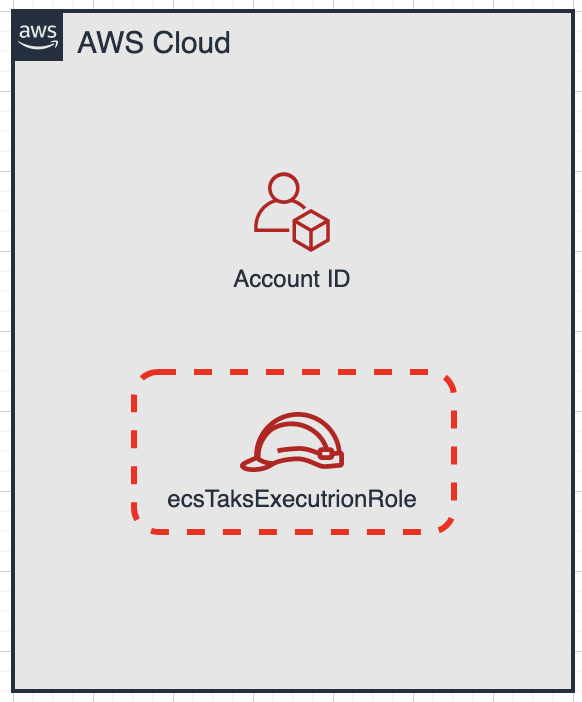
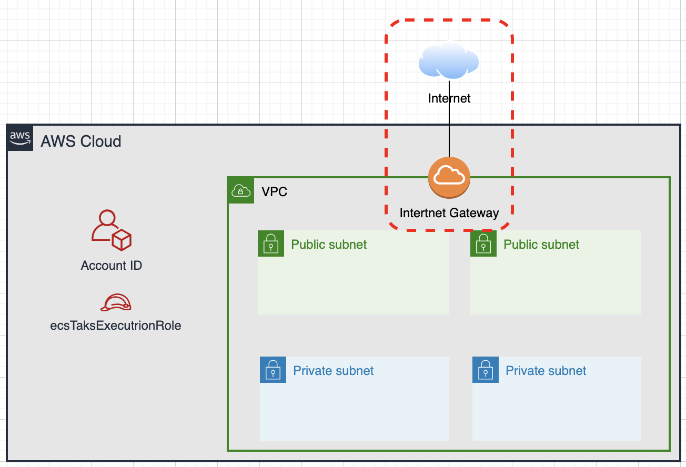
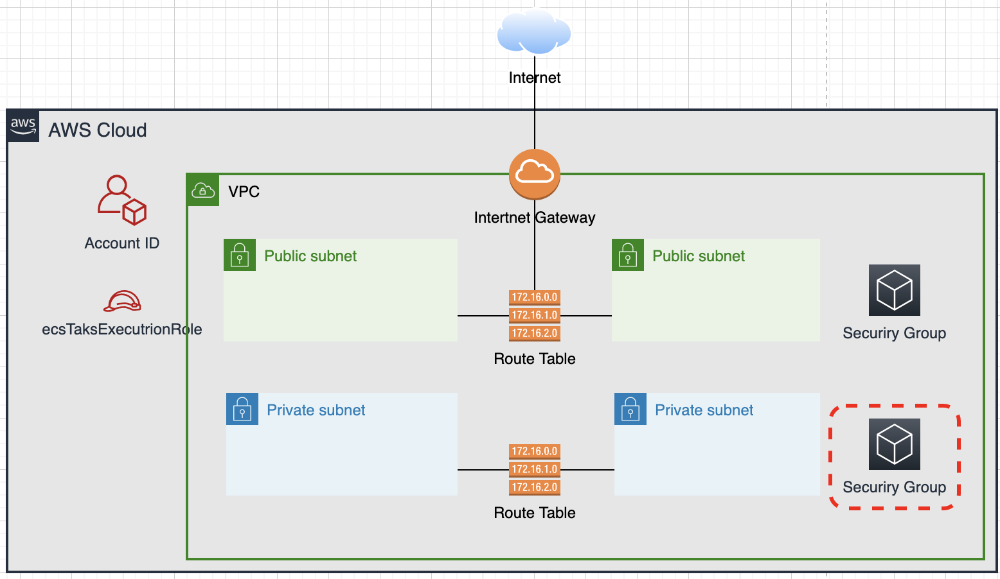
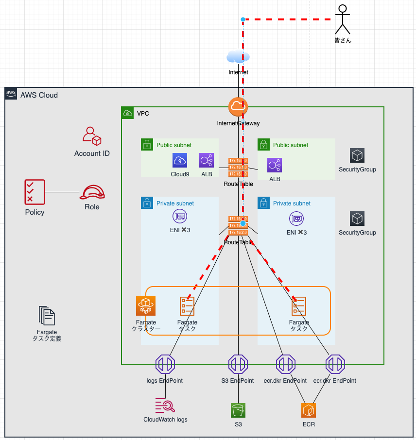

author: Shigeru Oda
summary: JAWS DAYS 2022 コンテナ ハンズオン
id:docs
categories: codelab,markdown
environments: HandsOn
status: Draft
feedback link: <https://github.com/shigeru-oda/jawsdays2022-container-handson>
analytics account: XXXXXXXX

# [JAWS DAYS 2022] ハンズオン～コンテナサービスをCI/CDパイプラインでデプロイしよう～

Duration: 0:05:00


## ご挨拶

### ■ご挨拶

当資料は[JAWS DAYS 2022 - Satellites](https://jawsdays2022.jaws-ug.jp/)でのハンズオントラックの一つ、[コンテナサービスをCI/CDパイプラインでデプロイしよう](https://jaws-ug.doorkeeper.jp/events/141627)のセッションで利用する資料となります

[JAWS DAYS 2022 - Satellites](https://jawsdays2022.jaws-ug.jp/)のハンズオンは以下3点ありますが、他セッションはGUI、CDKでの環境構築であったので、当セッションはCLIでの環境構築として準備しています

- [S3でWebサイトを公開して、リソースポリシーでアクセスを制御してみよう](https://jaws-ug.doorkeeper.jp/events/141646)
- [コンテナサービスをCI/CDパイプラインでデプロイしよう](https://jaws-ug.doorkeeper.jp/events/141627)
- [CDKでサーバーレスアプリをデプロイしよう](https://jaws-ug.doorkeeper.jp/events/141651)

初心者の方にはCLIコマンドが難しいかもしれませんが、まずはこういうステップが必要という勘所だけでも掴んで頂ければ幸いです、慣れた方はCLIコマンドの1つ１つの意味を理解するように進めて頂けるとありがたいです

### ■対象者

- コンテナが何かよく分からない人
- ＡＷＳでのコンテナサービスを知りたい人
- ＣＩ／ＣＤパイプラインでコンテナサービスをデプロイしたい人

### ■当日までにご準備が必要なもの

- マネジメントコンソールにログイン可能なAdministrator権限のIAMユーザー
- Chrome もしくは Firefox

### ■免責事項について

ハンズオンで利用するサービスは一部課金対象となるサービスもございます  
また、ハンズオンで作成した環境を削除しない場合には、課金が続くことによって高額になる可能性があります  
課金が発生したことによる責任は負えませんので、ご承知おきください
上記事項をご理解頂きお申込みいただけますようお願いいたします

### ■参考資料

- [AWS CI/CD for Amazon ECS ハンズオン~ Cloud9, Docker, Code Services を⽤いた開発効率向上 ~](https://pages.awscloud.com/rs/112-TZM-766/images/AWS_CICD_ECS_Handson.pdf)
- [20190731 Black Belt Online Seminar Amazon ECS Deep Dive](https://www.slideshare.net/AmazonWebServicesJapan/20190731-black-belt-online-seminar-amazon-ecs-deep-dive-162160987)

### ■手順について

貼り付けるコマンドは準備しているので、基本的にはCopy & Pasteで手順を進めることができます

#### cmd

cmdと記載された項目にある以下のような表示内容はコマンドをCopy & Pasteするモノとなります

```Sample
Copy & Pasteの対象です
```

#### result

resultと記載された項目にある以下のような表示内容はコマンドの実行結果です  
IDなどは個々に異なりますので

- 表示が大きく変わらない
- エラーメッセージが出力されていない

を確認ください

```Sample
cmd実行後の結果です
```

## ハンズオンを通して学ぶこと

Duration: 0:05:00

### ■ハンズオン１

- VPCを使ったネットワーク関係の構築
- VPCエンドポイントを使ったセキュア環境の構築
- ECS /Fargateを使ったサーバーレスコンテナ運用の構築


### ■ハンズオン２

- CoceCommitを使ったソースコード管理
- CodeBuildを使った自動ビルド
- CodeDeployを使ったECS/Fargateへのデプロイ
- CodePipelineを使ったCI/CDパイプラインの構築

**あとで完成図を挿入**

## 事前準備とネットワーク周りの構築

Duration: 0:05:00

### ■CloudShellの起動

#### AWS コンソールにログイン

・Administrator権限のIAMユーザーでAWSコンソールにログイン


・リージョンを"アジアパシフィック（東京）"に変更


#### CloudShellボタン押下

・画面右上のCloudShellボタンを押下  


#### CloudShellを起動

・今後はCloudShellの画面にcmdの内容をCopy & Pasteし、resultの内容を確認し進めて下さい


### ■AWS Account IDの取得


・IDを取得し、変数に格納・確認を行います

#### cmd

```CloudShell
AccoutID=`aws sts get-caller-identity --query Account --output text`
```

```CloudShell
clear; cat << EOF
AccoutID : ${AccoutID}
EOF
```

#### result

```CloudShell
AccoutID : 123456789012
```

### ■ECSタスクの実行Roleの存在確認



・ECSタスクを実行するRole(ecsTaskExecutionRole)の存在確認を行います

#### cmd

```Cloud9
aws iam list-roles | grep "RoleName" | grep "ecsTaskExecutionRole"
```

#### result（存在する場合）

```Cloud9
            "RoleName": "ecsTaskExecutionRole",
```

#### result（存在しない場合）

```Cloud9
（なし）
```

### ■ECSの実行Role作成（Roleが存在しない場合のみ実行）


・ecsTaskExecutionRoleが存在しない場合のみ実行します

#### cmd

```Cloud9
cat << EOF > assume-role-policy-document.json
{
  "Version": "2012-10-17",
  "Statement": [
    {
      "Sid": "",
      "Effect": "Allow",
      "Principal": {
        "Service": "ecs-tasks.amazonaws.com"
      },
      "Action": "sts:AssumeRole"
    }
  ]
}
EOF
```

```Cloud9
aws iam create-role \
  --role-name ecsTaskExecutionRole \
  --assume-role-policy-document file://assume-role-policy-document.json
```

#### result

```Cloud9
{
    "Role": {
        "Path": "/",
        "RoleName": "ecsTaskExecutionRole",
        "RoleId": "AROASHENIAIFOV2DAKSWN",
        "Arn": "arn:aws:iam::123456789012:role/ecsTaskExecutionRole",
        "CreateDate": "2022-09-06T14:50:16+00:00",
        "AssumeRolePolicyDocument": {
            "Version": "2012-10-17",
            "Statement": [
                {
                    "Sid": "",
                    "Effect": "Allow",
                    "Principal": {
                        "Service": "ecs-tasks.amazonaws.com"
                    },
                    "Action": "sts:AssumeRole"
                }
            ]
        }
    }
}
```

### ■RoleにPolicyをアタッチ（Roleが存在しない場合のみ実行）


・作成したRoleにPolicyをアタッチします

#### cmd

```Cloud9
aws iam attach-role-policy \
  --role-name ecsTaskExecutionRole \
  --policy-arn arn:aws:iam::aws:policy/service-role/AmazonECSTaskExecutionRolePolicy
```

#### result

```
（なし）
```

・Policyがアタッチされたことを確認します

#### cmd

```Cloud9
aws iam list-attached-role-policies \
  --role-name ecsTaskExecutionRole \
  | grep 'AmazonECSTaskExecutionRolePolicy'
```

#### result

```Cloud9
            "PolicyName": "AmazonECSTaskExecutionRolePolicy",
            "PolicyArn": "arn:aws:iam::aws:policy/service-role/AmazonECSTaskExecutionRolePolicy"
```

### ■VPCの作成


・VPCを新規に作成します

#### cmd

``` CloudShell
aws ec2 create-vpc \
    --cidr-block 10.0.0.0/16 \
    --tag-specification "ResourceType=vpc,Tags=[{Key=Name,Value=ContainerHandsOn}]"
```

#### result

```CloudShell
{
    "Vpc": {
        "CidrBlock": "10.0.0.0/16",
        "DhcpOptionsId": "dopt-c3de3ba5",
        "State": "pending",
        "VpcId": "vpc-0d3c1c88db46cfba7",
        "OwnerId": "123456789012",
        "InstanceTenancy": "default",
        "Ipv6CidrBlockAssociationSet": [],
        "CidrBlockAssociationSet": [
            {
                "AssociationId": "vpc-cidr-assoc-098ed848444db197b",
                "CidrBlock": "10.0.0.0/16",
                "CidrBlockState": {
                    "State": "associated"
                }
            }
        ],
        "IsDefault": false,
        "Tags": [
            {
                "Key": "Name",
                "Value": "ContainerHandsOn"
            }
        ]
    }
}
```

### ■VpcIdの取得

・作成したVPC IDを取得し、変数に格納・確認を行います

#### cmd

```CloudShell
VpcId=`aws ec2 describe-vpcs \
    --query 'Vpcs[*].VpcId' \
    --filters "Name=tag-key,Values=Name" \
    "Name=tag-value,Values=ContainerHandsOn" \
    --output text`
```

```CloudShell
clear; cat << EOF
AccoutID : ${AccoutID}
VpcId : ${VpcId}
EOF
```

#### results

```CloudShell
AccoutID : 123456789012
VpcId : vpc-0d3c1c88db46cfba7
```

#### ■DNS名前解決をONにする

・作成したVPCで「ドメイン名からIPアドレスへの変換、またはその逆」を可能にします  
・後程作成するVPCエンドポイントに必要な為です  

### cmd

```CloudShell
 aws ec2 modify-vpc-attribute \
  --vpc-id ${VpcId}  \
  --enable-dns-support  '{"Value":true}' 
```

### result

```CloudShell
（なし）
```

#### ■DNS名前解決の状態確認

・設定内容が正しく反映されているか確認を行います

### cmd

```CloudShell
aws ec2 describe-vpc-attribute \
  --query EnableDnsSupport \
  --vpc-id ${VpcId}  \
  --attribute enableDnsSupport
```

### result

```CloudShell
{
    "Value": true
}
```

#### ■DNSホスト名をONにする

・VPC内でDNSホスト名(ex : ip-10-0-0-23.ap-northeast-1.compute.internal)を持つように設定します  
・後程作成するVPCエンドポイントに必要な為です  

### cmd

```CloudShell
 aws ec2 modify-vpc-attribute \
  --vpc-id ${VpcId}  \
  --enable-dns-hostnames  '{"Value":true}' 
```

### result

```CloudShell
（なし）
```

#### ■DNSホスト名の状態確認

・設定内容が正しく反映されているか確認を行います

### cmd

```CloudShell
aws ec2 describe-vpc-attribute \
  --query EnableDnsHostnames \
  --vpc-id ${VpcId}  \
  --attribute enableDnsHostnames
```

### result

```CloudShell
{
    "Value": true
}
```

### ■Subnetの作成


・作成したVPCの中にSubnetを4つ作成します  
・Private Subnetが2つ、Public Subnetが2つです  

#### cmd (Public Subnet 1つ目)

```CloudShell
aws ec2 create-subnet \
    --vpc-id $VpcId \
    --availability-zone ap-northeast-1a \
    --cidr-block 10.0.0.0/24 \
    --tag-specifications "ResourceType=subnet,Tags=[{Key=Name,Value=ContainerHandsOnPublic}]"
```

#### result (Public Subnet 1つ目)

```CloudShell
{
    "Subnet": {
        "AvailabilityZone": "ap-northeast-1a",
        "AvailabilityZoneId": "apne1-az4",
        "AvailableIpAddressCount": 251,
        "CidrBlock": "10.0.0.0/24",
        "DefaultForAz": false,
        "MapPublicIpOnLaunch": false,
        "State": "available",
        "SubnetId": "subnet-0f66f257f167a1d47",
        "VpcId": "vpc-0d3c1c88db46cfba7",
        "OwnerId": "123456789012",
        "AssignIpv6AddressOnCreation": false,
        "Ipv6CidrBlockAssociationSet": [],
        "Tags": [
            {
                "Key": "Name",
                "Value": "ContainerHandsOnPublic"
            }
        ],
        "SubnetArn": "arn:aws:ec2:ap-northeast-1:123456789012:subnet/subnet-0f66f257f167a1d47",
        "EnableDns64": false,
        "Ipv6Native": false,
        "PrivateDnsNameOptionsOnLaunch": {
            "HostnameType": "ip-name",
            "EnableResourceNameDnsARecord": false,
            "EnableResourceNameDnsAAAARecord": false
        }
    }
}
```

#### cmd (Public Subnet 2つ目)

```CloudShell
aws ec2 create-subnet \
    --vpc-id $VpcId \
    --availability-zone ap-northeast-1c \
    --cidr-block 10.0.1.0/24 \
    --tag-specifications "ResourceType=subnet,Tags=[{Key=Name,Value=ContainerHandsOnPublic}]"
```

#### result (Public Subnet 2つ目)

```CloudShell
{
    "Subnet": {
        "AvailabilityZone": "ap-northeast-1c",
        "AvailabilityZoneId": "apne1-az1",
        "AvailableIpAddressCount": 251,
        "CidrBlock": "10.0.1.0/24",
        "DefaultForAz": false,
        "MapPublicIpOnLaunch": false,
        "State": "available",
        "SubnetId": "subnet-0a1e2afffc8c140d8",
        "VpcId": "vpc-0d3c1c88db46cfba7",
        "OwnerId": "123456789012",
        "AssignIpv6AddressOnCreation": false,
        "Ipv6CidrBlockAssociationSet": [],
        "Tags": [
            {
                "Key": "Name",
                "Value": "ContainerHandsOnPublic"
            }
        ],
        "SubnetArn": "arn:aws:ec2:ap-northeast-1:123456789012:subnet/subnet-0a1e2afffc8c140d8",
        "EnableDns64": false,
        "Ipv6Native": false,
        "PrivateDnsNameOptionsOnLaunch": {
            "HostnameType": "ip-name",
            "EnableResourceNameDnsARecord": false,
            "EnableResourceNameDnsAAAARecord": false
        }
    }
}
```

#### cmd (Private Subnet 1つ目)

```CloudShell
aws ec2 create-subnet \
    --vpc-id $VpcId \
    --availability-zone ap-northeast-1a \
    --cidr-block 10.0.2.0/24 \
    --tag-specifications "ResourceType=subnet,Tags=[{Key=Name,Value=ContainerHandsOnPrivate}]"
```

#### result (Private Subnet 1つ目)

```CloudShell
{
    "Subnet": {
        "AvailabilityZone": "ap-northeast-1a",
        "AvailabilityZoneId": "apne1-az4",
        "AvailableIpAddressCount": 251,
        "CidrBlock": "10.0.2.0/24",
        "DefaultForAz": false,
        "MapPublicIpOnLaunch": false,
        "State": "available",
        "SubnetId": "subnet-049f0119237ff00a0",
        "VpcId": "vpc-0d3c1c88db46cfba7",
        "OwnerId": "123456789012",
        "AssignIpv6AddressOnCreation": false,
        "Ipv6CidrBlockAssociationSet": [],
        "Tags": [
            {
                "Key": "Name",
                "Value": "ContainerHandsOnPrivate"
            }
        ],
        "SubnetArn": "arn:aws:ec2:ap-northeast-1:123456789012:subnet/subnet-049f0119237ff00a0",
        "EnableDns64": false,
        "Ipv6Native": false,
        "PrivateDnsNameOptionsOnLaunch": {
            "HostnameType": "ip-name",
            "EnableResourceNameDnsARecord": false,
            "EnableResourceNameDnsAAAARecord": false
        }
    }
}
```

#### cmd (Private Subnet 2つ目)

```CloudShell
aws ec2 create-subnet \
    --vpc-id $VpcId \
    --availability-zone ap-northeast-1c \
    --cidr-block 10.0.3.0/24 \
    --tag-specifications "ResourceType=subnet,Tags=[{Key=Name,Value=ContainerHandsOnPrivate}]"
```

#### result (Private Subnet 2つ目)

```CloudShell
{
    "Subnet": {
        "AvailabilityZone": "ap-northeast-1c",
        "AvailabilityZoneId": "apne1-az1",
        "AvailableIpAddressCount": 251,
        "CidrBlock": "10.0.3.0/24",
        "DefaultForAz": false,
        "MapPublicIpOnLaunch": false,
        "State": "available",
        "SubnetId": "subnet-0ea89b6bc85e0ec61",
        "VpcId": "vpc-0d3c1c88db46cfba7",
        "OwnerId": "123456789012",
        "AssignIpv6AddressOnCreation": false,
        "Ipv6CidrBlockAssociationSet": [],
        "Tags": [
            {
                "Key": "Name",
                "Value": "ContainerHandsOnPrivate"
            }
        ],
        "SubnetArn": "arn:aws:ec2:ap-northeast-1:123456789012:subnet/subnet-0ea89b6bc85e0ec61",
        "EnableDns64": false,
        "Ipv6Native": false,
        "PrivateDnsNameOptionsOnLaunch": {
            "HostnameType": "ip-name",
            "EnableResourceNameDnsARecord": false,
            "EnableResourceNameDnsAAAARecord": false
        }
    }
}
```

### ■Subnet IDの取得

・IDを取得し、変数に格納・確認を行います

#### cmd

```CloudShell
SubnetId1aPublic=`aws ec2 describe-subnets \
    --filters "Name=tag-key,Values=Name" \
    "Name=tag-value,Values=ContainerHandsOnPublic" \
    "Name=availabilityZone,Values=ap-northeast-1a" \
    --query "Subnets[*].SubnetId" \
    --output text`
```

```CloudShell
SubnetId1cPublic=`aws ec2 describe-subnets \
    --filters "Name=tag-key,Values=Name" \
    "Name=tag-value,Values=ContainerHandsOnPublic" \
    "Name=availabilityZone,Values=ap-northeast-1c" \
    --query "Subnets[*].SubnetId" \
    --output text`
```

```CloudShell
SubnetId1aPrivate=`aws ec2 describe-subnets \
    --filters "Name=tag-key,Values=Name" \
    "Name=tag-value,Values=ContainerHandsOnPrivate" \
    "Name=availabilityZone,Values=ap-northeast-1a" \
    --query "Subnets[*].SubnetId" \
    --output text`
```

```CloudShell
SubnetId1cPrivate=`aws ec2 describe-subnets \
    --filters "Name=tag-key,Values=Name" \
    "Name=tag-value,Values=ContainerHandsOnPrivate" \
    "Name=availabilityZone,Values=ap-northeast-1c" \
    --query "Subnets[*].SubnetId" \
    --output text`
```

```CloudShell
clear; cat << EOF
AccoutID : ${AccoutID}
VpcId : ${VpcId}
SubnetId1aPublic : ${SubnetId1aPublic}
SubnetId1cPublic : ${SubnetId1cPublic}
SubnetId1aPrivate : ${SubnetId1aPrivate}
SubnetId1cPrivate : ${SubnetId1cPrivate}
EOF
```

#### result

```CloudShell
AccoutID : 123456789012
VpcId : vpc-0d3c1c88db46cfba7
SubnetId1aPublic : subnet-0f66f257f167a1d47
SubnetId1cPublic : subnet-0a1e2afffc8c140d8
SubnetId1aPrivate : subnet-049f0119237ff00a0
SubnetId1cPrivate : subnet-0ea89b6bc85e0ec61
```

### ■InternetGatewayの作成


・Internetの出入り口であるInternetGatewayを作成する

#### cmd

```CloudShell
aws ec2 create-internet-gateway \
    --tag-specifications "ResourceType=internet-gateway,Tags=[{Key=Name,Value=ContainerHandsOn}]"
```

#### result

```CloudShell
{
    "InternetGateway": {
        "Attachments": [],
        "InternetGatewayId": "igw-0a511ba68ceb84ed8",
        "OwnerId": "123456789012",
        "Tags": [
            {
                "Key": "Name",
                "Value": "ContainerHandsOn"
            }
        ]
    }
}
```

### ■InternetGateway IDの取得

・IDを取得し、変数に格納・確認を行います

#### cmd

``` CloudShell
InternetGatewayId=`aws ec2 describe-internet-gateways \
    --query 'InternetGateways[*].InternetGatewayId' \
    --filters "Name=tag-key,Values=Name" \
    "Name=tag-value,Values=ContainerHandsOn" \
    --output text`
```

``` CloudShell
clear; cat << EOF
AccoutID : ${AccoutID}
VpcId : ${VpcId}
SubnetId1aPublic : ${SubnetId1aPublic}
SubnetId1cPublic : ${SubnetId1cPublic}
SubnetId1aPrivate : ${SubnetId1aPrivate}
SubnetId1cPrivate : ${SubnetId1cPrivate}
InternetGatewayId : ${InternetGatewayId}
EOF
```

#### result

``` CloudShell
AccoutID : 123456789012
VpcId : vpc-0d3c1c88db46cfba7
SubnetId1aPublic : subnet-0f66f257f167a1d47
SubnetId1cPublic : subnet-0a1e2afffc8c140d8
SubnetId1aPrivate : subnet-049f0119237ff00a0
SubnetId1cPrivate : subnet-0ea89b6bc85e0ec61
InternetGatewayId : igw-0a511ba68ceb84ed8
```

### ■InternetGatewayをVPCにAttach



・VPCとInternetGatewayを紐付けし、Internetとの接続点を作成します

#### cmd

```CloudShell
aws ec2 attach-internet-gateway \
    --internet-gateway-id ${InternetGatewayId} \
    --vpc-id ${VpcId}
```

#### result

```CloudShell
（何もなし）
```

### ■InternetGatewayをVPCに紐付けされていることを確認

・アタッチされていることを確認

#### cmd

```CloudShell
aws ec2 describe-internet-gateways \
    --internet-gateway-ids ${InternetGatewayId} \
    --query 'InternetGateways[*].Attachments[*].State' \
    --filters "Name=tag-key,Values=Name" \
    "Name=tag-value,Values=ContainerHandsOn" \
    --output text
```

#### result

```CloudShell
available
```

### ■RouteTableの作成


・PublicSubnetとPrivateSubnetのデータの流れを制御するルートテーブルを作成します  
・現時点ではRouteTableとSubnetの紐付けはないです  

#### cmd (PublicSubnet)

```CloudShell
aws ec2 create-route-table \
  --vpc-id ${VpcId} \
  --tag-specifications "ResourceType=route-table,Tags=[{Key=Name,Value=ContainerHandsOnPublic}]"
```

#### result (PublicSubnet)

```CloudShell
{
    "RouteTable": {
        "Associations": [],
        "PropagatingVgws": [],
        "RouteTableId": "rtb-00cf30796b25b9bc9",
        "Routes": [
            {
                "DestinationCidrBlock": "10.0.0.0/16",
                "GatewayId": "local",
                "Origin": "CreateRouteTable",
                "State": "active"
            }
        ],
        "Tags": [
            {
                "Key": "Name",
                "Value": "ContainerHandsOnPublic"
            }
        ],
        "VpcId": "vpc-0d3c1c88db46cfba7",
        "OwnerId": "123456789012"
    }
}
```

#### cmd (PrivateSubnet)

```CloudShell
aws ec2 create-route-table \
  --vpc-id ${VpcId} \
  --tag-specifications "ResourceType=route-table,Tags=[{Key=Name,Value=ContainerHandsOnPrivate}]"
```

#### result (PrivateSubnet)

```CloudShell
{
    "RouteTable": {
        "Associations": [],
        "PropagatingVgws": [],
        "RouteTableId": "rtb-0afaac377925bca9a",
        "Routes": [
            {
                "DestinationCidrBlock": "10.0.0.0/16",
                "GatewayId": "local",
                "Origin": "CreateRouteTable",
                "State": "active"
            }
        ],
        "Tags": [
            {
                "Key": "Name",
                "Value": "ContainerHandsOnPrivate"
            }
        ],
        "VpcId": "vpc-0d3c1c88db46cfba7",
        "OwnerId": "123456789012"
    }
}
```

### ■RouteTable IDの取得

・IDを取得し、変数に格納・確認を行います

#### cmd

```CloudShell
RouteTableIdPublic=`aws ec2 describe-route-tables \
  --query "RouteTables[*].RouteTableId" \
  --filters "Name=vpc-id,Values=${VpcId}" \
  "Name=tag-key,Values=Name" \
    "Name=tag-value,Values=ContainerHandsOnPublic" \
  --output text`
```

```CloudShell
RouteTableIdPrivate=`aws ec2 describe-route-tables \
  --query "RouteTables[*].RouteTableId" \
  --filters "Name=vpc-id,Values=${VpcId}" \
  "Name=tag-key,Values=Name" \
    "Name=tag-value,Values=ContainerHandsOnPrivate" \
  --output text`
```

```CloudShell
clear; cat << EOF
AccoutID : ${AccoutID}
VpcId : ${VpcId}
SubnetId1aPublic : ${SubnetId1aPublic}
SubnetId1cPublic : ${SubnetId1cPublic}
SubnetId1aPrivate : ${SubnetId1aPrivate}
SubnetId1cPrivate : ${SubnetId1cPrivate}
InternetGatewayId : ${InternetGatewayId}
RouteTableIdPublic : ${RouteTableIdPublic}
RouteTableIdPrivate : ${RouteTableIdPrivate}
EOF
```

#### result

```CloudShell
AccoutID : 123456789012
VpcId : vpc-0d3c1c88db46cfba7
SubnetId1aPublic : subnet-0f66f257f167a1d47
SubnetId1cPublic : subnet-0a1e2afffc8c140d8
SubnetId1aPrivate : subnet-049f0119237ff00a0
SubnetId1cPrivate : subnet-0ea89b6bc85e0ec61
InternetGatewayId : igw-0a511ba68ceb84ed8
RouteTableIdPublic : rtb-00cf30796b25b9bc9
RouteTableIdPrivate : rtb-0afaac377925bca9a
```

### ■RouteTableにSubnetを紐付け


・RouteTableとSubnetを紐付けします

#### cmd (PublicSubnet 1つ目)

```CloudShell
aws ec2 associate-route-table \
  --route-table-id ${RouteTableIdPublic} \
  --subnet-id ${SubnetId1aPublic}
```

#### result (PublicSubnet 1つ目)

```CloudShell
{
    "AssociationId": "rtbassoc-0e98cb5f6c54d5d83",
    "AssociationState": {
        "State": "associated"
    }
}
```

#### cmd (PublicSubnet 2つ目)

```CloudShell
aws ec2 associate-route-table \
  --route-table-id ${RouteTableIdPublic} \
  --subnet-id ${SubnetId1cPublic}
```

#### result (PublicSubnet 2つ目)

```CloudShell
{
    "AssociationId": "rtbassoc-0f3ca785ae8675b6f",
    "AssociationState": {
        "State": "associated"
    }
}
```

#### cmd (PrivateSubnet 1つ目)

```CloudShell
aws ec2 associate-route-table \
  --route-table-id ${RouteTableIdPrivate} \
  --subnet-id ${SubnetId1aPrivate}
```

#### result (PrivateSubnet 1つ目)

```CloudShell
{
    "AssociationId": "rtbassoc-07f8b8f8aa65d0df8",
    "AssociationState": {
        "State": "associated"
    }
}
```

#### cmd (PrivateSubnet 2つ目)

```CloudShell
aws ec2 associate-route-table \
  --route-table-id ${RouteTableIdPrivate} \
  --subnet-id ${SubnetId1cPrivate}
```

#### result (PrivateSubnet 2つ目)

```CloudShell
{
    "AssociationId": "rtbassoc-008c971373c02cf69",
    "AssociationState": {
        "State": "associated"
    }
}
```

### ■RouteTableにInternetGatewayを紐付け


・PublicSubnet用のRouteTableにInternetGatewayを紐付け、Internetに接続できるようにします

#### cmd

```CloudShell
aws ec2 create-route \
  --route-table-id ${RouteTableIdPublic} \
  --destination-cidr-block "0.0.0.0/0" \
  --gateway-id ${InternetGatewayId}
```

#### result

```CloudShell
{
    "Return": true
}
```

### ■PublicSubnet用のSecurityGroup作成


・PublicSubnet用のSecurityGroup作成

#### cmd

```CloudShell
aws ec2 create-security-group \
  --group-name PublicSecurityGroup \
  --description "Public Security Group" \
  --vpc-id ${VpcId} \
  --tag-specifications "ResourceType=security-group,Tags=[{Key=Name,Value=ContainerHandsOn-PublicSecurityGroup}]"
```

#### result

```CloudShell
{
    "GroupId": "sg-01cc901415c240504",
    "Tags": [
        {
            "Key": "Name",
            "Value": "ContainerHandsOn-PublicSecurityGroup"
        }
    ]
}
```

### ■PublicSunetのSecurityGroupsIdの取得

・IDを取得し、変数に格納・確認を行います

#### cmd

```
PublicSecurityGroupsId=`aws ec2 describe-security-groups \
  --query 'SecurityGroups[*].GroupId' \
  --filters "Name=tag-key,Values=Name" \
    "Name=tag-value,Values=ContainerHandsOn-PublicSecurityGroup" \
    --output text`
```

```CloudShell
clear; cat << EOF
AccoutID : ${AccoutID}
VpcId : ${VpcId}
SubnetId1aPublic : ${SubnetId1aPublic}
SubnetId1cPublic : ${SubnetId1cPublic}
SubnetId1aPrivate : ${SubnetId1aPrivate}
SubnetId1cPrivate : ${SubnetId1cPrivate}
InternetGatewayId : ${InternetGatewayId}
RouteTableIdPublic : ${RouteTableIdPublic}
RouteTableIdPrivate : ${RouteTableIdPrivate}
PublicSecurityGroupsId : ${PublicSecurityGroupsId}
EOF
```

#### result

```CloudShell
AccoutID : 123456789012
VpcId : vpc-0d3c1c88db46cfba7
SubnetId1aPublic : subnet-0f66f257f167a1d47
SubnetId1cPublic : subnet-0a1e2afffc8c140d8
SubnetId1aPrivate : subnet-049f0119237ff00a0
SubnetId1cPrivate : subnet-0ea89b6bc85e0ec61
InternetGatewayId : igw-0a511ba68ceb84ed8
RouteTableIdPublic : rtb-00cf30796b25b9bc9
RouteTableIdPrivate : rtb-0afaac377925bca9a
PublicSecurityGroupsId : sg-01cc901415c240504
```

### ■PrivateSubnet用のSecurityGroup作成



・PrivateSubnet用のSecurityGroup作成

#### cmd

```CloudShell
aws ec2 create-security-group \
  --group-name PrivateSecurityGroup \
  --description "Private Security Group" \
  --vpc-id ${VpcId} \
  --tag-specifications "ResourceType=security-group,Tags=[{Key=Name,Value=ContainerHandsOn-PrivateSecurityGroup}]"
```

#### result

```CloudShell
{
    "GroupId": "sg-040aff209e1fe59cc",
    "Tags": [
        {
            "Key": "Name",
            "Value": "ContainerHandsOn-PrivateSecurityGroup"
        }
    ]
}
```

### ■PublicSunetのSecurityGroupsIdの取得

・IDを取得し、変数に格納・確認を行います

```CloudShell
PrivateSecurityGroupsId=`aws ec2 describe-security-groups \
  --query 'SecurityGroups[*].GroupId' \
  --filters "Name=tag-key,Values=Name" \
    "Name=tag-value,Values=ContainerHandsOn-PrivateSecurityGroup" \
    --output text`
```

```CloudShell
clear; cat << EOF
AccoutID : ${AccoutID}
VpcId : ${VpcId}
SubnetId1aPublic : ${SubnetId1aPublic}
SubnetId1cPublic : ${SubnetId1cPublic}
SubnetId1aPrivate : ${SubnetId1aPrivate}
SubnetId1cPrivate : ${SubnetId1cPrivate}
InternetGatewayId : ${InternetGatewayId}
RouteTableIdPublic : ${RouteTableIdPublic}
RouteTableIdPrivate : ${RouteTableIdPrivate}
PublicSecurityGroupsId : ${PublicSecurityGroupsId}
PrivateSecurityGroupsId : ${PrivateSecurityGroupsId}
EOF
```

#### result

```CloudShell
AccoutID : 123456789012
VpcId : vpc-0d3c1c88db46cfba7
SubnetId1aPublic : subnet-0f66f257f167a1d47
SubnetId1cPublic : subnet-0a1e2afffc8c140d8
SubnetId1aPrivate : subnet-049f0119237ff00a0
SubnetId1cPrivate : subnet-0ea89b6bc85e0ec61
InternetGatewayId : igw-0a511ba68ceb84ed8
RouteTableIdPublic : rtb-00cf30796b25b9bc9
RouteTableIdPrivate : rtb-0afaac377925bca9a
PublicSecurityGroupsId : sg-01cc901415c240504
PrivateSecurityGroupsId : sg-040aff209e1fe59cc
```

### ■PublicSubnetのインバウンドルールを追加

・InternetからのHTTPでのアクセスを許可します

#### cmd

```CloudShell
aws ec2 authorize-security-group-ingress \
    --group-id ${PublicSecurityGroupsId} \
    --protocol tcp \
    --port 80 \
    --cidr 0.0.0.0/0
```

#### result

```CloudShell
{
    "Return": true,
    "SecurityGroupRules": [
        {
            "SecurityGroupRuleId": "sgr-011c9bf434c9439a0",
            "GroupId": "sg-01cc901415c240504",
            "GroupOwnerId": "123456789012",
            "IsEgress": false,
            "IpProtocol": "tcp",
            "FromPort": 80,
            "ToPort": 80,
            "CidrIpv4": "0.0.0.0/0"
        }
    ]
}
```

### ■PrivateSubnetのインバウンドルールを追加１

・PublicSubnet経由でのHTTPでのアクセスを許可します

#### cmd

```CloudShell
aws ec2 authorize-security-group-ingress \
    --group-id ${PrivateSecurityGroupsId} \
    --protocol tcp \
    --port 80 \
    --source-group ${PublicSecurityGroupsId}
```

#### result

```CloudShell
{
    "Return": true,
    "SecurityGroupRules": [
        {
            "SecurityGroupRuleId": "sgr-0eca9b6518889b4ca",
            "GroupId": "sg-040aff209e1fe59cc",
            "GroupOwnerId": "123456789012",
            "IsEgress": false,
            "IpProtocol": "tcp",
            "FromPort": 80,
            "ToPort": 80,
            "ReferencedGroupInfo": {
                "GroupId": "sg-01cc901415c240504"
            }
        }
    ]
}
```

### ■PrivateSubnetのインバウンドルールを追加２

・後で設定するVPCエンドポイントの為にHTTPSアクセスを許可します

#### cmd

```CloudShell
aws ec2 authorize-security-group-ingress \
    --group-id ${PrivateSecurityGroupsId} \
    --protocol tcp \
    --port 443 \
    --cidr 0.0.0.0/0
```

#### result

```CloudShell
{
    "Return": true,
    "SecurityGroupRules": [
        {
            "SecurityGroupRuleId": "sgr-0d637ce636f2f14d9",
            "GroupId": "sg-040aff209e1fe59cc",
            "GroupOwnerId": "123456789012",
            "IsEgress": false,
            "IpProtocol": "tcp",
            "FromPort": 443,
            "ToPort": 443,
            "CidrIpv4": "0.0.0.0/0"
        }
    ]
}
```

### ■CloudWatch LogGroupの作成


・ecsTaskExecutionRoleがLogGroupを作成できないので、手作成します。

#### cmd

```CloudShell
aws logs create-log-group --log-group-name awslogs-container-hands-on
```

#### result

```CloudShell
（なし）
```

### ■CloudWatch LogGroupの作成確認

#### cmd

```CloudShell
aws logs describe-log-groups --log-group-name-prefix awslogs-container-hands-on
```

#### result

```CloudShell
{
    "logGroups": [
        {
            "logGroupName": "awslogs-container-hands-on",
            "creationTime": 1662547861755,
            "metricFilterCount": 0,
            "arn": "arn:aws:logs:ap-northeast-1:378647896848:log-group:awslogs-container-hands-on:*",
            "storedBytes": 0
        }
    ]
}
```

### ■環境変数をメモ

・Cloud9で使うため、取得した変数をエディターに残して下さい

#### cmd

```CloudShell
clear; cat << EOF
export AccoutID="${AccoutID}"
export VpcId="${VpcId}"
export SubnetId1aPublic="${SubnetId1aPublic}"
export SubnetId1cPublic="${SubnetId1cPublic}"
export SubnetId1aPrivate="${SubnetId1aPrivate}"
export SubnetId1cPrivate="${SubnetId1cPrivate}"
export InternetGatewayId="${InternetGatewayId}"
export RouteTableIdPublic="${RouteTableIdPublic}"
export RouteTableIdPrivate="${RouteTableIdPrivate}"
export PublicSecurityGroupsId="${PublicSecurityGroupsId}"
export PrivateSecurityGroupsId="${PrivateSecurityGroupsId}"
EOF
```

#### result

```CloudShell
export AccoutID="123456789012"
export VpcId="vpc-0d3c1c88db46cfba7"
export SubnetId1aPublic="subnet-0f66f257f167a1d47"
export SubnetId1cPublic="subnet-0a1e2afffc8c140d8"
export SubnetId1aPrivate="subnet-049f0119237ff00a0"
export SubnetId1cPrivate="subnet-0ea89b6bc85e0ec61"
export InternetGatewayId="igw-0a511ba68ceb84ed8"
export RouteTableIdPublic="rtb-00cf30796b25b9bc9"
export RouteTableIdPrivate="rtb-0afaac377925bca9a"
export PublicSecurityGroupsId="sg-01cc901415c240504"
export PrivateSecurityGroupsId="sg-040aff209e1fe59cc"
```

## Cloud9作成

Duration: 0:05:00

### ■Cloud9の作成


・コードを記述、実行、デバッグできるクラウドベースの統合開発環境 (IDE)であるCloud9を作成

#### cmd

```CloudShell
aws cloud9 create-environment-ec2 \
  --name ContainerHandsOn \
  --description "ContainerHandsOn" \
  --instance-type t3.small  \
  --subnet-id ${SubnetId1aPublic}  \
  --automatic-stop-time-minutes 60 
```

#### result

```CloudShell
{
    "environmentId": "aa2999a731eb4178aed99069f1b683aa"
}
```

### ■AWS コンソールでCloud9を起動

- 上部の検索バーで`Cloud9`と検索
- `AWS Cloud9 > Your environments`に`ContainerHandsOn`が作成されているので`Open IDE`ボタン押下
- Cloud9の画面が表示される

・今後のcmdはCloud9のbashと書かれたTABの下に貼り付けていきます
<a href="./image/img4-1.png" target="_blank" rel="noopener noreferrer"></a>

・間違えてTABを閉じてしまった場合には以下で新しくTABを開いてください
<a href="./image/img4-2.png" target="_blank" rel="noopener noreferrer"></a>

## ECR作成

Duration: 0:05:00

### ■環境変数を貼り付け

・CloudShellで取得した環境変数をCloud9へ移設

#### cmd (以下はサンプルです、エディターに退避した結果を利用ください)

```Cloud9
export AccoutID="123456789012"
export VpcId="vpc-0d3c1c88db46cfba7"
export SubnetId1aPublic="subnet-0f66f257f167a1d47"
export SubnetId1cPublic="subnet-0a1e2afffc8c140d8"
export SubnetId1aPrivate="subnet-049f0119237ff00a0"
export SubnetId1cPrivate="subnet-0ea89b6bc85e0ec61"
export InternetGatewayId="igw-0a511ba68ceb84ed8"
export RouteTableIdPublic="rtb-00cf30796b25b9bc9"
export RouteTableIdPrivate="rtb-0afaac377925bca9a"
export PublicSecurityGroupsId="sg-01cc901415c240504"
export PrivateSecurityGroupsId="sg-040aff209e1fe59cc"
```

``` Cloud9
clear; cat << EOF
AccoutID : ${AccoutID}
VpcId : ${VpcId}
SubnetId1aPublic : ${SubnetId1aPublic}
SubnetId1cPublic : ${SubnetId1cPublic}
SubnetId1aPrivate : ${SubnetId1aPrivate}
SubnetId1cPrivate : ${SubnetId1cPrivate}
InternetGatewayId : ${InternetGatewayId}
RouteTableIdPublic : ${RouteTableIdPublic}
RouteTableIdPrivate : ${RouteTableIdPrivate}
PublicSecurityGroupsId : ${PublicSecurityGroupsId}
PrivateSecurityGroupsId : ${PrivateSecurityGroupsId}
EOF
```

#### result

``` Cloud9
AccoutID : 123456789012
VpcId : vpc-0d3c1c88db46cfba7
SubnetId1aPublic : subnet-0f66f257f167a1d47
SubnetId1cPublic : subnet-0a1e2afffc8c140d8
SubnetId1aPrivate : subnet-049f0119237ff00a0
SubnetId1cPrivate : subnet-0ea89b6bc85e0ec61
InternetGatewayId : igw-0a511ba68ceb84ed8
RouteTableIdPublic : rtb-00cf30796b25b9bc9
RouteTableIdPrivate : rtb-0afaac377925bca9a
PublicSecurityGroupsId : sg-01cc901415c240504
PrivateSecurityGroupsId : sg-040aff209e1fe59cc
```

### ■ECRの作成


・コンテナイメージのレジストリであるECRを作成

#### cmd

```Cloud9
aws ecr create-repository \
    --repository-name jaws-days-2022/container-hands-on \
    --tags "Key=Name,Value=ContainerHandsOn"
```

#### result

```Cloud9
{
    "repository": {
        "repositoryArn": "arn:aws:ecr:ap-northeast-1:123456789012:repository/jaws-days-2022/container-hands-on",
        "registryId": "123456789012",
        "repositoryName": "jaws-days-2022/container-hands-on",
        "repositoryUri": "123456789012.dkr.ecr.ap-northeast-1.amazonaws.com/jaws-days-2022/container-hands-on",
        "createdAt": "2022-09-06T13:21:42+00:00",
        "imageTagMutability": "MUTABLE",
        "imageScanningConfiguration": {
            "scanOnPush": false
        },
        "encryptionConfiguration": {
            "encryptionType": "AES256"
        }
    }
}
```

## Docker Image作成

Duration: 0:05:00

### ■Cloud9上にdockerセットアップされていることを確認

#### cmd

```Cloud9
docker -v
```

#### result

```Cloud9
Docker version 20.10.13, build a224086
```

### ■Cloud9上にDockerfileを作成

#### cmd

```Cloud9
cat << EOF > Dockerfile
FROM php:7.4.0-apache
COPY src/ /var/www/html/
EOF
```

```Cloud9
mkdir src
```

```Cloud9
cat << EOF > ./src/index.php
<!DOCTYPE html>
<html lang="ja">
  <head>
    <title>Hello! Jaws Days 2022!!</title>
  </head>
  <body>
    <p>Hello! Jaws Days 2022!!</p>
    <?php echo gethostname(); ?>
  </body>
</html>
EOF
```

```Cloud9
ls -l ./Dockerfile ./src/index.php
```

#### result

```Cloud9
-rw-rw-r-- 1 ec2-user ec2-user  47 Sep  6 13:26 ./Dockerfile
-rw-rw-r-- 1 ec2-user ec2-user 190 Sep  6 13:26 ./src/index.php
```

### ■Cloud9上でDocker イメージを構築

#### cmd

```Cloud9
docker build \
  -t jaws-days-2022/container-hands-on .
```

#### result

```Cloud9
（略）
Successfully built fed9645afaae
Successfully tagged jaws-days-2022/container-hands-on:latest
```

### ■Cloud9上でDocker イメージを構築されたことを確認

#### cmd

```cloud9
docker images \
  --filter reference= jaws-days-2022/container-hands-on:latest
```

#### result

```cloud9
REPOSITORY                          TAG       IMAGE ID       CREATED          SIZE
jaws-days-2022/container-hands-on   latest    98c14fa37bab   10 seconds ago   414MB
```

### ■Cloud9上でDocker イメージを起動

#### cmd

```Cloud9
docker run \
  --name container-hands-on \
  -d -p 8080:80 jaws-days-2022/container-hands-on:latest
```

#### result

```Cloud9
dcaf3423f6abeea3a67bab0c01a33e7b9d2c97131c8b304900f0455ee73da7b7
```

#### 画面

- Cloud9のヘッダ部分の`Preview`-> `Preview Runnnig Application`のボタン押下  
- `Hello! Jaws Days 2022!!`と記載された画面が表示されること  


Positive
: 何か間違ってコンテナを止めたい場合には以下を実行ください

```Cloud9
docker stop $(docker ps -q)
docker rm $(docker ps -q -a)
```

### ■DockerImageにTag付けを行う

#### cmd

```Cloud9
docker tag \
  jaws-days-2022/container-hands-on:latest `echo ${AccoutID}`.dkr.ecr.ap-northeast-1.amazonaws.com/jaws-days-2022/container-hands-on:latest
```

#### result

```Cloud9
（なし）
```

### ■DockerImageにTag付けの確認

#### cmd

```Cloud9
docker images \
  --filter reference=`echo ${AccoutID}`.dkr.ecr.ap-northeast-1.amazonaws.com/jaws-days-2022/container-hands-on:latest

```

#### result

```Cloud9
REPOSITORY                                                                            TAG       IMAGE ID       CREATED          SIZE
123456789012.dkr.ecr.ap-northeast-1.amazonaws.com/jaws-days-2022/container-hands-on   latest    98c14fa37bab   10 minutes ago   414MB
```

### ■認証トークンを取得し、レジストリに対して Docker クライアントを認証します

#### cmd

```Cloud9
aws ecr get-login-password \
  --region ap-northeast-1 | \
  docker login \
  --username AWS \
--password-stdin `echo ${AccoutID}`.dkr.ecr.ap-northeast-1.amazonaws.com
```

#### result

```Cloud9
WARNING! Your password will be stored unencrypted in /home/ec2-user/.docker/config.json.
Configure a credential helper to remove this warning. See
https://docs.docker.com/engine/reference/commandline/login/#credentials-store

Login Succeeded
```

### ■DockerImageをECRにPush


#### cmd

```Cloud9
docker push \
  `echo ${AccoutID}`.dkr.ecr.ap-northeast-1.amazonaws.com/jaws-days-2022/container-hands-on:latest
```

#### result

```Cloud9
The push refers to repository [123456789012.dkr.ecr.ap-northeast-1.amazonaws.com/jaws-days-2022/container-hands-on]
9f8ad0ecf420: Pushed 
536365481ed8: Pushed 
4b3693c51878: Pushed 
677c3ce9f0b4: Pushed 
c08f4d9c281b: Pushed 
ed13170590f7: Pushed 
37cbdda31557: Pushed 
9691e5d7a4c7: Pushed 
6a4d393f0795: Pushed 
e38834ac7561: Pushed 
ec64f555d498: Pushed 
840f3f414cf6: Pushed 
17fce12edef0: Pushed 
831c5620387f: Pushed 
latest: digest: sha256:1fb5a3ac5ea1e7d60c24f371564a8c2c7bbc8072be0e80a3c53c30e1cae3ffd3 size: 3242
```

## VPCエンドポイント作成

Duration: 0:05:00

FargateをPrivateSubnetで稼働させるため、以下VPCエンドポイントを準備します  
ECRに格納されたイメージを取得するためには通常Internet経由となります、しかし今回はFargateはPrivateSubnetというInternetに接続されていないので、Internet経由ではECRにアクセスできません  
これを解決するためにVPCエンドポイントというInternetに繋がらないAWSのネットワーク経由でECRにアクセスを行います。

- com.amazonaws.ap-northeast-1.s3
- com.amazonaws.ap-northeast-1.ecr.dkr
- com.amazonaws.ap-northeast-1.ecr.api
- com.amazonaws.ap-northeast-1.logs

### ■com.amazonaws.ap-northeast-1.s3


#### cmd

```Cloud9
aws ec2 create-vpc-endpoint \
    --vpc-id ${VpcId} \
    --vpc-endpoint-type Gateway \
    --service-name com.amazonaws.ap-northeast-1.s3 \
    --route-table-ids ${RouteTableIdPrivate} \
    --tag-specifications "ResourceType=vpc-endpoint,Tags=[{Key=Name,Value=ContainerHands}]"
```

#### result

```Cloud9
{
    "VpcEndpoint": {
        "PolicyDocument": "{\"Version\":\"2008-10-17\",\"Statement\":[{\"Effect\":\"Allow\",\"Principal\":\"*\",\"Action\":\"*\",\"Resource\":\"*\"}]}", 
        "VpcId": "vpc-0d3c1c88db46cfba7", 
        "Tags": [
            {
                "Value": "ContainerHands", 
                "Key": "Name"
            }
        ], 
        "NetworkInterfaceIds": [], 
        "SubnetIds": [], 
        "RequesterManaged": false, 
        "PrivateDnsEnabled": false, 
        "State": "available", 
        "ServiceName": "com.amazonaws.ap-northeast-1.s3", 
        "RouteTableIds": [
            "rtb-0afaac377925bca9a"
        ], 
        "Groups": [], 
        "OwnerId": "123456789012", 
        "VpcEndpointId": "vpce-035934e1a19b46f78", 
        "VpcEndpointType": "Gateway", 
        "CreationTimestamp": "2022-09-06T14:14:54.000Z", 
        "DnsEntries": []
    }
}
```

### ■com.amazonaws.ap-northeast-1.ecr.dkr


#### cmd

```Cloud9
aws ec2 create-vpc-endpoint \
    --vpc-id ${VpcId} \
    --vpc-endpoint-type Interface \
    --service-name com.amazonaws.ap-northeast-1.ecr.dkr \
    --subnet-ids ${SubnetId1aPrivate} ${SubnetId1cPrivate} \
    --security-group-id ${PrivateSecurityGroupsId} \
    --tag-specifications "ResourceType=vpc-endpoint,Tags=[{Key=Name,Value=ContainerHands}]"
```

#### result

```Cloud9
{
    "VpcEndpoint": {
        "VpcId": "vpc-0d3c1c88db46cfba7", 
        "Tags": [
            {
                "Value": "ContainerHands", 
                "Key": "Name"
            }
        ], 
        "NetworkInterfaceIds": [
            "eni-09e0a49241653c549", 
            "eni-05e27340a7008c6c5"
        ], 
        "SubnetIds": [
            "subnet-0ea89b6bc85e0ec61", 
            "subnet-049f0119237ff00a0"
        ], 
        "RequesterManaged": false, 
        "PrivateDnsEnabled": true, 
        "State": "pending", 
        "ServiceName": "com.amazonaws.ap-northeast-1.ecr.dkr", 
        "RouteTableIds": [], 
        "Groups": [
            {
                "GroupName": "PrivateSecurityGroup", 
                "GroupId": "sg-040aff209e1fe59cc"
            }
        ], 
        "OwnerId": "123456789012", 
        "VpcEndpointId": "vpce-0dceb08e8bffc9a0c", 
        "VpcEndpointType": "Interface", 
        "CreationTimestamp": "2022-09-06T14:15:53.158Z", 
        "DnsEntries": [
            {
                "HostedZoneId": "Z2E726K9Y6RL4W", 
                "DnsName": "vpce-0dceb08e8bffc9a0c-nuehayud.dkr.ecr.ap-northeast-1.vpce.amazonaws.com"
            }, 
            {
                "HostedZoneId": "Z2E726K9Y6RL4W", 
                "DnsName": "vpce-0dceb08e8bffc9a0c-nuehayud-ap-northeast-1a.dkr.ecr.ap-northeast-1.vpce.amazonaws.com"
            }, 
            {
                "HostedZoneId": "Z2E726K9Y6RL4W", 
                "DnsName": "vpce-0dceb08e8bffc9a0c-nuehayud-ap-northeast-1c.dkr.ecr.ap-northeast-1.vpce.amazonaws.com"
            }, 
            {
                "HostedZoneId": "ZONEIDPENDING", 
                "DnsName": "dkr.ecr.ap-northeast-1.amazonaws.com"
            }, 
            {
                "HostedZoneId": "ZONEIDPENDING", 
                "DnsName": "*.dkr.ecr.ap-northeast-1.amazonaws.com"
            }
        ]
    }
}
```

### ■com.amazonaws.ap-northeast-1.ecr.api


#### cmd

```Cloud9
aws ec2 create-vpc-endpoint \
    --vpc-id ${VpcId} \
    --vpc-endpoint-type Interface \
    --service-name com.amazonaws.ap-northeast-1.ecr.api \
    --subnet-ids ${SubnetId1aPrivate} ${SubnetId1cPrivate} \
    --security-group-id ${PrivateSecurityGroupsId} \
    --tag-specifications "ResourceType=vpc-endpoint,Tags=[{Key=Name,Value=ContainerHands}]"
```

#### result

```Cloud9
{
    "VpcEndpoint": {
        "VpcId": "vpc-0d3c1c88db46cfba7", 
        "Tags": [
            {
                "Value": "ContainerHands", 
                "Key": "Name"
            }
        ], 
        "NetworkInterfaceIds": [
            "eni-084e01fac365b44eb", 
            "eni-0f8846781b4fb82ee"
        ], 
        "SubnetIds": [
            "subnet-0ea89b6bc85e0ec61", 
            "subnet-049f0119237ff00a0"
        ], 
        "RequesterManaged": false, 
        "PrivateDnsEnabled": true, 
        "State": "pending", 
        "ServiceName": "com.amazonaws.ap-northeast-1.ecr.api", 
        "RouteTableIds": [], 
        "Groups": [
            {
                "GroupName": "PrivateSecurityGroup", 
                "GroupId": "sg-040aff209e1fe59cc"
            }
        ], 
        "OwnerId": "123456789012", 
        "VpcEndpointId": "vpce-0e45e7f04848a0600", 
        "VpcEndpointType": "Interface", 
        "CreationTimestamp": "2022-09-06T14:16:25.698Z", 
        "DnsEntries": [
            {
                "HostedZoneId": "Z2E726K9Y6RL4W", 
                "DnsName": "vpce-0e45e7f04848a0600-kef4k347.api.ecr.ap-northeast-1.vpce.amazonaws.com"
            }, 
            {
                "HostedZoneId": "Z2E726K9Y6RL4W", 
                "DnsName": "vpce-0e45e7f04848a0600-kef4k347-ap-northeast-1c.api.ecr.ap-northeast-1.vpce.amazonaws.com"
            }, 
            {
                "HostedZoneId": "Z2E726K9Y6RL4W", 
                "DnsName": "vpce-0e45e7f04848a0600-kef4k347-ap-northeast-1a.api.ecr.ap-northeast-1.vpce.amazonaws.com"
            }, 
            {
                "HostedZoneId": "ZONEIDPENDING", 
                "DnsName": "api.ecr.ap-northeast-1.amazonaws.com"
            }
        ]
    }
}
```

### ■com.amazonaws.ap-northeast-1.logs


#### cmd

```Cloud9
aws ec2 create-vpc-endpoint \
    --vpc-id ${VpcId} \
    --vpc-endpoint-type Interface \
    --service-name com.amazonaws.ap-northeast-1.logs \
    --subnet-ids ${SubnetId1aPrivate} ${SubnetId1cPrivate} \
    --security-group-id ${PrivateSecurityGroupsId} \
    --tag-specifications "ResourceType=vpc-endpoint,Tags=[{Key=Name,Value=ContainerHands}]"
```

#### result

```Cloud9
{
    "VpcEndpoint": {
        "VpcId": "vpc-0d3c1c88db46cfba7", 
        "Tags": [
            {
                "Value": "ContainerHands", 
                "Key": "Name"
            }
        ], 
        "NetworkInterfaceIds": [
            "eni-04b15926212e8ea31", 
            "eni-0514bbba136ec6108"
        ], 
        "SubnetIds": [
            "subnet-0ea89b6bc85e0ec61", 
            "subnet-049f0119237ff00a0"
        ], 
        "RequesterManaged": false, 
        "PrivateDnsEnabled": true, 
        "State": "pending", 
        "ServiceName": "com.amazonaws.ap-northeast-1.logs", 
        "RouteTableIds": [], 
        "Groups": [
            {
                "GroupName": "PrivateSecurityGroup", 
                "GroupId": "sg-040aff209e1fe59cc"
            }
        ], 
        "OwnerId": "123456789012", 
        "VpcEndpointId": "vpce-05ae88af55de2bf71", 
        "VpcEndpointType": "Interface", 
        "CreationTimestamp": "2022-09-06T14:16:50.374Z", 
        "DnsEntries": [
            {
                "HostedZoneId": "Z2E726K9Y6RL4W", 
                "DnsName": "vpce-05ae88af55de2bf71-5ltns582.logs.ap-northeast-1.vpce.amazonaws.com"
            }, 
            {
                "HostedZoneId": "Z2E726K9Y6RL4W", 
                "DnsName": "vpce-05ae88af55de2bf71-5ltns582-ap-northeast-1c.logs.ap-northeast-1.vpce.amazonaws.com"
            }, 
            {
                "HostedZoneId": "Z2E726K9Y6RL4W", 
                "DnsName": "vpce-05ae88af55de2bf71-5ltns582-ap-northeast-1a.logs.ap-northeast-1.vpce.amazonaws.com"
            }, 
            {
                "HostedZoneId": "ZONEIDPENDING", 
                "DnsName": "logs.ap-northeast-1.amazonaws.com"
            }
        ]
    }
}
```

## ALB作成

Duration: 0:05:00

### ■アプリケーションロードバランサーの作成


・実行されるコンテナのタスクを複数立てた場合に、処理を振り分けるようにアプリケーションロードバランサーを作成します

#### cmd

```Cloud9
aws elbv2 create-load-balancer \
    --name ContainerHandsOn \
    --subnets ${SubnetId1aPublic} ${SubnetId1cPublic} \
    --security-groups ${PublicSecurityGroupsId} \
    --tags "Key=Name,Value=ContainerHandsOn"
```

#### result

```Cloud9
{
    "LoadBalancers": [
        {
            "IpAddressType": "ipv4", 
            "VpcId": "vpc-0d3c1c88db46cfba7", 
            "LoadBalancerArn": "arn:aws:elasticloadbalancing:ap-northeast-1:123456789012:loadbalancer/app/ContainerHandsOn/75145ed42d9a3867", 
            "State": {
                "Code": "provisioning"
            }, 
            "DNSName": "ContainerHandsOn-610375823.ap-northeast-1.elb.amazonaws.com", 
            "SecurityGroups": [
                "sg-08822a4834ed05f46"
            ], 
            "LoadBalancerName": "ContainerHandsOn", 
            "CreatedTime": "2022-09-06T14:21:35.730Z", 
            "Scheme": "internet-facing", 
            "Type": "application", 
            "CanonicalHostedZoneId": "Z14GRHDCWA56QT", 
            "AvailabilityZones": [
                {
                    "SubnetId": "subnet-0a1e2afffc8c140d8", 
                    "LoadBalancerAddresses": [], 
                    "ZoneName": "ap-northeast-1c"
                }, 
                {
                    "SubnetId": "subnet-0f66f257f167a1d47", 
                    "LoadBalancerAddresses": [], 
                    "ZoneName": "ap-northeast-1a"
                }
            ]
        }
    ]
}
```

### ■ターゲットグループの作成

・タスクはどのようなプロトコルで稼働するターゲットであるか定義します

#### cmd

```Cloud9
aws elbv2 create-target-group \
    --name ContainerHandsOn \
    --protocol HTTP \
    --port 80 \
    --target-type ip \
    --health-check-protocol HTTP \
    --health-check-port traffic-port \
    --health-check-path /index.php \
    --vpc-id ${VpcId}
```

#### result

```Cloud9
{
    "TargetGroups": [
        {
            "TargetGroupArn": "arn:aws:elasticloadbalancing:ap-northeast-1:123456789012:targetgroup/ContainerHandsOn/7624dfd8f556a2d9",
            "TargetGroupName": "ContainerHandsOn",
            "Protocol": "HTTP",
            "Port": 80,
            "VpcId": "vpc-0d3c1c88db46cfba7",
            "HealthCheckProtocol": "HTTP",
            "HealthCheckPort": "traffic-port",
            "HealthCheckEnabled": true,
            "HealthCheckIntervalSeconds": 30,
            "HealthCheckTimeoutSeconds": 5,
            "HealthyThresholdCount": 5,
            "UnhealthyThresholdCount": 2,
            "HealthCheckPath": "/index.php",
            "Matcher": {
                "HttpCode": "200"
            },
            "TargetType": "ip",
            "ProtocolVersion": "HTTP1",
            "IpAddressType": "ipv4"
        }
    ]
}
```

### ■アプリケーションロードバランサーのDNS取得

#### cmd

```Cloud9
LoadBalancersDnsName=`aws elbv2 describe-load-balancers \
  --names ContainerHandsOn \
  --query "LoadBalancers[*].DNSName" \
  --output text`
```

```Cloud9
echo ${LoadBalancersDnsName}
```

#### result

```Cloud9
ContainerHandsOn-610375823.ap-northeast-1.elb.amazonaws.com
```

### ■アプリケーションロードバランサーのARN取得

#### cmd

```Cloud9
LoadBalancerArn=`aws elbv2 describe-load-balancers \
  --names ContainerHandsOn \
  --query "LoadBalancers[*].LoadBalancerArn" \
  --output text`
```

```Cloud9
echo ${LoadBalancerArn}
```

#### result

```Cloud9
arn:aws:elasticloadbalancing:ap-northeast-1:123456789012:loadbalancer/app/ContainerHandsOn/75145ed42d9a3867
```

### ■ターゲットグループのARN取得

#### cmd

```Cloud9
TargetGroupArn=`aws elbv2 describe-target-groups \
  --names ContainerHandsOn \
  --query "TargetGroups[*].TargetGroupArn" \
  --output text`
```

```Cloud9
echo ${TargetGroupArn}
```

#### result

```Cloud9
arn:aws:elasticloadbalancing:ap-northeast-1:123456789012:targetgroup/ContainerHandsOn/7f11fa9e9d635ce9
```

### ■リスナーの追加

・アプリケーションロードバランサーとターゲットグループを紐付けします

#### cmd

```Cloud9
aws elbv2 create-listener \
    --load-balancer-arn ${LoadBalancerArn} \
    --protocol HTTP \
    --port 80 \
    --default-actions Type=forward,TargetGroupArn=${TargetGroupArn}
```

#### result

```Cloud9
{
    "Listeners": [
        {
            "ListenerArn": "arn:aws:elasticloadbalancing:ap-northeast-1:123456789012:listener/app/ContainerHandsOn/75145ed42d9a3867/1245c4be3b3230b7",
            "LoadBalancerArn": "arn:aws:elasticloadbalancing:ap-northeast-1:123456789012:loadbalancer/app/ContainerHandsOn/75145ed42d9a3867",
            "Port": 80,
            "Protocol": "HTTP",
            "DefaultActions": [
                {
                    "Type": "forward",
                    "TargetGroupArn": "arn:aws:elasticloadbalancing:ap-northeast-1:123456789012:targetgroup/ContainerHandsOn/7f11fa9e9d635ce9",
                    "ForwardConfig": {
                        "TargetGroups": [
                            {
                                "TargetGroupArn": "arn:aws:elasticloadbalancing:ap-northeast-1:123456789012:targetgroup/ContainerHandsOn/7f11fa9e9d635ce9",
                                "Weight": 1
                            }
                        ],
                        "TargetGroupStickinessConfig": {
                            "Enabled": false
                        }
                    }
                }
            ]
        }
    ]
}
```

## Fargate作成

Duration: 0:05:00

### ■ECS/Fargate周辺の説明

#### 参考

[20190731 Black Belt Online Seminar Amazon ECS Deep Dive](https://www.slideshare.net/AmazonWebServicesJapan/20190731-black-belt-online-seminar-amazon-ecs-deep-dive-162160987)

#### ECS on EC2の構成図


- EC2上で稼働するTaskでコンテナが処理されます
- EC2を複数個まとめてクラスターとして扱います
- クラスター管理をし、どのEC2へ新規タスクを設けるかはECSの役目です

#### ECS on Fargateの構成図


- しかし僕らが注力したいのはコンテナでどのような処理が稼働するかです
- EC2の管理はやりたくないので、そこをマネージドしてくれるのがFargate

#### ECSの主要要素


- クラスター：実行環境の境界線
- サービス：タスクを維持する機能
- タスク：タスク定義に記載された内容を実行するコンテナ群
- タスク定義：CPU/メモリ、稼働するコンテナイメージ等、何を稼働させるのかの定義

### ■クラスターの作成


・クラスターという実行環境の境界線を作成します

#### cmd

```Cloud9
aws ecs create-cluster \
    --cluster-name ContainerHandsOn \
    --tags "key=Name,value=ContainerHandsOn"
```

#### result

```Cloud9
{
    "cluster": {
        "status": "ACTIVE", 
        "defaultCapacityProviderStrategy": [], 
        "statistics": [], 
        "capacityProviders": [], 
        "tags": [
            {
                "value": "ContainerHandsOn", 
                "key": "Name"
            }
        ], 
        "clusterName": "ContainerHandsOn", 
        "settings": [
            {
                "name": "containerInsights", 
                "value": "disabled"
            }
        ], 
        "registeredContainerInstancesCount": 0, 
        "pendingTasksCount": 0, 
        "runningTasksCount": 0, 
        "activeServicesCount": 0, 
        "clusterArn": "arn:aws:ecs:ap-northeast-1:123456789012:cluster/ContainerHandsOn"
    }
}
```

### ■タスク定義の作成


・どのようなタスクが稼働するかを定義します

#### cmd

```Cloud9
cat << EOF > register-task-definition.json
{
    "family": "ContainerHandsOn", 
    "executionRoleArn": "arn:aws:iam::${AccoutID}:role/ecsTaskExecutionRole", 
    "networkMode": "awsvpc", 
    "containerDefinitions": [
        {
            "name": "ContainerHandsOn", 
            "image": "${AccoutID}.dkr.ecr.ap-northeast-1.amazonaws.com/jaws-days-2022/container-hands-on:latest", 
            "portMappings": [
                {
                    "containerPort": 80, 
                    "hostPort": 80, 
                    "protocol": "tcp"
                }
            ], 
            "essential": true,
            "logConfiguration": {
                "logDriver": "awslogs",
                "options": {
                    "awslogs-create-group": "true",
                    "awslogs-group": "awslogs-container-hands-on",
                    "awslogs-region": "ap-northeast-1",
                    "awslogs-stream-prefix": "hands-on"
                }
            }
        }
    ], 
    "requiresCompatibilities": [
        "FARGATE"
    ], 
    "cpu": "256", 
    "memory": "512",
    "runtimePlatform": {
        "cpuArchitecture": "X86_64",
        "operatingSystemFamily": "LINUX"
    }
}
EOF
```

```Cloud9
aws ecs register-task-definition \
  --cli-input-json file://register-task-definition.json \
  --tags "key=Name,value=ContainerHandsOn"
```

#### result

```Cloud9
{
    "taskDefinition": {
        "taskDefinitionArn": "arn:aws:ecs:ap-northeast-1:123456789012:task-definition/ContainerHandsOn:1",
        "containerDefinitions": [
            {
                "name": "ContainerHandsOn",
                "image": "123456789012.dkr.ecr.ap-northeast-1.amazonaws.com/jaws-days-2022/container-hands-on:latest",
                "cpu": 0,
                "portMappings": [
                    {
                        "containerPort": 80,
                        "hostPort": 80,
                        "protocol": "tcp"
                    }
                ],
                "essential": true,
                "environment": [],
                "mountPoints": [],
                "volumesFrom": []
            }
        ],
        "family": "ContainerHandsOn",
        "executionRoleArn": "arn:aws:iam::123456789012:role/ecsTaskExecutionRole",
        "networkMode": "awsvpc",
        "revision": 1,
        "volumes": [],
        "status": "ACTIVE",
        "requiresAttributes": [
            {
                "name": "com.amazonaws.ecs.capability.ecr-auth"
            },
            {
                "name": "ecs.capability.execution-role-ecr-pull"
            },
            {
                "name": "com.amazonaws.ecs.capability.docker-remote-api.1.18"
            },
            {
                "name": "ecs.capability.task-eni"
            }
        ],
        "placementConstraints": [],
        "compatibilities": [
            "EC2",
            "FARGATE"
        ],
        "runtimePlatform": {
            "cpuArchitecture": "X86_64",
            "operatingSystemFamily": "LINUX"
        },
        "requiresCompatibilities": [
            "FARGATE"
        ],
        "cpu": "256",
        "memory": "512",
        "registeredAt": "2022-09-06T14:59:53.594000+00:00",
        "registeredBy": "arn:aws:sts::123456789012:assumed-role/AWSReservedSSO_AWSAdministratorAccess_8fe206b83490a022/ShigeruOda"
    },
    "tags": [
        {
            "key": "Name",
            "value": "ContainerHandsOn"
        }
    ]
}
```

### ■タスク定義のリビジョン取得

・タスク定義は作成する度にカウントアップされるので、最新のリビジョン番号を取得します

#### cmd

```Cloud9
RevisionNo=`aws ecs list-task-definitions \
  --family-prefix ContainerHandsOn \
  --status ACTIVE \
  --sort ASC | \
  grep ContainerHandsOn | tail -1 | sed -e 's/"//g' | cut -f 7 --delim=":"`
```

```Cloud9
echo ${RevisionNo}
```

#### result

```Cloud9
8
```

### ■サービスの作成


・実行数やネットワーク周りをまとめます

#### cmd

```Cloud9
aws ecs create-service \
    --cluster ContainerHandsOn \
    --service-name ContainerHandsOn \
    --task-definition ContainerHandsOn:${RevisionNo} \
    --deployment-controller type=CODE_DEPLOY \
    --desired-count 2 \
    --launch-type FARGATE \
    --platform-version LATEST \
    --network-configuration "awsvpcConfiguration={subnets=[${SubnetId1aPrivate},${SubnetId1cPrivate}],securityGroups=[${PrivateSecurityGroupsId}],assignPublicIp=DISABLED}" \
    --load-balancers targetGroupArn=${TargetGroupArn},containerName=ContainerHandsOn,containerPort=80 
```

#### result

```Cloud9
{
    "service": {
        "serviceArn": "arn:aws:ecs:ap-northeast-1:123456789012:service/ContainerHandsOn/ContainerHandsOn",
        "serviceName": "ContainerHandsOn",
        "clusterArn": "arn:aws:ecs:ap-northeast-1:123456789012:cluster/ContainerHandsOn",
        "loadBalancers": [
            {
                "targetGroupArn": "arn:aws:elasticloadbalancing:ap-northeast-1:123456789012:targetgroup/ContainerHandsOn/7624dfd8f556a2d9",
                "containerName": "ContainerHandsOn",
                "containerPort": 80
            }
        ],
        "serviceRegistries": [],
        "status": "ACTIVE",
        "desiredCount": 2,
        "runningCount": 0,
        "pendingCount": 0,
        "launchType": "FARGATE",
        "platformVersion": "LATEST",
        "platformFamily": "Linux",
        "taskDefinition": "arn:aws:ecs:ap-northeast-1:123456789012:task-definition/ContainerHandsOn:8",
        "deploymentConfiguration": {
            "deploymentCircuitBreaker": {
                "enable": false,
                "rollback": false
            },
            "maximumPercent": 200,
            "minimumHealthyPercent": 100
        },
        "deployments": [
            {
                "id": "ecs-svc/9015413324295259653",
                "status": "PRIMARY",
                "taskDefinition": "arn:aws:ecs:ap-northeast-1:123456789012:task-definition/ContainerHandsOn:1",
                "desiredCount": 2,
                "pendingCount": 0,
                "runningCount": 0,
                "failedTasks": 0,
                "createdAt": "2022-09-07T02:14:18.688000+00:00",
                "updatedAt": "2022-09-07T02:14:18.688000+00:00",
                "launchType": "FARGATE",
                "platformVersion": "1.4.0",
                "platformFamily": "Linux",
                "networkConfiguration": {
                    "awsvpcConfiguration": {
                        "subnets": [
                            "subnet-0ea89b6bc85e0ec61",
                            "subnet-049f0119237ff00a0"
                        ],
                        "securityGroups": [
                            "sg-040aff209e1fe59cc"
                        ],
                        "assignPublicIp": "DISABLED"
                    }
                },
                "rolloutState": "IN_PROGRESS",
                "rolloutStateReason": "ECS deployment ecs-svc/9015413324295259653 in progress."
            }
        ],
        "roleArn": "arn:aws:iam::123456789012:role/aws-service-role/ecs.amazonaws.com/AWSServiceRoleForECS",
        "events": [],
        "createdAt": "2022-09-07T02:14:18.688000+00:00",
        "placementConstraints": [],
        "placementStrategy": [],
        "networkConfiguration": {
            "awsvpcConfiguration": {
                "subnets": [
                    "subnet-0ea89b6bc85e0ec61",
                    "subnet-049f0119237ff00a0"
                ],
                "securityGroups": [
                    "sg-040aff209e1fe59cc"
                ],
                "assignPublicIp": "DISABLED"
            }
        },
        "healthCheckGracePeriodSeconds": 0,
        "schedulingStrategy": "REPLICA",
        "createdBy": "arn:aws:iam::123456789012:role/aws-reserved/sso.amazonaws.com/ap-northeast-1/AWSReservedSSO_AWSAdministratorAccess_8fe206b83490a022",
        "enableECSManagedTags": false,
        "propagateTags": "NONE",
        "enableExecuteCommand": false
    }
}
```

## 動作確認１

Duration: 0:05:00

### ■アドレス確認

#### cmd

```Cloud9
echo "http://"${LoadBalancersDnsName}
```

#### result

```Cloud9
http://ContainerHandsOn-610375823.ap-northeast-1.elb.amazonaws.com
```

### ■画面確認



- 503エラーの場合には1分程度待って、リトライをお願いします
- 上記で取得されたアドレスをChromeなどのブラウザに貼り付け、以下のような表示になること
- 更新を行うと2行目のhostnameが変更されていること（ALBで負荷分散されている確認）

### ■表示結果例

#### パターン例１


#### パターン例２


### ■CloudWatch Logsの確認

- 上部の検索バーで`CloudWatch`と検索
- CloudWatch > ロググループ > awslogs-container-hands-on > 2つのログストリームを確認
- "ロードバランサーのアクセスログ" と "ブラウザアクセスログ"をそれぞれのログストリームで確認

#### ログストリームを確認


#### ロードバランサーアクセスログを確認

```CloudWatch
10.0.0.102 - - [09/Sep/2022:03:09:33 +0000] \
"GET /index.php HTTP/1.1" 200 403 "-" "ELB-HealthChecker/2.0"
```

#### ブラウザアクセスログを確認

```CloudWatch
10.0.0.102 - - [09/Sep/2022:03:10:00 +0000] \
"GET / HTTP/1.1" 200 384 "-" "Mozilla/5.0 (Macintosh; Intel Mac OS X 10_15_7) AppleWebKit/537.36 (KHTML, like Gecko) Chrome/105.0.0.0 Safari/537.36"
```

## 変数整理

### ■ここまで取得された変数を整理

・後続のため、取得した変数をエディターに残して下さい

#### cmd

```Cloud9
clear; cat << EOF
export AccoutID="${AccoutID}"
export VpcId="${VpcId}"
export SubnetId1aPublic="${SubnetId1aPublic}"
export SubnetId1cPublic="${SubnetId1cPublic}"
export SubnetId1aPrivate="${SubnetId1aPrivate}"
export SubnetId1cPrivate="${SubnetId1cPrivate}"
export InternetGatewayId="${InternetGatewayId}"
export RouteTableIdPublic="${RouteTableIdPublic}"
export RouteTableIdPrivate="${RouteTableIdPrivate}"
export PublicSecurityGroupsId="${PublicSecurityGroupsId}"
export PrivateSecurityGroupsId="${PrivateSecurityGroupsId}"
export LoadBalancerArn="${LoadBalancerArn}"
export TargetGroupArn="${TargetGroupArn}"
export LoadBalancersDnsName="${LoadBalancersDnsName}"
export RevisionNo="${RevisionNo}"
EOF
```

#### result

```Cloud9
export AccoutID="123456789012"
export VpcId="vpc-0d3c1c88db46cfba7"
export SubnetId1aPublic="subnet-0f66f257f167a1d47"
export SubnetId1cPublic="subnet-0a1e2afffc8c140d8"
export SubnetId1aPrivate="subnet-049f0119237ff00a0"
export SubnetId1cPrivate="subnet-0ea89b6bc85e0ec61"
export InternetGatewayId="igw-0a511ba68ceb84ed8"
export RouteTableIdPublic="rtb-00cf30796b25b9bc9"
export RouteTableIdPrivate="rtb-0afaac377925bca9a"
export PublicSecurityGroupsId="sg-01cc901415c240504"
export PrivateSecurityGroupsId="sg-040aff209e1fe59cc"
export LoadBalancerArn="arn:aws:elasticloadbalancing:ap-northeast-1:123456789012:loadbalancer/app/ContainerHandsOn/75145ed42d9a3867"
export TargetGroupArn="arn:aws:elasticloadbalancing:ap-northeast-1:123456789012:targetgroup/ContainerHandsOn/7f11fa9e9d635ce9"
export LoadBalancersDnsName="ContainerHandsOn-610375823.ap-northeast-1.elb.amazonaws.com"
export RevisionNo="8"
```

## CodeCommit作成

Duration: 0:05:00

### ■CodeCommitの作成

・git互換のソースリポジトリであるCodeCommitを作成

#### cmd

```Cloud9
aws codecommit create-repository \
  --repository-name ContainerHandsOn \
  --repository-description "ContainerHandsOn" \
  --tags "key=Name,value=ContainerHandsOn"
```

#### result

```Cloud9
{
    "repositoryMetadata": {
        "accountId": "378647896848",
        "repositoryId": "b4e47286-11a4-4280-9760-8c8103a5ace7",
        "repositoryName": "ContainerHandsOn",
        "repositoryDescription": "ContainerHandsOn",
        "lastModifiedDate": 1662705554.252,
        "creationDate": 1662705554.252,
        "cloneUrlHttp": "https://git-codecommit.ap-northeast-1.amazonaws.com/v1/repos/ContainerHandsOn",
        "cloneUrlSsh": "ssh://git-codecommit.ap-northeast-1.amazonaws.com/v1/repos/ContainerHandsOn",
        "Arn": "arn:aws:codecommit:ap-northeast-1:378647896848:ContainerHandsOn"
    }
}
```

### ■CodeCommitリポジトリのクローン

#### cmd

```Cloud9
cd ~/environment/
git clone https://git-codecommit.ap-northeast-1.amazonaws.com/v1/repos/ContainerHandsOn
```

#### result

```Cloud9
Cloning into 'ContainerHandsOn'...
warning: You appear to have cloned an empty repository.
```

### ■資材の準備

#### cmd

```Cloud9
cd ContainerHandsOn
cp -p ../Dockerfile ./
cp -pr ../src ./
ls -lR
```

#### result

```Cloud9
.:
total 8
-rw-rw-r-- 1 ec2-user ec2-user   47 Sep  9 01:31 Dockerfile
drwxrwxr-x 2 ec2-user ec2-user 4096 Sep  9 01:32 src

./src:
total 4
-rw-rw-r-- 1 ec2-user ec2-user 190 Sep  9 01:32 index.php
```

### ■buildspec.ymlの新規作成

#### cmd

```Cloud9
cat << EOF > buildspec.yml
version: 0.2
phases:
  install:
    runtime-versions:
        docker: 20
        
  pre_build:
    commands:
      - echo Logging in to Amazon ECR...
      - docker version
      - aws ecr get-login-password --region ap-northeast-1 | docker login --username AWS --password-stdin 378647896848.dkr.ecr.ap-northeast-1.amazonaws.com
      - RepositoryUri=378647896848.dkr.ecr.ap-northeast-1.amazonaws.com/jaws-days-2022/container-hands-on
      - ImageTag=$(echo $CODEBUILD_RESOLVED_SOURCE_VERSION | cut -c 1-7)

  build:
    commands:
      - echo Build started on `date`
      - echo Building the Docker image...          
      - docker build -t jaws-days-2022/container-hands-on .
      - docker tag jaws-days-2022/container-hands-on:latest ${RepositoryUri}:latest
      - docker tag jaws-days-2022/container-hands-on:latest ${RepositoryUri}:${ImageTag}
      - printf '{"Version":"1.0","ImageURI":"%s"}' ${RepositoryUri}:${ImageTag} > imageDetail.json

  post_build:
    commands:
      - echo Build completed on `date`
      - echo Pushing the Docker image...
      - docker push ${RepositoryUri}:latest
      - docker push ${RepositoryUri}:${ImageTag}

artifacts:
  files: imageDetail.json
EOF
```

#### result

```Cloud9
（なし）
```

### ■buildspec.ymlの確認

#### cmd

```Cloud9
ls -l buildspec.yml
```

#### result

```Cloud9
-rw-rw-r-- 1 ec2-user ec2-user 968 Sep  9 07:19 buildspec.yml
```

### ■appspec.ymlの新規作成

#### cmd

```Cloud9
cat << EOF > appspec.yml
version: 0.0
Resources:
  - TargetService:
      Type: AWS::ECS::Service
      Properties:
        TaskDefinition: "<TASK_DEFINITION>"
        LoadBalancerInfo:
            ContainerName: "ContainerHandsOn" 
            ContainerPort: "80"
EOF
```

#### result

```Cloud9
（なし）
```

### ■appspec.ymlの確認

#### cmd

```Cloud9
ls -l appspec.yml
```

#### result

```Cloud9
-rw-rw-r-- 1 ec2-user ec2-user 255 Sep  9 07:25 appspec.yml
```

### ■taskdef.jsonの新規作成

#### cmd

```Cloud9
aws ecs describe-task-definition \
  --task-definition ContainerHandsOn:${RevisionNo} \
  --query taskDefinition > taskdef.json
```

#### result

```Cloud9
（なし）
```

### ■taskdef.jsonの変更

・Cloud9のエディター機能を使って、6行目を変更します  
・変更後、Ctrl+Sでの保存をお忘れなく  

#### 変更前

```Cloud9
"image": "123456789012.dkr.ecr.ap-northeast-1.amazonaws.com/jaws-days-2022/container-hands-on:latest",
```

#### 変更前

```Cloud9
"image": "<IMAGE_NAME>",
```

### ■CodeCommitへのPush

#### cmd

```Cloud9
git config --global user.name "Your Name"
git config --global user.email you@example.com

git add -A
git commit -m "first commit"
git push origin master
```

#### result

```Cloud9

```

## CodeBuild作成

Duration: 0:05:00

### ■CodeBuild用Role作成

#### cmd

```Cloud9
cat << EOF > assume-role-policy-document.json
{
  "Version": "2012-10-17",
  "Statement": [
    {
      "Sid": "",
      "Effect": "Allow",
      "Principal": {
        "Service": "codebuild.amazonaws.com"
      },
      "Action": "sts:AssumeRole"
    }
  ]
}
EOF
```

```Cloud9
aws iam create-role \
  --role-name ContainerHandsOnForCodeBuild \
  --assume-role-policy-document file://assume-role-policy-document.json
```

#### result

```Cloud9
xxx
```

### ■CodeBuild用RoleにPolicyをアタッチ

#### cmd

```
aws iam attach-role-policy \
  --role-name ContainerHandsOnForCodeBuild \
  --policy-arn arn:aws:iam::aws:policy/AWSCodeBuildDeveloperAccess
```

#### result

```
（なし）
```

#### cmd

```
aws iam attach-role-policy \
  --role-name ContainerHandsOnForCodeBuild \
  --policy-arn arn:aws:iam::aws:policy/AmazonEC2ContainerRegistryPowerUser
```

#### result

```
（なし）
```
#### cmd
```
aws iam list-attached-role-policies \
  --role-name ContainerHandsOnForCodeBuild
```
#### result
```Cloud9
{
    "AttachedPolicies": [
        {
            "PolicyName": "AmazonEC2ContainerRegistryPowerUser",
            "PolicyArn": "arn:aws:iam::aws:policy/AmazonEC2ContainerRegistryPowerUser"
        },
        {
            "PolicyName": "AWSCodeBuildDeveloperAccess",
            "PolicyArn": "arn:aws:iam::aws:policy/AWSCodeBuildDeveloperAccess"
        }
    ]
}
```

### ■CodeBuild設定
#### cmd
```Cloud9
cat << EOF > codebuild-create-project.json
{
    "name": "ContainerHandsOn",
    "source": {
        "type": "CODECOMMIT",
        "location": "https://git-codecommit.ap-northeast-1.amazonaws.com/v1/repos/ContainerHandsOn"
    },
    "sourceVersion": "refs/heads/master",
    "artifacts": {
        "type": "NO_ARTIFACTS"
    },
    "environment": {
        "type": "LINUX_CONTAINER",
        "image": "aws/codebuild/amazonlinux2-x86_64-standard:4.0",
        "computeType": "BUILD_GENERAL1_SMALL"
    },
    "serviceRole": "arn:aws:iam::${AccoutID}:role/ContainerHandsOnForCodeBuild"
}
EOF
```
#### result
```Cloud9
（なし）
```
### CodeBuild作成
#### cmd
```Cloud9
aws codebuild create-project \
  --cli-input-json file://codebuild-create-project.json \
  --tags key=Name,value=ContainerHandsOn
```
#### result
```Cloud9
{
    "project": {
        "name": "ContainerHandsOn",
        "arn": "arn:aws:codebuild:ap-northeast-1:378647896848:project/ContainerHandsOn",
        "source": {
            "type": "CODECOMMIT",
            "location": "https://git-codecommit.ap-northeast-1.amazonaws.com/v1/repos/ContainerHandsOn",
            "insecureSsl": false
        },
        "sourceVersion": "refs/heads/master",
        "artifacts": {
            "type": "NO_ARTIFACTS"
        },
        "cache": {
            "type": "NO_CACHE"
        },
        "environment": {
            "type": "LINUX_CONTAINER",
            "image": "aws/codebuild/amazonlinux2-x86_64-standard:4.0",
            "computeType": "BUILD_GENERAL1_SMALL",
            "environmentVariables": [],
            "privilegedMode": false,
            "imagePullCredentialsType": "CODEBUILD"
        },
        "serviceRole": "arn:aws:iam::378647896848:role/ContainerHandsOnForCodeBuild",
        "timeoutInMinutes": 60,
        "queuedTimeoutInMinutes": 480,
        "encryptionKey": "arn:aws:kms:ap-northeast-1:378647896848:alias/aws/s3",
        "tags": [
            {
                "key": "Name",
                "value": "ContainerHandsOn"
            }
        ],
        "created": "2022-09-10T05:23:34.387000+00:00",
        "lastModified": "2022-09-10T05:23:34.387000+00:00",
        "badge": {
            "badgeEnabled": false
        },
        "projectVisibility": "PRIVATE"
    }
}
```

## CodeDeploy作成

Duration: 0:05:00
### アプリケーションを作成
#### cmd
```Cloud9
aws deploy create-application \
  --application-name ContainerHandsOn \
  --compute-platform ECS \
  --tags Key=Name,Value=ContainerHandsOn
```
#### result
```Cloud9
{
    "applicationId": "84eb81cb-1e84-46cb-9209-c17334e7bc15"
}
```

### ■ デプロイグループの作成
#### cmd
```Cloud9
aws deploy create-deployment-group \
    --application-name ContainerHandsOn \
    --auto-scaling-groups CodeDeployDemo-ASG \
    --deployment-config-name CodeDeployDefault.OneAtATime \
    --deployment-group-name ContainerHandsOn \
    --ec2-tag-filters Key=Name,Value=CodeDeployDemo,Type=KEY_AND_VALUE \
    --service-role-arn arn:aws:iam::123456789012:role/CodeDeployDemoRol
```
#### result
## CodePipeline作成

Duration: 0:05:00

## Dockerコンテナ再ビルド(Codeシリーズを利用)

Duration: 0:05:00

## 動作確認２

Duration: 0:05:00

## 片付け

Duration: 0:05:00

### 途中の見出し

Positive
: 何かお知らせを書きたい時のボックス

Negative
: 何か注意点などを書きたい時のボックス
